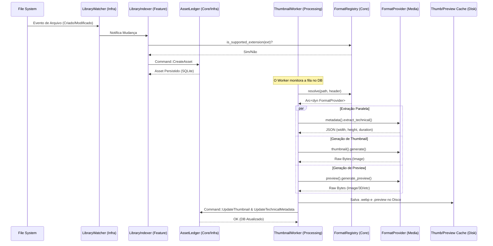

# Guia de Implementação de Formatos (V2)

Este documento descreve o fluxo de processamento de assets no Mundam, desde a detecção de um arquivo no disco até a extração de metadados e geração de thumbnails/previews, seguindo a Arquitetura Hexagonal e o padrão Format Registry.

## 1. Fluxo de Processamento de Assets

O diagrama abaixo ilustra o ciclo de vida de um asset assim que ele entra no radar do sistema.



---

## 2. Passo a Passo da Execução

Abaixo, detalhamos cada arquivo e trecho de código envolvido no processo:

1.  **Detecção**: `src-tauri/src/processing/watcher/sensor.rs` captura o evento do S.O. e envia para o `debouncer.rs`, que evita redundâncias.
2.  **Indexação**: `src-tauri/src/feature/library/indexer.rs` recebe o evento. Ele usa o `FormatRegistry` para validar se a extensão é suportada e então envia um `LedgerCommand::CreateAsset` para o `AssetLedger`.
3.  **Persistência Inicial**: `src-tauri/src/infra/database/ledger.rs` salva o asset no banco com `thumbnail_path = NULL` e metadados básicos.
4.  **Orquestração de Fundo**: `src-tauri/src/processing/workers/thumbnail_worker.rs` detecta assets sem thumbnail (FIFO) ou recebe IDs prioritários da UI (LIFO via `ThumbnailPriorityState`).
5.  **Resolução de Formato**: O worker chama `format_registry.resolve(&asset.path, &header)`. 
    - O `FormatRegistry` (`src-tauri/src/core/formats/registry.rs`) faz um lookup O(1) no HashMap de extensões.
6.  **Extração**: O worker invoca as *Capabilities* do provedor encontrado:
    - `extract_technical`: Retorna dimensões e dados específicos.
    - `generate`: Gera os bytes da imagem reduzida.
    - `generate_preview`: Gera a versão de alta fidelidade (ex: GLB para 3D ou PNG grande para PSD).
7.  **Finalização**: O Worker converte o thumbnail para WebP (via `image_utils.rs`), salva os arquivos na pasta `app_data/thumbnails/` e envia os comandos de atualização para o `AssetLedger`.

---

## 3. Como Adicionar Suporte a um Novo Formato

Para adicionar um novo formato (ex: `my_cool_format`), siga estes passos:

### Passo A: Criar o Provider
Crie um arquivo em `src-tauri/src/processing/media/<categoria>/` (veja seção 4 para organização).

```rust
use crate::core::formats::{FormatProvider, MetadataCapability, ThumbnailCapability, SupportedFormat};
use crate::core::error::AppResult;
use std::path::Path;
use async_trait::async_trait;

pub struct MyFormatProvider;

impl MyFormatProvider {
    pub fn new() -> Self { Self }
}

impl FormatProvider for MyFormatProvider {
    fn name(&self) -> &'static str { "MY_COOL_FORMAT" }
    
    fn supported_extensions(&self) -> Vec<&'static str> {
        vec!["mcf", "cool"] // Extensões e seus aliases
    }

    fn thumbnail(&self) -> Option<&dyn ThumbnailCapability> { Some(self) }
    
    fn metadata(&self) -> Option<&dyn MetadataCapability> { Some(self) }
}

#[async_trait]
impl MetadataCapability for MyFormatProvider {
    async fn extract_technical(&self, path: &Path) -> AppResult<serde_json::Value> {
        Ok(serde_json::json!({ "width": 1024, "height": 1024 }))
    }
}

#[async_trait]
impl ThumbnailCapability for MyFormatProvider {
    async fn generate(&self, path: &Path, asset_id: &str, size_hint: u32) -> AppResult<Vec<u8>> {
        // Lógica de extração de bytes de imagem
        Ok(vec![]) 
    }
}
```

### Passo B: Registrar no Sistema
No arquivo `src-tauri/src/core/formats/mod.rs`, adicione o provider na função `build_format_registry()`:

```rust
registry.register(Arc::new(MyFormatProvider::new()));
```

---

## 4. Organização do Diretório `processing/media`

Para manter a escalabilidade, o diretório `src-tauri/src/processing/media` deve ser organizado por categorias de tipo de arquivo. Cada formato deve ter seu próprio arquivo, e funções compartilhadas devem ir para `helpers`.

### Estrutura Proposta

```text
src-tauri/src/processing/media/
├── mod.rs                 # Exporta todos os módulos e subdiretórios
├── helpers/               # Funções de utilidade comum
│   ├── image_utils.rs     # Redimensionamento, detecção de formato, etc.
│   ├── icon_format.rs     # Fallback para ícones do sistema
│   └── fallback_format.rs # Fallback genérico para arquivos desconhecidos
├── extractors/            # Decodificadores binários específicos e pesados
│   ├── sai2_decoder.rs
│   └── krita_parser.rs
├── images/                # Imagens Raster e Vetoriais
│   ├── psd_format.rs
│   ├── ai_format.rs
│   ├── svg_format.rs
│   ├── raw_format.rs
│   ├── exr_format.rs
│   └── image_format.rs    # Formatos comuns (jpg, png, webp)
├── video/                 # Formatos de Vídeo e Transcoding
│   └── video_format.rs
├── audio/                 # Formatos de Áudio e Waveforms
│   └── audio_format.rs
├── models/                # Modelos 3D e CAD
│   ├── model3d_format.rs  (gltf, obj, stl)
│   ├── usd_format.rs
│   └── cad_format.rs
├── documents/             # Documentos, Fontes e Textos
│   ├── pdf_format.rs
│   ├── font_format.rs
│   ├── text_format.rs
│   └── xmind_format.rs
└── projects/              # Arquivos de projeto (Zips/Binários específicos)
    ├── aseprite_format.rs
    ├── binary_design_formats.rs (affinity, coreldraw)
    └── project_zip_formats.rs   (clipstudio, penpot, rebelle)
```

### Vantagens desta Organização:
1.  **Isolamento de Falhas**: Se o suporte a `PSD` quebrar, você sabe exatamente que o problema está em `images/psd_format.rs`.
2.  **Facilidade de Registro**: O `mod.rs` centraliza as exportações, facilitando a importação no `core/formats/mod.rs`.
3.  **Tratamento Exclusivo**: Permite definir fallbacks específicos por categoria (ex: se um vídeo falha, tenta o `ffmpeg_fallback`; se uma imagem falha, tenta o ícone do sistema).
4.  **Clareza de Aliases**: Cada arquivo de formato gerencia seus próprios aliases e extensões relacionadas, sem poluir um arquivo genérico.
