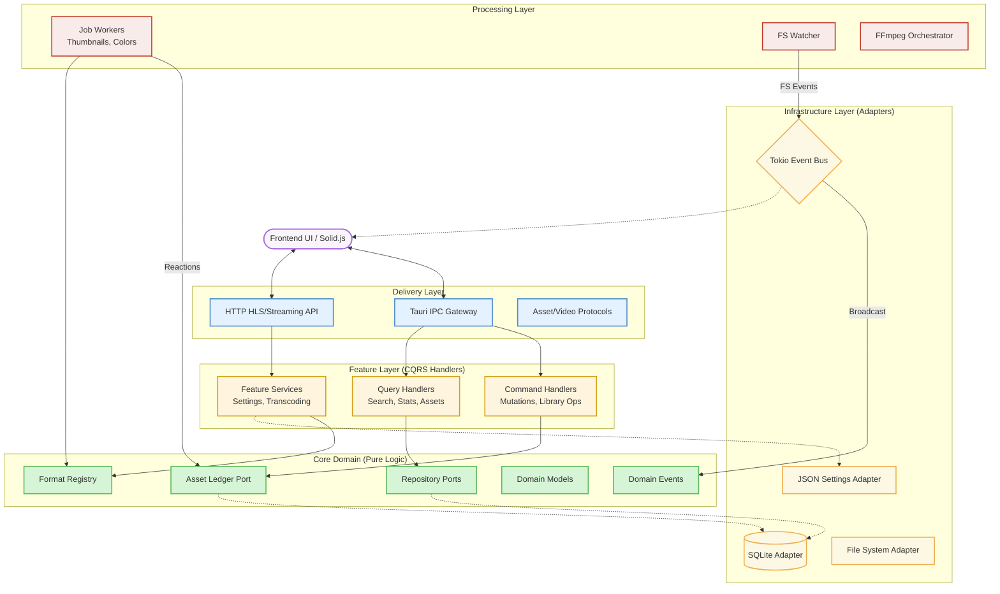

# MUDAM - Backend Overview

## Index

- [Folder structure](#folder-structure)
- [Architeture details](#architeture-details)
- [Core](#core)
- [Delivery](#delivery)
- [Feature](#feature)
- [Infra](#infra)
- [Processing](#processing)

## Folder structure
```
src-tauri/src/

├── core/
│   ├── error/
│   ├── events/
│   ├── formats/
│   ├── ledger/
│   ├── models/
│   ├── repository/
│   ├── settings/
│   └── workflows/
├── delivery/
│   ├── protocols/
│   ├── streaming/
│   └── tauri/
├── feature/
│   ├── analysis/
│   ├── assets/
│   ├── library/
│   ├── media/
│   ├── search/
│   ├── settings/
│   └── transcoding/
├── infra/
│   ├── config/
│   ├── database/
│   ├── events/
│   └── telemetry.rs
├── processing/
│   ├── media/
│   ├── transcoding/
│   ├── watcher/
│   └── workers/
├── lib.rs
├── lifecycle.rs
├── main.rs
```

## Architeture details

O backend do Mundam adota uma **Arquitetura Híbrida**, que combina a clareza visual e organizacional da **Arquitetura Orientada a Serviços (Vertical Slicing por Escopo)** com a consistência, desacoplamento, testabilidade e resiliência mecânica da **Arquitetura Hexagonal (Ports & Adapters)**, operando sob um modelo **Event-Driven (EDA)** e **CQRS** no núcleo vital (Core Domain).

Essa estrutura foi escolhida para resolver os desafios de um Digital Asset Manager (DAM) operando de forma pesada e offline em desktop (concorrência agressiva de sistema de arquivos, indexação massiva paralela, travas de banco de dados SQLite e corrupção cruzada de threads e processos), ao mesmo tempo em que mantém uma estrutura física de pastas (Rust) intuitiva para os desenvolvedores.


### Glossário de Termos Essenciais da Arquitetura

Para balizar o ciclo de desenvolvimento, adotam-se universalmente neste Backend as seguintes definições conceituais:

- **CQRS (Command e Query Responsibility Segregation):** Divisão arquitetural dos dados. Operações base focadas em leitura (**Queries**) jamais afetam estado e trafegam super rápido para a UI. Operações de modificação de estado (**Commands**, por ex: `MoveFolderCommand`) empacotam DTOs imutáveis de mudança e passam por extrema validação do backend sem bloquear leituras.
- **Port:** Uma *Trait* (Interface) em Rust (ex: `trait ThumbnailCapability { ... }`). É o núcleo que define que *algo abstraido* processa a requisição.
- **Adapter:** A implementação concreta, geralmente "suja", daquele *Port* (ex: o `Mp4FfmpegAdapter` utilizando subprocessos reais ou C++ ffi para respeitar a Trait acima).
- **Event Bus:** O Barramento Central reativo da memória do Rust (Ex: usando `tokio::sync::broadcast`). Extingue instâncias de módulos invocando uma a outra de forma acoplada. "Módulos falam pro vazio, Módulos interessados Escutam do vazio."
- **Asset Ledger:** O Único Ponto de Verdade (Single Source of Truth) para modificações de estado e de disco do projeto Inteiro. O Ledger pega `Commands` vindos do Bus (S.O. ou UI) e os aplica com Idempotência Transacional no Banco e no Disco Rígido. Evita corridas malucas de gravação e mantém versões limpas.
- **Format Registry:** O "Cartório" dos formatos. Toda extensão, mime-type ou "magic byte" de um arquivo é detectada e devolvida a uma estrutura *Capability*, eliminando blocos de códigos com centenas de desvios condicionais na raiz.

### Core Principles

1.  **Vertical Slicing (Macro):** A organização física (`core/`, `feature/`, `processing/`, etc.) permite que desenvolvedores naveguem por domínios de responsabilidade, facilitando a localização de código e a escalabilidade do projeto.
2.  **Hexagonal Architecture (Micro):** O domínio central (`Core`) é isolado de detalhes de infraestrutura. Ele define **Ports** (Traits em Rust) que são implementados por **Adapters** na camada `Infra`. Isso permite trocar o banco de dados (SQLite) ou o sistema de eventos sem tocar na lógica de negócio.
3.  **Event-Driven Architecture (EDA):** A comunicação entre componentes é majoritariamente assíncrona através de um **Event Bus** (baseado em `tokio::sync::broadcast`). Módulos emitem `DomainEvents` e outros interessados (como o Indexador ou a UI) reagem a eles.
4.  **CQRS (Command Query Responsibility Segregation):** Separação clara entre operações de escrita (**Commands**) e leitura (**Queries**).
    *   **Commands:** Passam obrigatoriamente pelo **Asset Ledger**, garantindo integridade transacional e serialização de operações pesadas.
    *   **Queries:** São otimizadas para performance, acessando diretamente os adaptadores de banco de dados para entregar dados rápidos à interface.

### Architectural Diagram



### Layer Responsibilities

| Layer          | Responsibility                 | Key Characteristics                                                    |
| :------------- | :----------------------------- | :--------------------------------------------------------------------- |
| **Delivery**   | Portas de entrada e saída.     | Conhece o Tauri, protocolos HTTP e comunicação externa.                |
| **Feature**    | Casos de uso e orquestração.   | Implementa a lógica de aplicação (CQRS). Não conhece o DB diretamente. |
| **Core**       | Regras de negócio e contratos. | "Domínio Puro". Define o que o sistema faz, não como ele persiste.     |
| **Processing** | Trabalho pesado em background. | Atores e workers assíncronos que reagem a eventos e processam mídia.   |
| **Infra**      | Implementações técnicas.       | Conhece o SQLx, sistema de arquivos, sistema operacional e logs.       |

## Core

### Error

O módulo de erro centraliza a gestão de falhas em toda a aplicação, garantindo que erros de diferentes origens (I/O, Banco de Dados, Formatos) sejam tratados de forma consistente.

*   **`domain.rs`**: Define o `AppError`, um enum exaustivo de todos os erros possíveis no domínio. Utiliza a crate `thiserror` para derivação automática de mensagens.
*   **`context.rs`**: Fornece a trait `Context`, permitindo anexar metadados e descrições a erros de baixo nível enquanto eles sobem na pilha de chamadas.
*   **`tauri_mapper.rs`**: Implementa a conversão de `AppError` para strings ou tipos serializáveis que o Tauri pode enviar de volta para o frontend através do IPC.

### Events

Representa o "sistema nervoso" do Mundam. Define como as diferentes partes do sistema se comunicam sem acoplamento direto.

*   **`payloads.rs`**: Contém o enum `DomainEvent`, que lista todos os eventos significativos do sistema (ex: `AssetCreated`, `ScanProgress`, `ThumbnailGenerated`).
*   **`bus.rs`**: Define a trait `AppEventBus`, o contrato para o barramento de eventos que permite publicar e subscrever a mensagens de forma assíncrona.

### Formats

O coração da extensibilidade do Mundam. Implementa o padrão **Format Registry** para lidar com a diversidade de arquivos de design e mídia.

*   **`types.rs`**: Define tipos base como `Extension`, `MimeType` e categorias de mídia.
*   **`capabilities.rs`**: Define as "habilidades" que um formato pode ter através de traits (ex: `ThumbProvider`, `MetadataProvider`, `WaveformProvider`).
*   **`registry.rs`**: O `FormatRegistry` atua como um roteador O(1), mapeando extensões de arquivos para os provedores que implementam as capacidades necessárias.
*   **`provider.rs`**: Define a trait base `FormatProvider` que todos os plugins de formato devem implementar.

### Ledger

O `AssetLedger` é o único ponto de verdade para mutações de estado no sistema. Ele garante que mudanças no banco de dados e no sistema de arquivos ocorram de forma atômica e ordenada.

*   **`port.rs`**: Define a trait `TransactionalAssetLedger`, que é o contrato que a infraestrutura deve seguir para persistir mudanças.
*   **`command.rs`**: Define o enum `LedgerCommand`, representando intenções de mudança (ex: `CreateAsset`, `MoveFolder`, `UpdateTags`).
*   **`mock.rs`**: Implementação em memória para testes unitários rápidos.

### Models

Contém as estruturas de dados fundamentais do domínio, focadas em regras de negócio e representação de estado, livres de decorators de banco de dados (exceto quando necessário para performance).

*   **`asset.rs`**: A estrutura principal `Asset`, representando um arquivo indexado, seus metadados, cores e estado de processamento.
*   **`search.rs`**: Modelos para filtros de busca, critérios de ordenação e resultados de pesquisa.
*   **`smart_folder.rs`**: Define `SmartFolder`, que são basicamente buscas salvas que se comportam como pastas dinâmicas.

### Repository

Define como o sistema recupera dados sem se preocupar com a origem (SQL, Cache, Memória).

*   **`asset.rs`**: Contém a trait `AssetQueryHandler`, definindo métodos para listar assets, buscar pastas e obter estatísticas da biblioteca.

### Settings

Gere a configuração global da aplicação e do usuário.

*   **`port.rs`**: Define a trait `SettingsPort` para persistência de configurações.
*   **`model.rs`**: Estrutura `AppSettings` que mapeia todas as opções configuráveis (concorrência de indexação, caminhos de cache, etc).

### Workflows

Contém orquestrações complexas que envolvem múltiplos passos ou componentes do domínio.

*   **`thumbnails/`**: Lógica de priorização e fluxos de geração de thumbnails, gerenciando a fila de processamento baseada na visibilidade do usuário na UI.

## Delivery

### Protocols

Implementa handlers para esquemas de URI customizados, permitindo que o frontend acesse arquivos locais e thumbnails de forma segura e eficiente.

*   **`asset.rs`**, **`audio.rs`**, **`video.rs`**: Handlers para os protocolos `asset://`, `audio://`, `video://` e `thumb://`.
*   **`common.rs`**: Lógica compartilhada para processamento de Range Requests (essencial para seeking de vídeo) e headers de cache.

### Streaming

Um servidor HTTP de alta performance baseado em **Axum** que roda em paralelo ao Tauri. É utilizado para streaming on-the-fly de vídeos pesados via HLS.

*   **`server.rs`**: O motor do servidor Axum, gerenciando rotas, autenticação via token de sessão e streaming de arquivos.
*   **`playlist.rs`**, **`segment.rs`**: Lógica para geração dinâmica de playlists `.m3u8` e segmentos `.ts` para HLS.
*   **`process_manager.rs`**: Gerencia os processos do transcodificador vinculados a uma sessão de streaming.

### Tauri

A ponte principal entre o mundo Rust e o mundo JavaScript/Solid.js.

*   **`commands/`**: Diretório contendo todos os comandos IPC invocáveis pelo frontend.
    *   **`queries.rs`**: Comandos de leitura que consultam o `AssetQueryHandler`.
    *   **`mutations.rs`**: Comandos de escrita que despacham `LedgerCommands`.
    *   **`streaming.rs`**: Comandos para controle e status do servidor de streaming.
    *   **`settings.rs`**: Comandos para leitura e atualização de configurações.
*   **`thumbnails.rs`**: Comandos específicos para sinalizar prioridade de geração de thumbnails (ex: quais assets estão visíveis na tela).

## Feature

### Analysis

Contém lógica para análise profunda de assets após a indexação inicial.

*   **`colors.rs`**: Algoritmos para extração de paletas de cores dominantes e cores vibrantes de imagens e vídeos, permitindo a busca por cor na UI.

### Assets

Gerencia a lógica de negócio focada em assets individuais.

*   **`queries.rs`**: `AssetQueryService` que atua como uma camada de serviço sobre o repositório, preparando os dados para a entrega no frontend.

### Library

O núcleo de gestão da biblioteca de mídia do Mundam.

*   **`indexer.rs`**: O `LibraryIndexer` é responsável por varrer o sistema de arquivos, detectar novos arquivos ou mudanças, e sincronizar o estado com o Ledger de forma concorrente e resiliente.

### Media

Funcionalidades específicas de mídia que não se encaixam apenas em metadados.

*   **`waveform.rs`**: Gera e gerencia dados de waveform (forma de onda) para assets de áudio, permitindo visualizações ricas no player.

### Search

Motor de busca unificado do backend.

*   **`query_handler.rs`**: Orquestra consultas complexas que podem envolver múltiplos critérios (tags, datas, ratings, tipos de arquivo e busca textual).

### Settings

Camada de serviço para as configurações da aplicação.

*   **`service.rs`**: `SettingsService` que expõe métodos seguros para ler e atualizar as configurações, garantindo que valores inválidos não sejam persistidos.

### Transcoding

Gestão de transcodificação de vídeo de alto nível.

*   **`hls_manager.rs`**: Orquestra o ciclo de vida das sessões HLS, garantindo que o transcodificador seja iniciado e parado conforme a demanda do player.
*   **`cache.rs`**: Implementa o `TranscodeCache`, que armazena segmentos transcodificados para acelerar o acesso subsequente ao mesmo vídeo.
*   **`detector.rs`**: Lógica para decidir se um arquivo precisa ser transcodificado baseado no suporte nativo do browser/WebView.

## Infra

### Config

Adaptadores para persistência de configurações de baixo nível.

*   **`json_adapter.rs`**: Implementação concreta que salva as configurações do usuário em um arquivo `settings.json` na pasta de dados local da aplicação.

### Database

O motor de persistência relacional do Mundam, baseado em **SQLite** e **SQLx**.

*   **`manager.rs`**: Gerencia o pool de conexões e garante que as migrações de esquema sejam aplicadas corretamente durante a inicialização.
*   **`ledger.rs`**: Implementação robusta do `AssetLedger`. Utiliza transações SQL para garantir que operações complexas (como mover pastas) sejam atômicas.
*   **`queries.rs`**: Contém as consultas SQL otimizadas para leitura de assets, pastas e estatísticas.
*   **`search_builder.rs`**: Lógica para construção dinâmica de queries SQL complexas baseadas nos filtros de busca selecionados pelo usuário.
*   **`models.rs`**: Definições das tabelas e mapeamento direto entre linhas do banco de dados e objetos Rust.

### Events

Implementação física da infraestrutura de mensagens.

*   **`tokio_bus.rs`**: Implementa o barramento de eventos utilizando `tokio::sync::broadcast`. Suporta centenas de subscritores simultâneos com baixa latência e overhead mínimo de memória.

### Telemetry

O subsistema de diagnósticos e monitoramento.

*   **`telemetry.rs`**: Configura o `tracing` para captura de logs estruturados em diferentes níveis (INFO, DEBUG, ERROR), essencial para depuração de problemas complexos em ambiente de produção.

## Processing

### Media

Onde reside a implementação concreta de todos os provedores de formato. É a camada mais "suja" e complexa, lidando com dezenas de formatos binários e padrões de metadados.

*   **Implementações de Formato**: Arquivos como `psd_format.rs`, `raw_format.rs`, `ai_format.rs`, `video_format.rs`, etc., contêm a lógica específica para abrir, ler e extrair dados de cada tipo de arquivo suportado.
*   **`extractors/`**: Contém decodificadores binários customizados para formatos sem bibliotecas oficiais (ex: decodificador proprietário para arquivos `.sai2`).
*   **`image_utils.rs`**: Utilitários para processamento de imagem de alta performance (redimensionamento Lanczos3, conversão de espaço de cores, etc).

### Transcoding

Interface de baixo nível com ferramentas de processamento de sinal.

*   **`mod.rs`**: Orquestra subprocessos FFmpeg, configurando pipes de I/O e argumentos otimizados para gerar streams HLS compatíveis com o browser em tempo real.

### Watcher

Responsável por manter a biblioteca sincronizada com as mudanças no disco em tempo real.

*   **`sensor.rs`**: Interface direta com as APIs de notificação do Sistema Operacional (FSEvents no Mac, Inotify no Linux).
*   **`debouncer.rs`**: Componente crítico que filtra a "tempestade" de eventos brutos do S.O., agrupando operações atômicas e resolvendo heurísticas de renomeação/movimentação para evitar redundância no banco de dados.

### Workers

Atores em background que processam tarefas intensivas de CPU e I/O.

*   **`thumbnail_worker.rs`**: Gerencia a fila de geração de thumbnails, respeitando as prioridades de visibilidade enviadas pelo frontend.
*   **`color_worker.rs`**: Extrai informações cromáticas dos assets de forma assíncrona, permitindo que a busca por cores funcione sem atrasar a indexação inicial.
