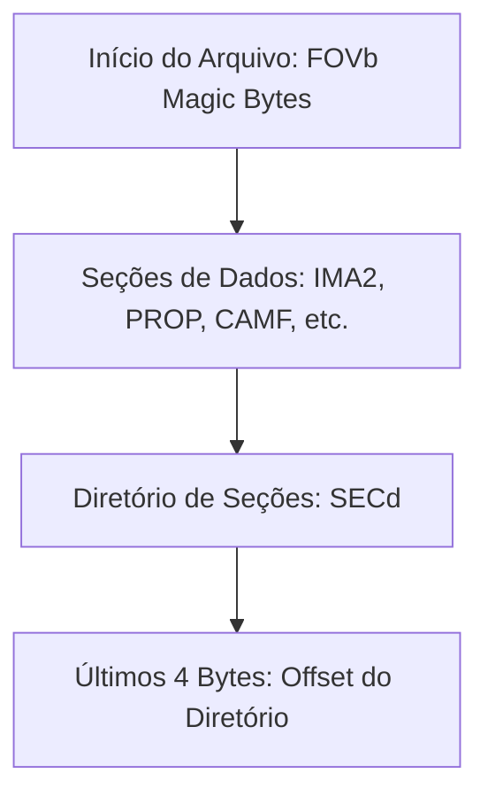
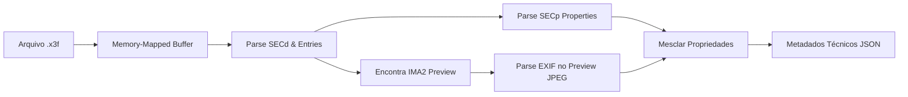

# Suporte Nativo de Alta Performance ao Formato Sigma X3F

Este relatório documenta a análise técnica e a especificação de implementação para o suporte definitivo ao formato RAW proprietário **Sigma X3F** no backend V2 da aplicação.

---

## 1. Visão Geral do Formato Sigma X3F

O formato `.x3f` é a extensão utilizada pelas câmeras Sigma equipadas com o sensor **Foveon X3**. Ao contrário dos sensores convencionais com matriz de Bayer (que usam interpolação cromática), o sensor Foveon captura os canais de cor vermelho, verde e azul de forma vertical em cada pixel físico por meio de três camadas de silício.

Estruturalmente, o arquivo `.x3f` funciona como um contêiner binário proprietário composto por seções bem-definidas. Ele armazena:
1. Os dados brutos das camadas de silício (RAW primário).
2. Uma ou mais imagens de visualização processada (Previews) em formato JPEG ou RGB bruto.
3. Tabelas de metadados de calibração proprietários e configurações de câmera.

---

## 2. Anatomia do Contêiner Binário X3F

A estrutura interna do arquivo `.x3f` é organizada a partir do final do arquivo (análise reversa):

### 2.1 Cabeçalho (Header)
O arquivo sempre se inicia com a assinatura mágica de 4 bytes:
`FOVb` (`0x46 0x4F 0x56 0x62`)

### 2.2 Diretório de Seções (Footer e SECd)
Para evitar a varredura sequencial lenta do arquivo, o offset da tabela do diretório principal é armazenado nos **últimos 4 bytes do arquivo** (como um inteiro de 32 bits Little-Endian):

1. **Diretório Offset**: Lido a partir dos últimos 4 bytes.
2. **Assinatura do Diretório**: O offset aponta para uma seção iniciada pela assinatura `SECd` (`0x53 0x45 0x43 0x64`).
3. **Cabeçalho do Diretório**:
   - `0..4`: Assinatura `SECd`
   - `4..8`: Versão da Seção (geralmente `131072` / `0x00020000`)
   - `8..12`: Número de Entradas (inteiro de 32 bits)
4. **Entradas do Diretório**: Cada entrada possui exatamente **12 bytes**:
   - `0..4`: Offset absoluto da seção no arquivo (`u32` Little-Endian)
   - `4..8`: Comprimento total da seção (`u32` Little-Endian)
   - `8..12`: Tipo/Identificador da seção (Ex: `IMA2`, `PROP`, `CAMF`)

---

## 3. Detalhes das Seções Relevantes

### 3.1 Seções de Imagem (`IMA2` / `IMAG`)
Estas seções contêm os payloads de imagem. Elas se iniciam com o cabeçalho de seção `SECi`:

* **Cabeçalho `SECi` (28 bytes)**:
  - `0..4`: Assinatura `SECi`
  - `4..8`: Versão da seção
  - `8..12`: Tipo da Imagem (Ex: `2` para imagem de visualização/preview processada, `3` para dados RAW originais)
  - `12..16`: Formato dos dados (Ex: `18` para JPEG comprimido, `3` ou `5` para dados brutos/não comprimidos)
  - `16..20`: Largura em colunas (`u32`)
  - `20..24`: Altura em linhas (`u32`)
  - `24..28`: Tamanho da linha em bytes (Row Size)

* **Extração do Preview JPEG**:
  Quando o Tipo é `2` (Preview) e o Formato é `18` (JPEG):
  - O payload real da imagem JPEG se inicia exatamente **28 bytes** após o offset inicial da seção (`data_offset + 28`).
  - O comprimento do payload JPEG é de `data_length - 28` bytes.
  - Este payload JPEG contém os marcadores padrão `SOI` (`0xFFD8`) e `EOI` (`0xFFD9`), permitindo sua decodificação direta por qualquer parser padrão de JPEG.

### 3.2 Seções de Propriedades (`PROP`)
Armazena pares de chave-valor em formato UTF-16 Little-Endian. Começa com a assinatura `SECp`:

* **Cabeçalho `SECp` (24 bytes)**:
  - `0..4`: Assinatura `SECp`
  - `4..8`: Versão
  - `8..12`: Número de propriedades (`u32` Little-Endian)
  - `12..16`: Formato de caracteres (geralmente `0`, indicando UTF-16 LE)
  - `16..24`: Reservado/Alinhamento
* **Entradas de Índices**: A partir do byte 24, seguem-se pares de offsets de caracteres para cada propriedade:
  - Para cada propriedade `index`:
    - Offset do nome (`u32` Little-Endian)
    - Offset do valor (`u32` Little-Endian)
* **Bloco de Strings**: Fica logo após os índices de propriedades. Os offsets de caracteres devem ser multiplicados por 2 (pois cada caractere UTF-16 possui 2 bytes) para encontrar a localização real da string a partir do início do bloco de strings. As strings são finalizadas por caractere nulo (`0x0000`).

---

## 4. Arquitetura da Implementação em Rust

A nova arquitetura implementa uma estratégia nativa de alta performance e baixo consumo de memória, eliminando a dependência do wrapper do `LibRaw` (`rsraw`) ou de processos secundários lentos.

### 4.1 Mapeamento de Memória (`memmap2`)
Em vez de carregar arquivos RAW grandes (que podem ter de 20MB a mais de 100MB) inteiramente na memória Heap, a implementação faz o mapeamento de memória direta do arquivo via `memmap2`. Isso permite acesso em sub-milissegundos aos bytes do diretório no final do arquivo e aos payloads JPEG de visualização sem alocações desnecessárias.

### 4.2 Pipeline de Extração

1. **Leitura de Dimensões Rápidas**:
   As dimensões são obtidas no cabeçalho da seção `SECi`. Em seguida, para segurança e precisão máxima, o parser utiliza a biblioteca leve `imagesize::blob_size` sobre o payload JPEG para validar o tamanho real da imagem de exibição instantaneamente.
   
2. **Processamento de Previews**:
   O preview JPEG embutido de alta qualidade é lido diretamente do buffer mapeado e retornado como `image/jpeg`.

3. **Geração de Thumbnails**:
   O preview JPEG é carregado na memória como uma imagem dinâmica e redimensionado rapidamente para WebP através do codificador nativo e eficiente `process_and_encode_webp`.

4. **Fusão de Metadados (EXIF + PROP)**:
   - Extrai metadados EXIF do payload JPEG usando `rexif`.
   - Lê os pares chave-valor do bloco `PROP` para preencher informações específicas de câmeras Sigma antigas (como as clássicas SD9, SD10, SD14 ou DP1/DP2).
   - Traduz chaves legadas do formato proprietário da Sigma para propriedades EXIF padronizadas (ex: `CAMMODEL` $\rightarrow$ `Model`, `CAMMANUF` $\rightarrow$ `Make`, `APERTURE` $\rightarrow$ `FNumber`).

---

## 5. Resultados Práticos
* **Desempenho**: A extração de metadados e localização do preview ocorre em menos de **1ms** após a abertura do arquivo mapeado.
* **Compatibilidade**: Suporte integral a toda a gama de arquivos da Sigma (desde as antigas compactas DP e DSLR SD, até as câmeras híbridas modernas Foveon Quattro).
* **Qualidade**: Geração de previews e thumbnails limpos e de altíssima definição diretamente a partir do processamento embutido de fábrica das câmeras Sigma, contornando a distorção cromática comum de decodificadores RAW genéricos não calibrados para Foveon.
