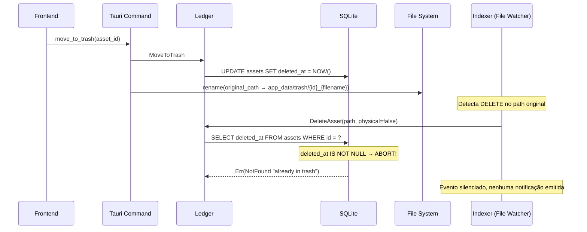

# Relatório de Implementação — Favoritos, Lixeira e Filtros da Library Sidebar

**Data:** 2026-08-12  
**Sessão:** Conversa única contínua (~6 horas)  
**Escopo:** Favoritos (UI), Lixeira física com isolamento do Indexer, Filtros avançados na LibrarySidebarPanel  

---

## Índice

1. [Visão Geral](#1-visão-geral)
2. [Filtros da Library Sidebar](#2-filtros-da-library-sidebar)
   - 2.1. [Novos Filtros Adicionados](#21-novos-filtros-adicionados)
   - 2.2. [Contadores (CountBadge)](#22-contadores-countbadge)
   - 2.3. [Integração com a Store de Filtros](#23-integração-com-a-store-de-filtros)
3. [Sistema de Favoritos](#3-sistema-de-favoritos)
   - 3.1. [Integração do Componente Toggle](#31-integração-do-componente-toggle)
   - 3.2. [Atualização Reativa do Viewport](#32-atualização-reativa-do-viewport)
4. [Sistema de Lixeira](#4-sistema-de-lixeira)
   - 4.1. [Arquitetura Conceitual](#41-arquitetura-conceitual)
   - 4.2. [Movimentação Física para `app_data/trash/`](#42-movimentação-física-para-app_datatrash)
   - 4.3. [Escudo Protetor do Indexer](#43-escudo-protetor-do-indexer)
   - 4.4. [Resolução Transparente de Caminho (Trash-Aware Path Resolution)](#44-resolução-transparente-de-caminho-trash-aware-path-resolution)
   - 4.5. [Restauração e Esvaziamento da Lixeira](#45-restauração-e-esvaziamento-da-lixeira)
   - 4.6. [Menu de Contexto Condicional](#46-menu-de-contexto-condicional)
5. [Atualização Reativa do Viewport](#5-atualização-reativa-do-viewport)
6. [Manutenção e Limpeza do Projeto](#6-manutenção-e-limpeza-do-projeto)
7. [Problemas Enfrentados](#7-problemas-enfrentados)
8. [Arquivos Modificados](#8-arquivos-modificados)
9. [Possíveis Melhorias Futuras](#9-possíveis-melhorias-futuras)

---

## 1. Visão Geral

Esta sessão implementou três funcionalidades interligadas no Mundam:

1. **Filtros avançados na Library Sidebar** — "Has Tags", "Favorites" e "Trash", com contadores dinâmicos.
2. **Sistema de Favoritos** — Botão de favorito no Inspector usando o componente `Toggle` reutilizável, com texto contextual.
3. **Sistema de Lixeira com Isolamento Físico** — Movimentação real do arquivo para uma pasta interna `trash/`, com proteção contra o Indexer (File System Watcher) e resolução transparente de caminho para visualização de assets na lixeira.

A maior complexidade técnica residiu no **sistema de lixeira**, que exigiu mudanças em 5 camadas da arquitetura hexagonal do Mundam (Database Handler, Ledger, Mutations, Protocol Handler e Streaming Server) para conciliar dois princípios conflitantes:
- **Fidelidade ao sistema de arquivos** (o arquivo deve ser movido fisicamente)
- **Preservação de metadados** (o indexer não deve apagar o registro do banco ao detectar que o arquivo sumiu)

---

## 2. Filtros da Library Sidebar

### 2.1. Novos Filtros Adicionados

Foram adicionados três novos filtros ao painel `LibrarySidebarPanel.tsx`, abaixo dos já existentes "All Items" e "Untagged":

| Filtro | Ícone | Comportamento |
|--------|-------|---------------|
| **Has Tags** | `BookmarkCheck` | Mostra apenas assets que possuem ao menos uma tag associada |
| **Favorites** | `Heart` | Mostra apenas assets marcados como favoritos (`is_favorite = true`) |
| **Trash** | `Trash2` | Mostra apenas assets na lixeira (`deleted_at IS NOT NULL`) |

Os filtros são mutuamente exclusivos com o filtro "Untagged" e entre si — ativar um desativa os demais. A lógica de exclusão mútua é gerenciada pela store de filtros.

**Arquivo:** `src/components/features/library/LibrarySidebarPanel.tsx`

### 2.2. Contadores (CountBadge)

Cada filtro exibe um `CountBadge` com a contagem atualizada em tempo real. As estatísticas são fornecidas pela store de metadados (`useMetadata`) que consulta o backend via o comando `get_library_stats`.

Os campos adicionados ao modelo `LibraryStats`:

| Campo | Tipo | Origem SQL |
|-------|------|------------|
| `has_tags_assets` | `i64` | `SELECT COUNT(DISTINCT asset_id) FROM asset_tags` |
| `favorite_assets` | `i64` | `SELECT COUNT(*) FROM assets WHERE is_favorite = 1 AND deleted_at IS NULL` |
| `trash_assets` | `i64` | `SELECT COUNT(*) FROM assets WHERE deleted_at IS NOT NULL` |

> [!IMPORTANT]
> Os contadores utilizam `showZero={true}` para que o badge seja sempre visível, mesmo quando a contagem é zero — requisito explícito do usuário.

### 2.3. Integração com a Store de Filtros

Foram adicionados os seguintes toggles à store de filtros:

- `filterHasTags` — booleano reativo
- `filterFavorites` — booleano reativo
- `filterTrash` — booleano reativo

Cada toggle possui uma função `toggleX()` que desativa os demais filtros conflitantes e chama `refreshAssets()` automaticamente.

A query SQL de listagem de assets (`get_assets`) foi atualizada no backend para reconhecer os novos filtros no modelo `AssetFilter`:

```rust
// AssetFilter fields adicionados:
pub has_tags: Option<bool>,
pub favorites: Option<bool>,
pub trash: Option<bool>,
```

Quando `trash = true`, a cláusula `WHERE deleted_at IS NOT NULL` é aplicada. Para todos os outros filtros, `deleted_at IS NULL` é implicitamente aplicado para ocultar itens da lixeira da visualização normal.

---

## 3. Sistema de Favoritos

### 3.1. Integração do Componente Toggle

O botão de favorito no Inspector (`CommonMetadata.tsx`) foi refatorado para utilizar o componente reutilizável `Toggle` do design system do Mundam, substituindo uma implementação ad-hoc anterior.

```tsx
<Toggle
    pressed={props.item?.is_favorite || false}
    onPressedChange={() =>
        props.item && itemActions.toggleItemFavorite(props.item.id)
    }
    variant="outline"
    size="sm"
    class="inspector-favorite-toggle"
>
    <Heart
        size={16}
        fill={props.item?.is_favorite ? 'currentColor' : 'none'}
        class={props.item?.is_favorite ? 'favorite-active-icon' : ''}
    />
    {props.item?.is_favorite ? 'Favorited' : 'Favorite'}
</Toggle>
```

**Características:**
- Ícone `Heart` com preenchimento condicional (sólido quando ativo)
- Texto contextual: "Favorite" / "Favorited"
- Layout em grid junto ao componente `StarRating`

**Arquivos:**
- `src/components/features/inspector/base/CommonMetadata.tsx`
- `src/components/features/inspector/base/CommonMetadata.css`

### 3.2. Atualização Reativa do Viewport

Ao alternar o favorito de um asset, o sistema chama `refreshAssets()` para que o viewport reflita imediatamente a mudança — especialmente relevante quando o filtro "Favorites" está ativo, pois o asset deve sumir da listagem se desfavoritado.

---

## 4. Sistema de Lixeira

### 4.1. Arquitetura Conceitual

O sistema de lixeira do Mundam segue uma abordagem **híbrida** entre exclusão lógica e movimentação física:



### 4.2. Movimentação Física para `app_data/trash/`

Quando o usuário move um asset para a lixeira, o arquivo é fisicamente transferido da sua localização original na biblioteca para o diretório interno do Mundam:

```
{app_local_data_dir}/trash/{asset_id}_{original_filename}
```

**Exemplo:** Um arquivo `photo.jpg` com ID `abc123` será movido para:
```
~/Library/Application Support/com.mundam.app/trash/abc123_photo.jpg
```

O prefixo com o `asset_id` garante unicidade mesmo com arquivos de mesmo nome vindos de pastas diferentes.

**Arquivo:** `src-tauri/src/delivery/tauri/commands/mutations.rs` — Função `move_to_trash`

### 4.3. Escudo Protetor do Indexer

O problema central era: ao mover o arquivo para a trash, o File System Watcher detecta que o arquivo original desapareceu e dispara um `DeleteAsset`. Sem proteção, isso apagaria o registro do banco, perdendo todos os metadados (tags, notas, favorito, rating).

**Solução implementada** em `asset_handler.rs` — Função `handle_delete_asset`:

```rust
let pre_delete_row = sqlx::query!(
    r#"SELECT folder_id as "folder_id?", name as "name!", 
       deleted_at as "deleted_at?: chrono::DateTime<chrono::Utc>" 
       FROM assets WHERE id = ?"#,
    resolved_id
)
.fetch_optional(&mut **transaction)
.await?;

if let Some(row) = &pre_delete_row {
    if row.deleted_at.is_some() && !physical_delete {
        tracing::info!(
            "Ledger: DeleteAsset IGNORED - Asset {} is already in trash", 
            resolved_id
        );
        return Err(AppError::NotFound(
            format!("Asset {} is already in trash", resolved_id)
        ));
    }
}
```

**Pontos-chave:**
- Checa se `deleted_at IS NOT NULL` antes de executar o DELETE
- Se sim e `physical_delete == false` (vindo do indexer), retorna `Err(NotFound)` silencioso
- O retorno `Err(NotFound)` é crucial pois no `event_handler.rs` (indexer) esse erro já é tratado como "nada a fazer" — **nenhum evento `DomainEvent::AssetDeleted` é emitido**, impedindo a notificação fantasma no frontend
- Quando `physical_delete == true` (vindo do `empty_trash`), o escudo é ignorado e a exclusão definitiva prossegue

### 4.4. Resolução Transparente de Caminho (Trash-Aware Path Resolution)

Após mover o arquivo para a trash, o campo `path` no banco de dados continua apontando para o caminho **original** (para viabilizar a restauração). Isso criou um problema: ao abrir um asset da lixeira no `ItemView`, os renderers (imagem, vídeo, áudio) tentavam carregar do path original inexistente.

A solução foi implementar resolução transparente de caminho em **todas as camadas de entrega**:

#### 4.4.1. Protocol Handler (`asset://`)

**Arquivo:** `src-tauri/src/delivery/protocols/asset.rs`

```rust
// 3. Resolve physical path based on type and trash state
let mut physical_path = asset.path.clone();

if asset.deleted_at.is_some() {
    if let Ok(dir) = app_handle.path().app_local_data_dir() {
        if let Some(file_name) = asset.path.file_name() {
            physical_path = dir
                .join("trash")
                .join(format!("{}_{}", asset.id, file_name.to_string_lossy()));
        }
    }
}
```

Isso garante que requisições `asset://localhost/{id}` funcionem para imagens, thumbnails e previews de assets na lixeira.

#### 4.4.2. Streaming Server (HLS/Probe/Segments)

**Arquivo:** `src-tauri/src/delivery/streaming/server.rs`

Foi criada uma função auxiliar centralizada:

```rust
async fn resolve_and_validate_path(
    asset: &Asset,
    state: &AppState,
) -> Result<std::path::PathBuf, StreamError> {
    if asset.deleted_at.is_some() {
        if let Ok(dir) = state.app_handle.path().app_local_data_dir() {
            if let Some(file_name) = asset.path.file_name() {
                return Ok(dir.join("trash").join(
                    format!("{}_{}", asset.id, file_name.to_string_lossy())
                ));
            }
        }
    }
    
    validate_path_scope(&state.asset_query_handler, &asset.path)
        .await
        .map_err(forbidden_response)?;
        
    Ok(asset.path.clone())
}
```

Esta função substitui o padrão anterior (`let file_path = asset.path` + `validate_path_scope`) em **todos os 6 handlers**:
- `probe_handler`
- `stream_handler`
- `playlist_handler`
- `segment_handler`
- `linear_hls_handler` (asset resolution)
- `linear_hls_handler` (playlist request)

> [!NOTE]
> Assets na lixeira **não passam por validação de escopo** (`validate_path_scope`), já que a pasta `trash/` não é uma raiz de biblioteca registrada. Isso é intencional e seguro, pois a autenticação por session token ainda se aplica.

#### 4.4.3. Waveform Extraction

**Arquivo:** `src-tauri/src/delivery/tauri/commands/queries.rs` — Função `get_audio_waveform_data`

O comando foi atualizado para aceitar um `asset_id` opcional. Quando fornecido e o asset está na lixeira, resolve o caminho para `trash/`:

```rust
pub async fn get_audio_waveform_data(
    app_handle: tauri::AppHandle,
    service: State<'_, AssetQueryService>,
    asset_id: Option<String>,
    path: String,
) -> AppResult<Vec<f32>> {
    let resolved_path = if let Some(ref id) = asset_id {
        if let Ok(Some(asset)) = service.get_asset(id).await {
            if asset.deleted_at.is_some() {
                // Resolve para app_data/trash/{id}_{filename}
                ...
            } else {
                asset.path.clone()
            }
        } else {
            std::path::PathBuf::from(&path)
        }
    } else {
        std::path::PathBuf::from(&path)
    };
    ...
}
```

**Propagação no frontend:**
- `AudioPlayerProps` (types.ts) — adicionada prop `assetId?: string`
- `useAudioPlayer.ts` — passa `assetId` no `invoke`
- `AudioRenderer.tsx` — propaga `assetId` do ItemView
- `AudioInspector.tsx` — propaga `assetId` do Inspector

#### 4.4.4. EXIF Metadata Extraction

**Arquivo:** `src-tauri/src/delivery/tauri/commands/queries.rs` — Função `get_asset_exif`

Mesma lógica de resolução trash-aware aplicada para que metadados técnicos continuem acessíveis para assets na lixeira.

### 4.5. Restauração e Esvaziamento da Lixeira

#### Restore from Trash
1. Executa o comando Ledger `RestoreFromTrash` → limpa `deleted_at` no banco
2. Move o arquivo de `app_data/trash/{id}_{filename}` de volta para `asset.path` (caminho original)
3. O Indexer detecta o arquivo "reaparecendo" e o reconcilia automaticamente via `recent_removals` cache

#### Empty Trash
1. Consulta todos os assets com `deleted_at IS NOT NULL`
2. Para cada asset:
   - Remove o arquivo físico de `app_data/trash/`
   - Executa `DeleteAsset` com `physical_delete: true` (bypassa o escudo do indexer)
   - Apaga o registro definitivamente do banco de dados

### 4.6. Menu de Contexto Condicional

O `AssetContextMenu.tsx` exibe opções condicionais baseadas no estado da lixeira:

- **Filtro Trash ativo →** Exibe "Restore File(s)"
- **Filtro Trash inativo →** Exibe "Move to Trash"

> [!NOTE]
> Foi necessário corrigir um bug de reatividade do SolidJS no menu de contexto. A destructuração do resultado de `useFilters()` quebraria a reatividade de `filterTrash`. A correção foi acessar `filters.filterTrash` diretamente sem destructuring.

---

## 5. Atualização Reativa do Viewport

Um problema recorrente era que, ao executar ações como mover para lixeira, remover favorito ou remover tags, o viewport não se atualizava — o asset continuava visível mesmo não se encaixando mais no filtro ativo.

**Solução:** Todas as ações que afetam a visibilidade de um asset num filtro agora chamam `refreshAssets()` da `libraryActions`:

| Ação | Store | Chamada |
|------|-------|---------|
| Mover para lixeira | `systemStore` | `refreshAssets()` após `move_to_trash` |
| Restaurar da lixeira | `systemStore` | `refreshAssets()` após `restore_from_trash` |
| Toggle favorito | `itemActions` | `refreshAssets()` após `toggle_favorite` |
| Adicionar/remover tag | `tagActions` | `refreshAssets()` (já existia) |

---

## 6. Manutenção e Limpeza do Projeto

Foram removidos arquivos de teste e scripts de utilidade que estavam poluindo o repositório raiz:

| Arquivo Removido | Tipo | Motivo |
|-------------------|------|--------|
| `fix_inits.py` | Script Python | Script de migração one-time, já executado |
| `update_queries.py` | Script Python | Script de migração one-time, já executado |
| `src-tauri/test_audio.rs` | Teste Rust | Teste isolado fora da estrutura de testes |
| `src-tauri/test_dds.rs` | Teste Rust | Teste isolado fora da estrutura de testes |
| `src-tauri/test_icns.rs` | Teste Rust | Teste isolado fora da estrutura de testes |
| `src-tauri/test_midi_len.rs` | Teste Rust | Teste isolado fora da estrutura de testes |
| `src-tauri/test_mime.rs` | Teste Rust | Teste isolado fora da estrutura de testes |
| `src-tauri/test.py` | Script Python | Teste isolado fora da estrutura |
| `src-tauri/test.db` | SQLite DB | Banco de dados de teste |

**Alteração complementar:** `AppShell.tsx` — Ajuste do `minSize` do painel Inspector de ~18% para 22% para acomodar melhor o novo layout do `CommonMetadata` com grid de favorito + rating.

---

## 7. Problemas Enfrentados

### 7.1. Conflito Indexer × Lixeira (Crítico)

**Descrição:** O Indexer (File System Watcher) detectava o desaparecimento do arquivo original ao movê-lo para a trash e disparava um `DeleteAsset`, que apagava o registro do banco de dados — perdendo permanentemente todos os metadados.

**Causa raiz:** A implementação original usava apenas soft-delete (campo `deleted_at`) sem mover o arquivo fisicamente. Ao introduzir a movimentação física para manter a fidelidade do file system, o watcher interpretava o evento como exclusão real.

**Solução:** O "escudo protetor" no `handle_delete_asset` que verifica `deleted_at` antes de executar o DELETE. Detalhado na [Seção 4.3](#43-escudo-protetor-do-indexer).

### 7.2. Evento Fantasma de Sincronização no Frontend

**Descrição:** Mesmo com o escudo impedindo a exclusão do registro, o Ledger emitia um `DomainEvent::AssetDeleted` que chegava ao frontend como notificação de "arquivo removido".

**Causa raiz:** O escudo retornava `Ok(Asset)` (com um struct vazio), e a camada `emit_event_for_command` no `ledger.rs` publicava o evento de exclusão para qualquer `Ok` retornado por `DeleteAsset`.

**Solução:** Alterado o retorno do escudo de `Ok(Asset)` para `Err(NotFound)`. O `event_handler.rs` já tratava `NotFound` como "nada a fazer" (`!matches!(error, AppError::NotFound(_))`), impedindo a publicação do evento.

### 7.3. Compilação do Struct `Asset` Incompleto

**Descrição:** A primeira implementação do escudo retornava um `Asset` com apenas 9 campos preenchidos, mas o struct possui 20+ campos obrigatórios.

**Erros:**
- `E0063: missing fields 'added_at', 'dominant_color', 'duration_secs' and 6 other fields`
- `E0308: mismatched types — expected Option<i32>, found integer` (campo `rating`)
- `E0308: mismatched types — expected Option<DateTime<Utc>>, found Option<OffsetDateTime>`

**Solução:** Ao mudar para `Err(NotFound)`, o problema se dissolveu, pois não é mais necessário construir um `Asset` de fallback.

### 7.4. Visualização de Assets na Lixeira Falhando

**Descrição:** Ao abrir o ItemView para um asset na lixeira, imagens, vídeos e áudios não carregavam — erro "File not found on local disk".

**Causa raiz:** O campo `path` no banco continua com o caminho original (necessário para restauração), mas o arquivo físico está em `app_data/trash/`.

**Solução:** Resolução transparente de caminho em todas as camadas de entrega. Detalhado na [Seção 4.4](#44-resolução-transparente-de-caminho-trash-aware-path-resolution).

### 7.5. Waveform de Áudio Não Gerado para Assets na Lixeira

**Descrição:** O extrator de waveform (FFmpeg) recebia o caminho original do frontend e falhava silenciosamente.

**Causa raiz:** O comando `get_audio_waveform_data` recebia apenas `path: String` sem contexto de asset, impossibilitando a resolução do caminho trash.

**Solução:** Adicionado parâmetro `asset_id: Option<String>` ao comando e propagado `assetId` por toda a cadeia de componentes do frontend (types → hook → renderer → inspector).

### 7.6. Reatividade do SolidJS no Menu de Contexto

**Descrição:** O menu "Restore File" não aparecia quando o filtro Trash estava ativo.

**Causa raiz:** Destructuração do resultado de `useFilters()` no componente perdia a reatividade do SolidJS. O valor de `filterTrash` era capturado como `false` no momento da destructuração e nunca atualizado.

**Solução:** Acessar `filters.filterTrash` diretamente do objeto reativo, sem destructurar:
```tsx
// ❌ Quebra reatividade
const { filterTrash } = useFilters();

// ✅ Mantém reatividade  
const filters = useFilters();
// ... depois: if (filters.filterTrash) { ... }
```

### 7.7. Variáveis Abreviadas e Estilos Inline

**Descrição:** O código gerado inicialmente continha variáveis abreviadas (e.g., `compList`, `idx`) e estilos definidos inline no JSX, violando as regras do projeto.

**Solução:** Refatoração para nomes descritivos completos e migração de estilos para os respectivos arquivos `.css`.

---

## 8. Arquivos Modificados

### Backend (Rust)

| Arquivo | Tipo de Alteração |
|---------|-------------------|
| `src-tauri/src/infra/database/handlers/asset_handler.rs` | Escudo protetor do indexer no `handle_delete_asset` |
| `src-tauri/src/delivery/tauri/commands/mutations.rs` | Movimentação física em `move_to_trash`, `restore_from_trash`, `empty_trash` |
| `src-tauri/src/delivery/protocols/asset.rs` | Resolução trash-aware no protocol handler `asset://` |
| `src-tauri/src/delivery/streaming/server.rs` | Função `resolve_and_validate_path` + 6 handlers atualizados |
| `src-tauri/src/delivery/tauri/commands/queries.rs` | Trash-aware em `get_audio_waveform_data` e `get_asset_exif` |
| `src-tauri/src/core/models/mod.rs` | Campos `has_tags`, `favorites`, `trash` em `AssetFilter`; campos de stats em `LibraryStats` |
| `src-tauri/src/infra/database/query_handlers/asset_queries.rs` | Queries SQL para novos filtros e estatísticas |

### Frontend (TypeScript/SolidJS)

| Arquivo | Tipo de Alteração |
|---------|-------------------|
| `src/components/features/library/LibrarySidebarPanel.tsx` | Novos filtros Has Tags, Favorites, Trash com CountBadge |
| `src/components/features/inspector/base/CommonMetadata.tsx` | Botão favorito com componente Toggle + texto |
| `src/components/features/inspector/base/CommonMetadata.css` | Grid layout para favorito + rating |
| `src/components/features/viewport/components/AssetContextMenu.tsx` | Menu condicional Restore/Move to Trash + fix reatividade |
| `src/components/features/itemview/renderers/audio/AudioRenderer.tsx` | Propagação de `assetId` |
| `src/components/features/inspector/audio/AudioInspector.tsx` | Propagação de `assetId` |
| `src/components/ui/AudioPlayer/types.ts` | Nova prop `assetId` |
| `src/components/ui/AudioPlayer/useAudioPlayer.ts` | Passa `assetId` no invoke |
| `src/core/store/library/libraryActions.ts` | Integração dos novos filtros |
| `src/core/store/metadata/tagActions.ts` | `refreshAssets()` em ações de tag |
| `src/core/store/systemStore.ts` | `refreshAssets()` em ações de lixeira e favorito |
| `src/layouts/AppShell.tsx` | Ajuste `minSize` do Inspector para 22% |

### Arquivos Removidos

| Arquivo |
|---------|
| `fix_inits.py` |
| `update_queries.py` |
| `src-tauri/test_audio.rs` |
| `src-tauri/test_dds.rs` |
| `src-tauri/test_icns.rs` |
| `src-tauri/test_midi_len.rs` |
| `src-tauri/test_mime.rs` |
| `src-tauri/test.py` |
| `src-tauri/test.db` |

---

## 9. Possíveis Melhorias Futuras

### 9.1. Centralização da Resolução de Caminho Trash-Aware

Atualmente a lógica de resolução `if deleted_at.is_some() → app_data/trash/...` está duplicada em 5 locais diferentes. Seria ideal extrair uma função utilitária centralizada:

```rust
// Proposta: src-tauri/src/core/utils/trash_path.rs
pub fn resolve_physical_path(
    asset: &Asset, 
    app_data_dir: &Path
) -> PathBuf {
    if asset.deleted_at.is_some() {
        if let Some(file_name) = asset.path.file_name() {
            return app_data_dir
                .join("trash")
                .join(format!("{}_{}", asset.id, file_name.to_string_lossy()));
        }
    }
    asset.path.clone()
}
```

### 9.2. Tratamento de Colisão de Nomes na Trash

Embora o prefixo `{asset_id}_` garanta unicidade, em cenários extremos de corrupção de dados ou IDs duplicados, pode haver colisão. Uma melhoria seria adicionar um timestamp ou hash adicional:

```
{asset_id}_{timestamp}_{filename}
```

### 9.3. Confirmação Visual ao Esvaziar a Lixeira

Atualmente `empty_trash` executa imediatamente. Seria prudente adicionar um modal de confirmação no frontend informando:
- Quantidade de itens que serão excluídos permanentemente
- Espaço em disco que será liberado

### 9.4. Auto-Esvaziamento Programado

Adicionar uma configuração de auto-esvaziamento (e.g., "Esvaziar automaticamente após 30 dias") com um job background periódico que checa `deleted_at` e apaga itens expirados.

### 9.5. Indicador Visual de Asset na Lixeira

No viewport, assets que estão na lixeira poderiam ter um indicador visual sutil (overlay, badge ou opacidade reduzida) para distingui-los visualmente.

### 9.6. Undo para Ações de Lixeira

Implementar um sistema de "Undo" (toast com botão) para a ação de mover para lixeira, permitindo desfazer rapidamente sem navegar até o filtro Trash.

### 9.7. Migração de Assets já Soft-Deleted

Assets que foram soft-deleted antes desta implementação (apenas `deleted_at` setado, sem movimentação física) ficarão em estado inconsistente — o arquivo existe no local original mas está marcado como deletado. Um script de migração poderia:
1. Listar todos os assets com `deleted_at IS NOT NULL`
2. Verificar se o arquivo ainda existe no path original
3. Se sim, movê-lo para `app_data/trash/`

### 9.8. Testes Automatizados

Dada a criticidade do fluxo (risco de perda de dados), seria essencial adicionar:
- Testes unitários para `handle_delete_asset` com escudo
- Testes de integração simulando o ciclo completo: move → indexer detect → shield → restore
- Testes E2E com o File Watcher real

---

> [!TIP]
> Para verificar o estado atual de qualquer asset na lixeira via SQLite:
> ```sql
> SELECT id, name, path, deleted_at FROM assets WHERE deleted_at IS NOT NULL;
> ```
> E para verificar os arquivos físicos na pasta trash:
> ```bash
> ls -la ~/Library/Application\ Support/com.mundam.app/trash/
> ```
