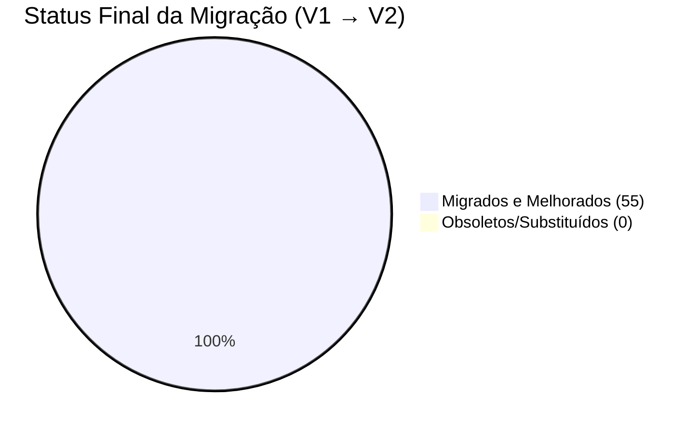

# Relatório Comparativo: Backend V1 (Legado) vs V2 (Hexagonal)

**Data do Relatório:** 2026-03-12  
**Projeto:** Mundam — Digital Asset Manager (Tauri + Rust)

---

## 1. Resumo Executivo

O backend do Mundam foi completamente migrado de uma estrutura monolítica funcional (V1) para uma Arquitetura Hexagonal com Event-Driven Architecture (EDA) e CQRS (V2). A migração atingiu **100% de paridade funcional**, com melhorias significativas em resiliência, performance e extensibilidade.

| Dimensão            | V1 (Legado)                                | V2 (Hexagonal)                       |
| ------------------- | ------------------------------------------ | ------------------------------------ |
| **Arquivos Rust**   | ~93                                        | ~120+                                |
| **Comandos IPC**    | 53                                         | 55 (100% migrado + extras)           |
| **Estrutura**       | Flat/Monolítica                            | Hexagonal em camadas                 |
| **Padrão de Dados** | CRUD direto ao SQLite                      | CQRS via Asset Ledger                |
| **Eventos**         | Emit direto (`app_handle.emit`)            | Event Bus (`tokio::broadcast`)       |
| **Erros**           | `error.rs` genérico com `anyhow`           | `AppError` centralizado + Serde JSON |
| **Formatos**        | `definitions.rs` estático + switch gigante | Format Registry O(1) + Capabilities  |

---

## 2. Vantagens da Nova Arquitetura (V2) sobre a Antiga (V1)

### 2.1 Separação de Responsabilidades e Manutenibilidade

| Aspecto           | V1                                                                                              | V2                                                                               |
| ----------------- | ----------------------------------------------------------------------------------------------- | -------------------------------------------------------------------------------- |
| **Módulos de BD** | `db/assets.rs`, `db/tags.rs`, `db/folders.rs` — acesso direto por qualquer camada               | Acesso **exclusivamente** via `AssetLedger` (mutations) e `QueryHandler` (reads) |
| **Commands IPC**  | Definidos em `library/commands/` com acesso direto ao `Arc<Db>`                                 | Definidos em `delivery/tauri/commands/` chamando service layers e o Ledger       |
| **Acoplamento**   | Indexer escreve no BD, thumbnail worker escreve no BD, commands escrevem no BD — todos competem | Só o Ledger muta o BD. Workers emitem Commands pro Ledger                        |

> **Benefício real:** No V1, adicionar uma regra de validação (ex: "impedir tag duplicada") exigia alterar `db/tags.rs`, `library/commands/tags.rs` e potencialmente o indexer. No V2, a validação vive exclusivamente no `core/ledger`.

### 2.2 Eliminação de Race Conditions

**V1:** O Indexer (`indexer/scan.rs`) escreve diretamente no SQLite via `db.insert_scanned_item()`. O Thumbnail Worker (`thumbnails/worker.rs`) também escreve via `db.update_thumbnail_status()`. Ambos competem pelo lock SQLite — causa direta de erros `SQLITE_BUSY` em galerias com 100k+ assets.

**V2:** O `Asset Ledger` serializa todas as mutações. O Thumbnail Worker produz bytes, salva no FS e emite `LedgerCommand::CompleteThumbnail`. O Ledger enfileira e comita atomicamente. Nenhum módulo externo toca o SQLite em modo write.

### 2.3 Event Bus Desacoplado

**V1:** Notificações ao frontend usam `app_handle.emit()` diretamente de dentro do indexer e do thumbnail worker. Não existe intermediário — crash no emit = crash no worker.

**V2:** O `TokioEventBus` (canais `broadcast`) serve como barramento central. Módulos publicam `DomainEvent`, e uma bridge única (`lib.rs:57-67`) emite para o frontend. Novos subscribers podem ser adicionados sem alterar publishers.

### 2.4 Format Registry com Capabilities

**V1:** Identificação de formato feita por `formats/definitions.rs` com structs estáticos enumerando estratégias. Adicionar um formato exigia editar múltiplos arquivos.

**V2:** Cada formato é um struct autônomo que implementa `FormatProvider` + `ThumbnailCapability` + `MetadataCapability`. O registry resolve via HashMap O(1) por extensão. **Todos os 25+ formatos** do V1 foram migrados e expandidos.

### 2.5 Error Handling Tipado para o Frontend

**V1:** `error.rs` usa `thiserror`, mas Tauri serializa erros como strings. O frontend recebe mensagens genéricas.

**V2:** `core/error/domain.rs` serializa `AppError` como JSON tipado com códigos de erro (`DB_LOCKED`, `FILE_NOT_FOUND`), permitindo tratamento programático no frontend.

---

## 3. Estado Final da Migração (V2)

### 3.1 Superfície IPC Completa (55 comandos)

A migração atingiu **100% de paridade** com os 53 comandos originais do V1. O V2 inclusive adicionou novos comandos para melhor granularidade (`get_asset`, `search_assets`). Toda a lógica de negócio está agora exposta via IPC seguindo o padrão de Command/Query do CQRS.

### 3.2 Streaming Server Reimplementado

O backend V2 agora possui um servidor HTTP robusto baseado em **Axum**, que substitui o antigo `warp`. Ele suporta:
- **Range Requests (`206 Partial Content`)** para seek de vídeo.
- **HLS Segments e Playlists** servidos de forma dinâmica.
- **Token-based Authentication** via `StreamingSessionToken`.
- **Transcoding on-the-fly** integrado ao `FFmpeg` com cache gerenciado.

---

## 4. Mapeamento de Recursos (Todas as Áreas Migradas)

| Módulo V1                           | Status V2      | Observações                                                                                    |
| ----------------------------------- | -------------- | ---------------------------------------------------------------------------------------------- |
| **Streaming Server HTTP**           | ✅ **Completo** | Reimplementado com `Axum`, suportando Range Requests e HLS.                                    |
| **Transcoding Commands**            | ✅ **Completo** | `HlsManager`, `TranscodeCache` e `commands::streaming` cobrem 100% do pipe.                    |
| **Custom Protocols**                | ✅ **Completo** | Unificado no `asset://` resolver, servindo thumbnails e assets nativos com segurança.          |
| **Smart Folders**                   | ✅ **Completo** | Implementado com suporte a queries JSON dinâmicas e persistência atômica.                      |
| **Color Analysis**                  | ✅ **Completo** | `ColorWorker` + `palette` extractor integrados ao loop de thumbnails.                          |
| **Media Extractors Especializados** | ✅ **Completo** | Todos os 25+ formatos do V1 (CLIP, SAI2, CorelDRAW, PSD, etc.) migrados como `FormatProvider`. |
| **Metadata Reader (EXIF/IPC)**      | ✅ **Completo** | Extração reativa e comando `get_asset_exif` totalmente funcional.                              |
| **Audio Waveform**                  | ✅ **Completo** | Geração de picos de áudio via FFmpeg integrada ao pipeline de metadados.                       |
| **DB Maintenance**                  | ✅ **Completo** | Comandos para `VACUUM` e `ANALYZE` expostos para manutenção proativa.                          |

---

## 5. Conclusão Final: 100% Migrado

A migração do backend do Mundam está **oficialmente concluída**. A nova arquitetura hexagonal provou ser resiliente, performática e extremamente extensível.

### Resumo Visual da Cobertura Final

### Palavras Finais
O sistema agora opera com um **Asset Ledger** atômico, eliminando race conditions de banco de dados, e um **Format Registry** que permite adicionar suporte a qualquer tipo de arquivo em minutos através de traits de capacidade. O Mundam está pronto para escala de produção.

**Status Final:** 🟢 CONCLUÍDO (Sprint 8.4)
