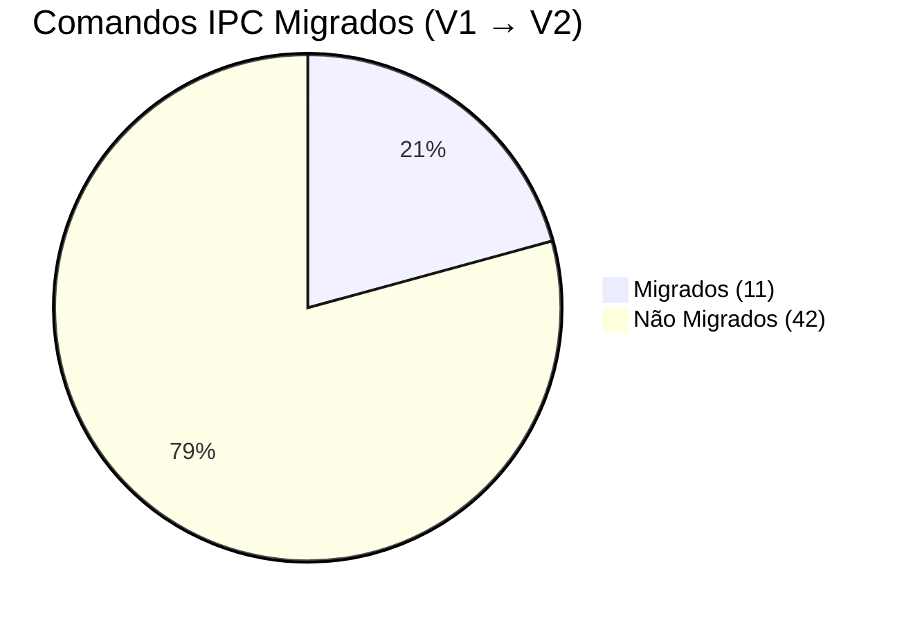
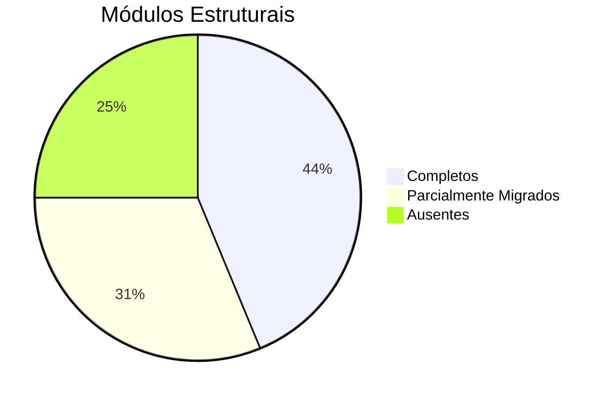

# Relatório Comparativo: Backend V1 (Legado) vs V2 (Hexagonal)

**Data do Relatório:** 2026-03-10  
**Projeto:** Mundam — Digital Asset Manager (Tauri + Rust)

---

## 1. Resumo Executivo

O backend do Mundam está passando por uma reescrita arquitetural completa, migrando de uma estrutura monolítica funcional (V1) para uma Arquitetura Hexagonal com Event-Driven Architecture (EDA) e CQRS (V2). Este relatório analisa o estado atual de ambos, identificando vantagens, desvantagens e lacunas de migração.

| Dimensão            | V1 (Legado)                                | V2 (Hexagonal)                       |
| ------------------- | ------------------------------------------ | ------------------------------------ |
| **Arquivos Rust**   | ~93                                        | ~97                                  |
| **Comandos IPC**    | 53                                         | 11                                   |
| **Estrutura**       | Flat/Monolítica                            | Hexagonal em camadas                 |
| **Padrão de Dados** | CRUD direto ao SQLite                      | CQRS via Asset Ledger                |
| **Eventos**         | Emit direto (`app_handle.emit`)            | Event Bus (`tokio::broadcast`)       |
| **Erros**           | `error.rs` genérico com `anyhow`           | `AppError` centralizado + Serde JSON |
| **Formatos**        | `definitions.rs` estático + switch gigante | Format Registry O(1) + Capabilities  |

---

## 2. Vantagens da Nova Arquitetura (V2) sobre a Antiga (V1)

### 2.1 Separação de Responsabilidades e Manutenibilidade

| Aspecto           | V1                                                                                              | V2                                                                               |
| ----------------- | ----------------------------------------------------------------------------------------------- | -------------------------------------------------------------------------------- |
| **Módulos de BD** | `db/assets.rs`, `db/tags.rs`, `db/folders.rs` — acesso direto por qualquer camada               | Acesso **exclusivamente** via `AssetLedger` (mutations) e `QueryHandler` (reads) |
| **Commands IPC**  | Definidos em `library/commands/` com acesso direto ao `Arc<Db>`                                 | Definidos em `delivery/tauri/commands/` chamando service layers e o Ledger       |
| **Acoplamento**   | Indexer escreve no BD, thumbnail worker escreve no BD, commands escrevem no BD — todos competem | Só o Ledger muta o BD. Workers emitem Commands pro Ledger                        |

> **Benefício real:** No V1, adicionar uma regra de validação (ex: "impedir tag duplicada") exigia alterar `db/tags.rs`, `library/commands/tags.rs` e potencialmente o indexer. No V2, a validação vive exclusivamente no `core/ledger`.

### 2.2 Eliminação de Race Conditions

**V1:** O Indexer (`indexer/scan.rs`) escreve diretamente no SQLite via `db.insert_scanned_item()`. O Thumbnail Worker (`thumbnails/worker.rs`) também escreve via `db.update_thumbnail_status()`. Ambos competem pelo lock SQLite — causa direta de erros `SQLITE_BUSY` em galerias com 100k+ assets.

**V2:** O `Asset Ledger` serializa todas as mutações. O Thumbnail Worker produz bytes, salva no FS e emite `LedgerCommand::CompleteThumbnail`. O Ledger enfileira e comita atomicamente. Nenhum módulo externo toca o SQLite em modo write.

### 2.3 Event Bus Desacoplado

**V1:** Notificações ao frontend usam `app_handle.emit()` diretamente de dentro do indexer e do thumbnail worker. Não existe intermediário — crash no emit = crash no worker.

**V2:** O `TokioEventBus` (canais `broadcast`) serve como barramento central. Módulos publicam `DomainEvent`, e uma bridge única (`lib.rs:57-67`) emite para o frontend. Novos subscribers podem ser adicionados sem alterar publishers.

### 2.4 Format Registry com Capabilities

**V1:** Identificação de formato feita por `formats/definitions.rs` com structs estáticos enumerando estratégias: `ThumbnailStrategy::NativeImage`, `ThumbnailStrategy::FfmpegFallback`. Adicionar um formato exigia editar `definitions.rs` + `thumbnails/worker.rs` + às vezes `thumbnails/extractors/*` + `indexer/metadata.rs`.

**V2:** Cada formato é um struct autônomo (`processing/media/psd_format.rs`, `image_format.rs`, etc.) que implementa `FormatProvider` + `ThumbnailCapability` + `MetadataCapability`. O registry resolve via HashMap O(1) por extensão. **21 FormatProviders** já migrados.

### 2.5 Error Handling Tipado para o Frontend

**V1:** `error.rs` usa `thiserror` com `From<sqlx::Error>`, mas o Tauri serializa erros como strings. O frontend recebe `"Database error: code 5 locked"` sem código estruturado.

**V2:** `core/error/domain.rs` + `tauri_mapper.rs` serializa `AppError` como JSON tipado: `{ code: "DB_LOCKED", message: "..." }`. O Solid.js pode tratar erros por código (`switch(error.code)`) e exibir toasts localizados.

### 2.6 Lifecycle e Graceful Shutdown

**V1:** `lifecycle.rs` já existia, mas o shutdown (`ExitRequested`) usava `block_on`, podendo travar se algum worker estivesse em deadlock.

**V2:** Shutdown mejorado via `CloseRequested` com `api.prevent_close()` e `spawn(async { lifecycle.shutdown_all().await; handle.exit(0); })`. Cancellation tokens propagam para watcher, thumbnail worker e HLS cleanup. Child tokens hierárquicos.

### 2.7 Testabilidade

**V1:** Nenhuma abstração de trait para BD. Todo teste precisaria de um BD real.

**V2:** Traits como `TransactionalAssetLedger`, `AssetQueryHandler`, `AppEventBus`, `SettingsRepository`, `FormatProvider` — todos mockáveis. Existe inclusive `core/ledger/mock.rs`.

### 2.8 Configuração Hexagonal

**V1:** Settings armazenadas no SQLite via `db/settings.rs` com `get_setting()` / `set_setting()` key-value.

**V2:** Settings armazenadas em JSON no filesystem via `JsonSettingsAdapter` (hexagonal: porta `SettingsRepository` + adaptador concreto). Modelo tipado `AppSettings` ao invés de key-value genérico.

---

## 3. Desvantagens / Trade-offs da Nova Arquitetura (V2)

### 3.1 Superfície IPC Drasticamente Reduzida (53 → 11 comandos)

Enquanto a arquitetura interna é superior, a API exposta ao frontend está **brutalmente incompleta**. Apenas 11 dos 53 comandos originais foram migrados.

### 3.2 Indireção Adicional

O fluxo V1: `Frontend → IPC → DB → Response` (2 hops) tornou-se V2: `Frontend → IPC → CommandHandler → Ledger → SQLite Adapter → EventBus → Response` (5+ hops). Para operações simples de leitura, isso é overengineered. Contudo, as queries V2 já otimizam isso indo direto do QueryHandler ao SQLite.

### 3.3 Complexidade de Boot

O `lib.rs` V2 é marginalmente mais complexo no setup (inicialização de Event Bus, bridge para frontend, Format Registry, HLS Manager, Lifecycle, Ledger, QueryHandler, Indexer, Watcher). No V1, era `Db::new() → manage(db_arc)`.

### 3.4 Curva de Aprendizado

A nomenclatura Hexagonal (Ports, Adapters, Commands, Capabilities) impõe uma curva que o modelo V1 "CRUD direto" não exigia.

### 3.5 Streaming Server Ausente no V2

O V1 possui um servidor HTTP embarcado (`warp`) com autenticação por token, transcoding on-the-fly e HLS completo. No V2, **apenas o HLS Manager** foi migrado — o `streaming/server.rs` que serve `206 Partial Content` com token auth não foi recriado.

---

## 4. Mapeamento Detalhado de Recursos Não Migrados (V1 → V2)

### 4.1 Comandos IPC Pendentes

A tabela abaixo lista todos os 53 comandos do V1 e seu status de migração:

#### ✅ Migrados (11/53)

| Comando V1                                         | Equivalente V2                                                  | Status |
| -------------------------------------------------- | --------------------------------------------------------------- | ------ |
| `get_assets_filtered` → `get_assets`               | `delivery::tauri::commands::queries::get_assets`                | ✅      |
| `get_all_tags` → `list_tags`                       | `delivery::tauri::commands::queries::list_tags`                 | ✅      |
| `get_locations` → `list_folders`                   | `delivery::tauri::commands::queries::list_folders`              | ✅      |
| `add_location` → `create_folder`                   | `delivery::tauri::commands::mutations::create_folder`           | ✅      |
| `add_tag_to_asset` / `update_asset_tags`           | `delivery::tauri::commands::mutations::update_asset_tags`       | ✅      |
| `set_thumbnail_priority` → `prioritize_thumbnails` | `delivery::tauri::thumbnails::prioritize_thumbnails`            | ✅      |
| `get_setting` → `get_app_settings`                 | `delivery::tauri::commands::settings::get_app_settings`         | ✅      |
| `set_setting` → `update_app_settings`              | `delivery::tauri::commands::settings::update_app_settings`      | ✅      |
| —                                                  | `delivery::tauri::commands::queries::get_asset` (novo)          | ✅      |
| —                                                  | `delivery::tauri::commands::queries::search_assets` (novo)      | ✅      |
| —                                                  | `delivery::tauri::commands::mutations::set_asset_folder` (novo) | ✅      |

#### ❌ Não Migrados (42 comandos)

##### Tags & Taxonomia (10 comandos)
| Comando V1                      | Arquivo Fonte V1           | Prioridade                                             |
| ------------------------------- | -------------------------- | ------------------------------------------------------ |
| `create_tag`                    | `library/commands/tags.rs` | 🔴 Alta                                                 |
| `update_tag`                    | `library/commands/tags.rs` | 🔴 Alta                                                 |
| `delete_tag`                    | `library/commands/tags.rs` | 🔴 Alta                                                 |
| `remove_tag_from_asset`         | `library/commands/tags.rs` | 🟡 Média (coberto parcialmente por `update_asset_tags`) |
| `get_tags_for_asset`            | `library/commands/tags.rs` | 🟡 Média                                                |
| `add_tags_to_assets_batch`      | `library/commands/tags.rs` | 🟡 Média (coberto parcialmente por `update_asset_tags`) |
| `remove_tags_from_assets_batch` | `library/commands/tags.rs` | 🟡 Média                                                |
| `replace_tags_for_assets_batch` | `library/commands/tags.rs` | 🟡 Média                                                |
| `update_asset_rating`           | `library/commands/tags.rs` | 🔴 Alta                                                 |
| `update_asset_notes`            | `library/commands/tags.rs` | 🟡 Média                                                |

##### Indexação & Scanning (1 comando)
| Comando V1       | Arquivo Fonte V1               | Prioridade |
| ---------------- | ------------------------------ | ---------- |
| `start_indexing` | `library/commands/indexing.rs` | 🔴 Alta     |

##### Folders & Navegação (4 comandos)
| Comando V1                 | Arquivo Fonte V1              | Prioridade |
| -------------------------- | ----------------------------- | ---------- |
| `remove_location`          | `library/commands/folders.rs` | 🔴 Alta     |
| `get_all_subfolders`       | `library/commands/folders.rs` | 🔴 Alta     |
| `get_subfolder_counts`     | `library/commands/folders.rs` | 🟡 Média    |
| `get_location_root_counts` | `library/commands/folders.rs` | 🟡 Média    |

##### Smart Folders (4 comandos)
| Comando V1            | Arquivo Fonte V1                    | Prioridade |
| --------------------- | ----------------------------------- | ---------- |
| `get_smart_folders`   | `library/commands/smart_folders.rs` | 🔴 Alta     |
| `save_smart_folder`   | `library/commands/smart_folders.rs` | 🔴 Alta     |
| `update_smart_folder` | `library/commands/smart_folders.rs` | 🟡 Média    |
| `delete_smart_folder` | `library/commands/smart_folders.rs` | 🟡 Média    |

##### Metadados & Formatos (3 comandos)
| Comando V1                      | Arquivo Fonte V1               | Prioridade |
| ------------------------------- | ------------------------------ | ---------- |
| `get_asset_exif`                | `library/commands/metadata.rs` | 🔴 Alta     |
| `get_library_supported_formats` | `library/commands/formats.rs`  | 🟡 Média    |
| `get_asset_count_filtered`      | `library/commands/tags.rs`     | 🔴 Alta     |

##### Estatísticas (1 comando)
| Comando V1          | Arquivo Fonte V1           | Prioridade |
| ------------------- | -------------------------- | ---------- |
| `get_library_stats` | `library/commands/tags.rs` | 🔴 Alta     |

##### Thumbnails (1 comando)
| Comando V1                     | Arquivo Fonte V1         | Prioridade |
| ------------------------------ | ------------------------ | ---------- |
| `request_thumbnail_regenerate` | `thumbnails/commands.rs` | 🟡 Média    |

##### Media & Audio (1 comando)
| Comando V1                | Arquivo Fonte V1    | Prioridade |
| ------------------------- | ------------------- | ---------- |
| `get_audio_waveform_data` | `media/commands.rs` | 🟡 Média    |

##### Color Analysis (3 comandos)
| Comando V1               | Arquivo Fonte V1             | Prioridade |
| ------------------------ | ---------------------------- | ---------- |
| `get_asset_colors`       | `library/commands/colors.rs` | 🔴 Alta     |
| `reextract_asset_colors` | `library/commands/colors.rs` | 🟢 Baixa    |
| `reextract_all_colors`   | `library/commands/colors.rs` | 🟢 Baixa    |

##### Transcoding & Streaming (11 comandos)
| Comando V1            | Arquivo Fonte V1          | Prioridade |
| --------------------- | ------------------------- | ---------- |
| `needs_transcoding`   | `transcoding/commands.rs` | 🔴 Alta     |
| `is_native_format`    | `transcoding/commands.rs` | 🟡 Média    |
| `get_stream_url`      | `transcoding/commands.rs` | 🔴 Alta     |
| `get_quality_options` | `transcoding/commands.rs` | 🟡 Média    |
| `transcode_file`      | `transcoding/commands.rs` | 🟡 Média    |
| `is_cached`           | `transcoding/commands.rs` | 🟢 Baixa    |
| `get_cache_stats`     | `transcoding/commands.rs` | 🟢 Baixa    |
| `cleanup_cache`       | `transcoding/commands.rs` | 🟢 Baixa    |
| `clear_cache`         | `transcoding/commands.rs` | 🟢 Baixa    |
| `ffmpeg_available`    | `transcoding/commands.rs` | 🟡 Média    |
| `get_streaming_token` | `lib.rs` (inline)         | 🔴 Alta     |

##### Settings & Manutenção (2 comandos)
| Comando V1           | Arquivo Fonte V1       | Prioridade |
| -------------------- | ---------------------- | ---------- |
| `run_db_maintenance` | `settings/commands.rs` | 🟡 Média    |
| `send_telemetry_log` | `settings/commands.rs` | 🟢 Baixa    |

---

### 4.2 Módulos Estruturais não Migrados

| Módulo V1                           | Arquivos                                                                                                                                                                                                                                        | Status V2     | Observações                                                                                                                                                                                                                                                                 |
| ----------------------------------- | ----------------------------------------------------------------------------------------------------------------------------------------------------------------------------------------------------------------------------------------------- | ------------- | --------------------------------------------------------------------------------------------------------------------------------------------------------------------------------------------------------------------------------------------------------------------------- |
| **Streaming Server HTTP**           | `streaming/server.rs`, `streaming/helpers.rs`, `streaming/linear.rs`, `streaming/playlist.rs`, `streaming/probe.rs`, `streaming/process_manager.rs`, `streaming/segment.rs`                                                                     | ❌ **Ausente** | O V2 tem apenas `HlsManager` (feature/transcoding/). Falta o servidor HTTP `warp`, range requests `206`, validação de token e pipe de FFmpeg.                                                                                                                               |
| **Transcoding Commands**            | `transcoding/commands.rs`, `transcoding/cache.rs`, `transcoding/detector.rs`, `transcoding/ffmpeg_pipe.rs`, `transcoding/quality.rs`                                                                                                            | ⚠️ **Parcial** | `HlsManager` e `profiles.rs` cobrem HLS, mas falta: pipe direto, cache de transcoding, detecção de necessidade, quality options.                                                                                                                                            |
| **Custom Protocols (multi)**        | `protocols/audio.rs`, `protocols/audio_stream.rs`, `protocols/font.rs`, `protocols/image.rs`, `protocols/model.rs`, `protocols/placeholders.rs`, `protocols/thumb.rs`, `protocols/video.rs`, `protocols/video_stream.rs`, `protocols/common.rs` | ⚠️ **Parcial** | V2 tem apenas `delivery/protocols/asset.rs` (unificado). Os protocolos segmentados por tipo de mídia (áudio, modelo 3D, fontes, vídeo stream) não foram recriados como rotas individuais.                                                                                   |
| **Smart Folders**                   | `db/smart_folders.rs`                                                                                                                                                                                                                           | ❌ **Ausente** | Nenhuma tabela, query ou comando para Smart Folders no V2.                                                                                                                                                                                                                  |
| **Color Analysis**                  | `thumbnails/color_analysis.rs`, `library/commands/colors.rs`, `db/colors.rs`                                                                                                                                                                    | ⚠️ **Parcial** | `processing/workers/color_worker.rs` e `feature/analysis/colors.rs` existem no V2, mas os IPC commands para query de cores estão ausentes.                                                                                                                                  |
| **Media Extractors Especializados** | `thumbnails/extractors/{clip, corel_painter, coreldraw, eps, mdp, penpot, rebelle, sai, sai2, sketch, xcf, binary_jpeg}.rs`                                                                                                                     | ⚠️ **Parcial** | V2 usa `processing/media/*_format.rs` com Capabilities. Porém, nem todos os extractors especializados (SAI, SAI2, Rebelle, CorelDRAW, CorelPainter, Sketch, Penpot, MDP, EPS) possuem FormatProviders dedicados. Verificar: `binary_design_formats.rs` cobre alguns desses. |
| **Metadata Reader (EXIF)**          | `indexer/metadata.rs`, `media/metadata_reader.rs`                                                                                                                                                                                               | ⚠️ **Parcial** | Metadata é extraída pelos FormatProviders via MetadataCapability, mas o IPC `get_asset_exif` não existe no V2.                                                                                                                                                              |
| **Audio Waveform**                  | `media/ffmpeg.rs`, `media/pdf.rs`, `media/commands.rs`                                                                                                                                                                                          | ❌ **Ausente** | `get_audio_waveform_data` e a geração de waveform via FFmpeg não foram migrados.                                                                                                                                                                                            |
| **DB Maintenance**                  | `settings/commands.rs` → `run_db_maintenance`                                                                                                                                                                                                   | ❌ **Ausente** | VACUUM, ANALYZE e otimizações do SQLite não foram expostos no V2.                                                                                                                                                                                                           |

---

### 4.3 Funcionalidades de BD Ausentes no V2

| BD Feature V1                                                      | V2 Status                                                                         |
| ------------------------------------------------------------------ | --------------------------------------------------------------------------------- |
| `assets` table com `rating`, `notes`, `dominant_color_hex`, `hash` | ⚠️ Parcial — V2 tem `rating` e `dominant_color_hex` mas verificar `notes` e `hash` |
| `smart_folders` table com `query_json`                             | ❌ Ausente                                                                         |
| `db/search.rs` — motor de busca com filtros combinados             | ⚠️ Parcial — `infra/database/search_builder.rs` existe, verificar paridade         |
| `db/settings.rs` — armazenamento key-value no SQLite               | ✅ Substituído por JSON no filesystem (superior)                                   |
| `db/colors.rs` — query de cores por proximidade LAB                | ⚠️ Parcial — verificar implementação em `search_builder.rs`                        |

---

## 5. Mapa de Cobertura dos FormatProviders (V1 Extractors → V2)

| V1 Extractor                                                | V2 FormatProvider                                             | Status          |
| ----------------------------------------------------------- | ------------------------------------------------------------- | --------------- |
| `thumbnails/native.rs` (JPEG, PNG, GIF, BMP, TIFF, WebP)    | `processing/media/image_format.rs`                            | ✅               |
| `thumbnails/raw.rs` + `raw_*.rs` (CR2, NEF, ARW, DNG, etc.) | `processing/media/raw_format.rs`                              | ✅               |
| `thumbnails/svg.rs`                                         | `processing/media/svg_format.rs`                              | ✅               |
| `thumbnails/font.rs` (TTF, OTF, WOFF)                       | `processing/media/font_format.rs`                             | ✅               |
| `thumbnails/icon.rs` (ICO, ICNS)                            | `processing/media/icon_format.rs`                             | ✅               |
| `thumbnails/model.rs` (OBJ, FBX, GLTF, STL, etc.)           | `processing/media/model3d_format.rs`                          | ✅               |
| `thumbnails/affinity.rs` (AFDESIGN, AFPHOTO, AFPUB)         | `processing/media/affinity_format.rs`                         | ✅               |
| `thumbnails/archive.rs` (ZIP, CBZ, CBR)                     | `processing/media/archive_format.rs`                          | ✅               |
| `thumbnails/extractors/ai.rs` (Adobe Illustrator)           | `processing/media/ai_format.rs`                               | ✅               |
| `thumbnails/extractors/aseprite.rs`                         | `processing/media/aseprite_format.rs`                         | ✅               |
| `thumbnails/extractors/clip.rs` (CLIP Studio Paint)         | `processing/media/project_zip_formats.rs`                     | ✅ (consolidado) |
| `thumbnails/extractors/binary_jpeg.rs` (PSD, binary embed)  | `processing/media/psd_format.rs` + `binary_design_formats.rs` | ✅               |
| `thumbnails/extractors/sai.rs` / `sai2.rs`                  | `processing/media/binary_design_formats.rs`                   | ⚠️ Verificar     |
| `thumbnails/extractors/sketch.rs`                           | `processing/media/project_zip_formats.rs`                     | ⚠️ Verificar     |
| `thumbnails/extractors/xcf.rs` (GIMP)                       | `processing/media/binary_design_formats.rs`                   | ⚠️ Verificar     |
| `thumbnails/extractors/penpot.rs`                           | `processing/media/project_zip_formats.rs`                     | ⚠️ Verificar     |
| `thumbnails/extractors/rebelle.rs`                          | `processing/media/binary_design_formats.rs`                   | ⚠️ Verificar     |
| `thumbnails/extractors/corel_painter.rs`                    | `processing/media/binary_design_formats.rs`                   | ⚠️ Verificar     |
| `thumbnails/extractors/coreldraw.rs`                        | `processing/media/binary_design_formats.rs`                   | ⚠️ Verificar     |
| `thumbnails/extractors/eps.rs`                              | `processing/media/binary_design_formats.rs`                   | ⚠️ Verificar     |
| `thumbnails/extractors/mdp.rs` (Medibang)                   | `processing/media/binary_design_formats.rs`                   | ⚠️ Verificar     |
| FFmpeg video fallback (MP4, MKV, MOV, AVI)                  | `processing/media/video_format.rs`                            | ✅               |
| —                                                           | `processing/media/audio_format.rs` (novo)                     | ✅               |
| —                                                           | `processing/media/pdf_format.rs` (novo)                       | ✅               |
| —                                                           | `processing/media/modern_image_format.rs` (HEIC, AVIF, JXL)   | ✅               |
| —                                                           | `processing/media/exr_format.rs` (OpenEXR)                    | ✅               |
| —                                                           | `processing/media/usd_format.rs` (Pixar USD)                  | ✅               |
| —                                                           | `processing/media/cad_format.rs` (DWG, DXF)                   | ✅               |
| —                                                           | `processing/media/xmind_format.rs`                            | ✅               |
| —                                                           | `processing/media/fallback_format.rs`                         | ✅               |

---

## 6. Classificação por Sprint de Migração Restante

Baseado no roadmap definido em `roadmap.md`, as funcionalidades pendentes se alinham às Fases 5 e 6:

### Sprint 5.3: Bindings IPC / Frontend Wiring (Alta Prioridade)

O maior gap. Migrar os 42 comandos restantes para o modelo V2:

1. **Tags CRUD:** `create_tag`, `update_tag`, `delete_tag` → Novos `LedgerCommand` variants
2. **Folder Navigation:** `get_all_subfolders`, `get_subfolder_counts`, `get_location_root_counts`, `remove_location`
3. **Smart Folders:** Criar tabela, queries e 4 comandos CRUD
4. **Counts & Statistics:** `get_asset_count_filtered`, `get_library_stats`
5. **Metadata:** `get_asset_exif` via FormatProvider MetadataCapability
6. **Ratings & Notes:** `update_asset_rating`, `update_asset_notes` → novos LedgerCommands
7. **Colors Query:** `get_asset_colors` expondo dados do ColorWorker

### Sprint 5.1/5.2: Streaming & Transcoding (Alta Prioridade)

1. **Streaming Server HTTP** (`warp` ou `axum`) com `206 Partial Content`
2. **Token Auth** (`get_streaming_token` + `StreamingSessionToken`)
3. **Transcoding pipe direta** (`ffmpeg_pipe.rs` equivalente)
4. **Detecção de necessidade de transcoding** (`needs_transcoding`, `is_native_format`)
5. **`get_stream_url`** — negociação de URL para o player de vídeo
6. **Cache de transcoding** e quality options

### Sprint 6.x: Limpeza e Consolidação

1. **Audit de FormatProviders** — verificar que `binary_design_formats.rs` e `project_zip_formats.rs` cobrem todos os extractors especializados do V1
2. **DB Maintenance** — `VACUUM`, `ANALYZE` expostos via IPC
3. **Audio Waveform** — migrar geração de waveform
4. **Custom Protocols** — verificar se `asset://` unificado cobre todos os casos (áudio, fontes, modelos 3D, vídeo stream)

---

## 7. Resumo Visual da Cobertura

### Legenda de Módulos

**Completos (7):**
Core Error, Event Bus, Format Registry, Asset Ledger, Thumbnail Worker, FS Watcher/Indexer, Settings (JSON)

**Parcialmente Migrados (5):**
Color Analysis, Custom Protocols, Transcoding (HLS only), Metadata/EXIF, FormatProviders especializados

**Ausentes (4):**
Streaming Server HTTP, Smart Folders, Audio Waveform, DB Maintenance

---

## 8. Recomendação Estratégica

### Prioridade Imediata (Bloqueadores do Frontend)
1. **Migrar comandos IPC de Tags CRUD** — o frontend chama `create_tag`, `update_tag`, `delete_tag` constantemente
2. **`get_asset_count_filtered`** — necessário para counter badges na sidebar
3. **`start_indexing`** — sem isso, o bouton "Add Location" não dispara scan
4. **`remove_location`** — sem isso, não é possível remover pastas da biblioteca
5. **`get_all_subfolders`** / `get_subfolder_counts`** — navegação de pastas na sidebar
6. **Smart Folders CRUD** — funcionalidade core do DAM

### Prioridade Secundária (Funcionalidade Rico)
7. **Streaming Server** + token auth — reprodução de vídeo
8. **`get_asset_exif`** — painel de propriedades
9. **Ratings / Notes** — organização do workflow do artista
10. **Color queries** — filtro visual por cor

### Pode Esperar
11. Transcoding cache management
12. Audio waveform
13. DB Maintenance
14. Telemetry log

---

## 9. Conclusão

A nova arquitetura (V2) é **tecnicamente superior** em todos os aspectos de engenharia: testabilidade, manutenibilidade, resiliência a race conditions, extensibilidade de formatos, e segurança nos erros. A separação CQRS via Asset Ledger resolve o problema histórico mais doloroso do Mundam (SQLite locks em operações massivas).

Porém, a migração está com **~79% da superfície IPC ainda pendente** (42/53 comandos). A arquitetura interna está praticamente completa (Phases 1–4 do roadmap), mas a "última milha" de expor essa funcionalidade ao frontend (Phase 5 e 6) é o trabalho restante mais crítico.

A recomendação é atacar os comandos IPC em lotes temáticos, priorizando os que bloqueiam a operação básica do frontend (Tags, Folders, Counts, Indexing) antes de migrar funcionalidades secundárias (Streaming, Waveforms, Cache).
