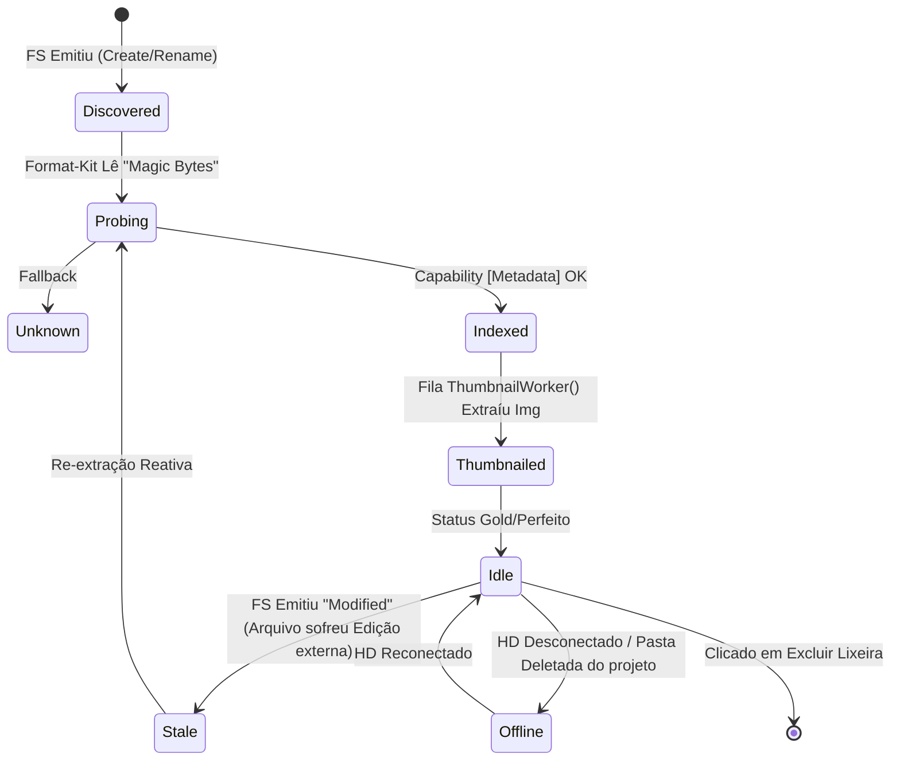
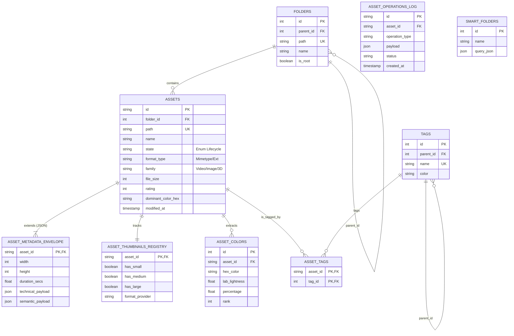

# Data Model & State Machine (O Coração do Banco e do Asset)

Na nova arquitetura (Hexagonal + CQRS), o modelo de dados e a máquina de estado do Asset devem refletir a separação entre *O que aconteceu* (Eventos/Comandos) e *O que o usuário vê* (Read Model / Projeções otimizadas para a UI). O mundam usa primariamente **SQLite local**, portanto, o design do banco usa `JSONB/JSON` gerado de forma inteligente para escalar a diversidade de campos que diferentes "Capabilities" dos formatos exigirão.

---

## 1. CQRS no SQLite (Tabelas de "Mutation" vs "Read")

No SQLite, não rodamos um "Event Sourcing" puro e complexo (onde a tabela só guarda os eventos como num banco no-sql e calcula o estado total no *boot*). Ao invés disso, trabalharemos de forma Híbrida/Pragmática (CQRS simplificado).

### 1.1 `asset_operations_log` (O Auditor de Eventos Reativos)
Quando o Ledger aceita uma mutação brutal (ex: Deletar arquivo ou Alterar massivamente Tags), ele grava esse comando na tabela de log. Isso serve para `Undo/Redo`, rastreio de telemetria falha de I/O em Filesystem e Resiliência.

```sql
CREATE TABLE asset_operations_log (
    id TEXT PRIMARY KEY,
    operation_type TEXT NOT NULL,      -- Ex: "MOVE_ASSET", "UPDATE_TAGS", "FS_DELETE"
    asset_id TEXT NOT NULL,
    payload JSON NOT NULL,             -- Ex: {"tags_added": ["ferias"], "tags_removed": []}
    status TEXT NOT NULL,              -- "PENDING", "COMPLETED", "FAILED"
    error_note TEXT,
    created_at TIMESTAMP DEFAULT CURRENT_TIMESTAMP
);
```

### 1.2 `assets` e `asset_metadata_envelope` (The Query/Read Models)
É a tabela espelho-d'água usada velozmente pelo Frontend e pelo `QueryHandler` do Tauri. Estruturada para Paginação rápida.

```sql
CREATE TABLE assets (
    id TEXT PRIMARY KEY,
    name TEXT NOT NULL,
    path TEXT UNIQUE NOT NULL,         -- Path absoluto
    state TEXT NOT NULL,               -- Máquina de estado (Ex: "INDEXED", "STALE")
    format_type TEXT NOT NULL,         -- Resolvido via Format-Kit (Ex: "image/jpeg", "model/gltf", "unknown")
    family TEXT NOT NULL,              -- Categoria para UI (Ex: "IMAGE", "VIDEO", "3D", "PROJECT")
    file_size INTEGER NOT NULL,
    created_at TIMESTAMP,
    updated_at TIMESTAMP
);

-- Tabela Envelope de Metadados Abstrata:
-- Aqui brilhamos com os formatos dinâmicos do Format-kit. O "PSD" não tem "duração de vídeo", 
-- e o "MP4" não tem "Câmera ISO". Essa tabela normaliza e flexibiliza perfeitamente os dados em SQLite.
CREATE TABLE asset_metadata_envelope (
    asset_id TEXT PRIMARY KEY,
    width INTEGER,                     -- Core query prop (visual grid)
    height INTEGER,                    -- Core query prop (visual grid)
    duration_secs REAL,                -- Core query prop (exclusivo media timer)
    dominant_colors JSON,              -- Core query prop (Paletas hex base para a listagem)
    
    -- "Technical" recebe FFMPEG Probe (codec_name, bit_rate), EXIF cru total, PDFium stats, etc. Isolado para Inspector e Deep Search.
    technical_payload JSON,            

    -- "Semantic" recebe Tags IA, Face Detection Coordinates, OCR de texto, OCR de PDF. Isolado para Filtro de Busca Fuzzy profunda.
    semantic_payload JSON,             

    FOREIGN KEY (asset_id) REFERENCES assets(id) ON DELETE CASCADE
);
```

---

## 2. A Máquina de Estado do Asset (Lifecycle Lifecycle)

O maior erro dos File Watchers comuns é crer que um arquivo detectado já é "Trabalhável". A detecção de 1 GB de vídeo na pasta costuma durar segundos contínuos do S.O.
A nova arquitetura introduz uma **Máquina de Estado** forte operada pelo `AssetLedger`, refletida no campo `state` e controlando quem pode acionar qual capability.



> **E que faz o State Transitioner no Backend?**
> Apenas Arquivos em Transição `Indexed` ou `Stale` podem ser despachados ao Bus para a sub-fila de _Thumbnails_! Evitando que a UI veja ícones quebrados ou processos do *FFmpeg* entrem em deadlock tentando abrir um Arquivo Incompleto (`Discovered`).

---

## 3. Gestão de Miniaturas (O Cache em O.S.)

As Thumbnails não poluem o SQLite pesado, elas existem unicamente no Sistema de Arquivos mapeadas via ID do Asset (Ex: `~/.mundam/thumbnails/small/123-abc.webp`).

O BD tem apenas um apontador de segurança para queries visuais:

```sql
CREATE TABLE asset_thumbnails_registry (
    asset_id TEXT PRIMARY KEY,
    has_small BOOLEAN DEFAULT 0,
    has_medium BOOLEAN DEFAULT 0,
    has_large BOOLEAN DEFAULT 0,
    extracted_at TIMESTAMP,
    format_provider TEXT,               -- O nome da Capability que providenciou a foto (ffmpeg, mupdf, native)
    FOREIGN KEY (asset_id) REFERENCES assets(id) ON DELETE CASCADE
);
```

---

## 4. Diagrama de Entidade-Relacionamento (ERD Completo)

O Diagrama abaixo consolida a visão final do SQLite desenhada nesta nova Arquitetura, abraçando as tabelas nativas de taxonomia persistentes com o empoderamento do Envelope Dinâmico CQRS:


