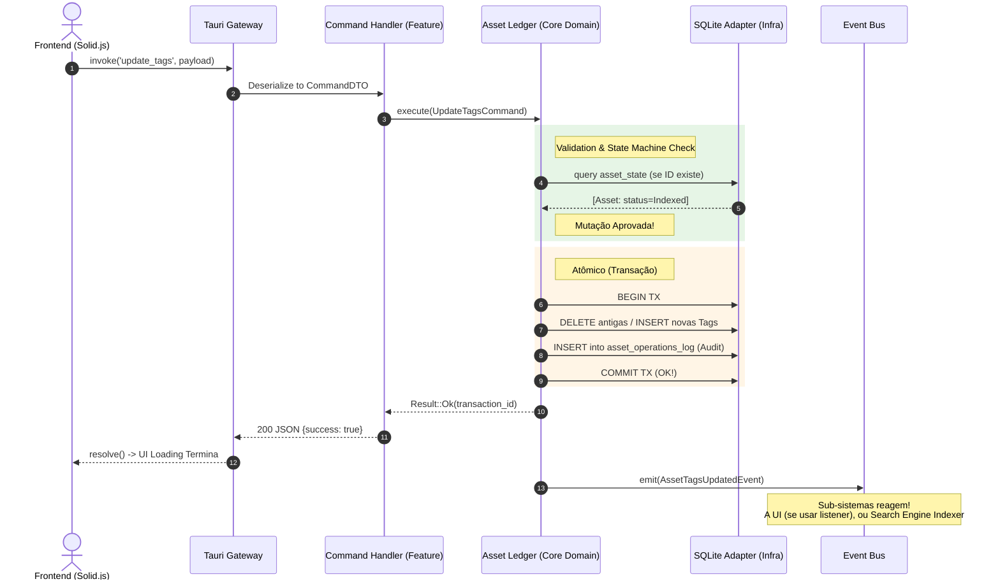

# 01. Asset Ledger e CQRS (A Lógica Mutacional Central)

## 1. Visão Geral e Objetivo Macro

O **Asset Ledger** é o "Motor Principal" e o coração purista da nossa Arquitetura Hexagonal. Ele existe para resolver a fraqueza clássica de sistemas de gerenciamento de arquivos em desktop: **Condições de Corrida (Race Conditions)**. 
Quando o usuário (via interface) e o sistema operacional (via modificação externa de arquivo) tentam alterar a mesma entidade no banco de dados SQLite simultaneamente ao milissegundo, a transação colapsa e gera erros de estado, bloqueios ou arquivos órfãos. 

O objetivo do modelo CQRS centrado no Ledger é ser a única comporta validada por onde todas as "Ordens de Alteração e Gravação" (Commands) passam, antes de tocarem o banco. Ele garante a Idempotência, isola as Leituras rápidas para a UI, e funciona de maneira transacional em Rust, servindo como o guardião rigoroso da base de dados e do File System.

## 2. Localização Exata
`src-tauri/src/core/ledger/`
`src-tauri/src/feature/library/` (Onde habitam os Command Handlers de Assets específicos)

---

## 3. Responsabilidades

### O que NÓS FAZEMOS:
- **Centralizamos toda e qualquer Mutação (Command):** Adicionamos tags, renomeamos arquivos, processamos a detecção de novos mídias e deletamos itens.
- **Validamos a Integridade e o State Machine:** Checamos se a operação é válida para a Máquina de Estados da Mídia (ex: Um asset `Discovered` não pode receber "Update Tags", pois sua extração de formato nem sequer acabou. O Ledger barra o comando no nascedouro).
- **Garantimos Transações Atômicas:** Se precisarmos dar update nas tags *E* mover uma pasta, ou movemos/processamos *tudo* com sucesso ou o SQLite/Filesystem não sofre nenhuma mutação pela metade (Rollback + Registro em `asset_operations_log`).
- **Auditamos em Log:** Escrevemos a assinatura da ação aprovada na `asset_operations_log` antes de dar ok.

### O que NÓS NÃO FAZEMOS:
- **O Ledger NÃO gera Thumbnails.** Ele emite evento "Asset Está Indexado, Trabalhadores: preparem Thumbnails" e o Módulo de Thumbnail pega na Fila.
- **O Ledger NÃO serve listas para a Interface Gráfica.** Operações ricas de leitura cruzam por fora (via `Query Handlers`) e lêem as *Read Tables* na veia do SQLx.
- **O Ledger NÃO reage passivamente:** Ele não escuta eventos de filesystem; ele é um serviço ativado pelos Adaptadores/Handlers (`Command Handlers`).

---

## 4. Diagrama de Sequência de Invocação e Persistência



---

## 5. Estruturas de Dados e Traits (O Contrato "Port")

O contrato estabelece uma Trait (interface) rigorosa que o `LedgerBuilder` no início do App vai injetar na aplicação. Essa Trait abstrai as invocações diretas ao SQLx para permitir testes unitários completos na memória e na RAM usando `MockLedger`.

```rust
// core/ledger/command.rs
// Payload genérico de mutação rigorosa sem SQLx explícito.
pub enum LedgerCommand {
    CreateAsset { path: PathBuf, state_init: AssetState },
    UpdateTags { asset_id: String, add: Vec<String>, remove: Vec<String> },
    DeleteAsset { asset_id: String, physical_delete: bool },
    MarkAsStale { asset_id: String },
    // ...
}

// core/ledger/port.rs
// Interface base para o Core invocar a manipulação. 
// Note que as operações devolvem o Recibo de Log. 
#[async_trait::async_trait]
pub trait TransactionalAssetLedger: Send + Sync {
    async fn execute(&self, command: LedgerCommand) -> Result<String /* Tx ID */, LedgerError>;
}

// O Erro estrito deste Domínio
pub enum LedgerError {
    AssetNotFound(String),
    IllegalStateTransition(AssetState, AssetState),
    UnderlyingStorageFailed(String), // Fallback map para o Adapter de BD
    ConcurrencyViolation,
}
```

---

## 6. Dependências e Conexões com o EventBus

O *Asset Ledger* é em grande parte um **Agente Produtor** (Emitter) do `Event Bus`. 

### Ações Onde o Ledger **Ouve** o Evento do Barramento:
- O Ledger em regra escuta Zero eventos autônomos. Ele é a ponte acionada sempre pelos Handlers (A camada application o recruta) vindos das rotas do Tauri RPC, ou dos Agentes de processamento contínuo (Ex: O *FileWatcher* bate no `CommandHandler`, que repassa o `LedgerCommand::CreateAsset` pro Ledger).

### Ações Onde o Ledger **Emite** o Evento do Barramento:
Toda mutação bem sucedida no banco gera um *Domain Event* equivalente disparado pelo Ledger após o Commit do banco confirmando a fixação de dados:
- `AssetCreatedEvent` (Desperta sub-rotinas de Indexação do formato)
- `AssetTagsUpdatedEvent` (Pode forçar o ElasticSearch/FTS a re-indexar texto livre)
- `AssetStateTransitionedEvent` (Base vital que desperta o "Extrator de Thumbnail" caso a transição caia em `state=Indexed`).
- `AssetDeletedEvent` (Comanda aos adaptadores de I/O de disco limparem respiros da cache de miniaturas física do Mac/Windows).

---

## 7. Tratamento de Erros Esperados

### **Cenário 1: SQLite Trancado Temporal (Busy Lock Timeout)**
- *Causa:* Dois jobs paralelos rodando no banco forçaram um Lock.
- *Comportamento do Ledger:* O adaptador SQLx do Ledger vai fazer *Retry Celing Backoff* transparente 3 vezes em 50ms antes de rejeitar. Se estourar a resiliência adaptativa, ele retorna `LedgerError::UnderlyingStorageFailed` encadeado para o Frontend como `"DB_LOCKED_TIMEDOUT"`. O Command morre limpo na transação e a Tabela de Log Audita o "Failed".

### **Cenário 2: Transição Ilegal de Estado (`IllegalStateTransition`)**
- *Causa:* Frontend mal-sincronizado disparou uma alteração sobre um Asset que o Sistema Operacional já emitiu o evento que o Arquivo foi apagado fora do app, e cujo estado oficial agora é `Offline`.
- *Comportamento do Ledger:* Barra instantaneamente por conflito de lógica mecânica sem tocar no DB. O Frontend recebe o erro elegante `"ILLEGAL_STATE_TRANSITION"`.
