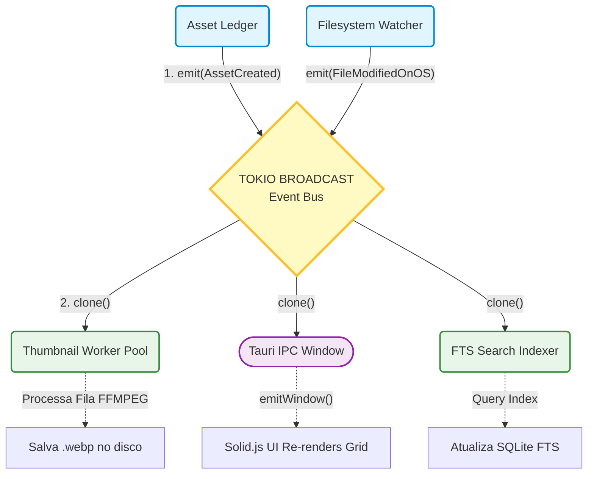

# 02. Event Bus e Reatividade (Sistema Nervoso do Backend)

## 1. Visão Geral e Objetivo Macro

O **Event Bus (Barramento de Eventos)** é a espinha dorsal da Arquitetura Orientada a Eventos (EDA). Sua missão primária é **desacoplar** os módulos do sistema. Em uma arquitetura orientada a serviços tradicional, se o `Indexador` encontra um arquivo novo, ele precisa *saber a existência* do `Serviço de Thumbnail` para mandar extrair a capa, e do `Serviço FTS` para ordenar a indexação de busca. Isso gera um código "espaguete" e dependências cíclicas intransponíveis.

Com o Event Bus, o `Indexador` apenas "grita para o vazio": *"Achei a foto XYZ!"*. O Event Bus propaga isso para todos os cantos do backend (Broadcast). O `ThumbnailWorker` e o `Solid.js Frontend` o escutam de forma inerte e fazem seu trabalho independentemente. Se o módulo da thumbnail quebrar e for deletado do código, o `Indexador` continua intacto.

## 2. Localização Exata
- **Core Abstrato:** `src-tauri/src/core/events/` (Enums de Payload e Trait)
- **Implementação (Infra):** `src-tauri/src/infra/events/` (Adaptador em cima de `tokio::sync::broadcast`)

---

## 3. Responsabilidades

### O que NÓS FAZEMOS:
- **Distribuição Multi-Thread Segura:** Usamos canais assíncronos (channels) de Tokio `(Sender / Receiver)` construídos para clonar dados com performance máxima para múltiplos módulos ouvintes espalhados pelas threads do computador (`MPSC` ou `Broadcast`).
- **Fan-Out de I/O em Fila:** Recebemos um único evento e repicamos clones otimizados dele para os diferentes serviços independentes interessados.
- **Isolamento de Erros:** Se um ouvinte "X" ler um evento e entrar em loop infinito por causa de um bug de regex no Rust, o ouvinte "Y" e o Barramento em si não quebram.

### O que NÓS NÃO FAZEMOS:
- **O Event Bus NÃO tem memória de longo prazo:** Diferente do Kafka, o Bus do Mundam não retém eventos que já passaram. Se um nó "Worker" nascer depois de um evento ter ocorrido, ele não verá o evento velho. O SQLite é a fonte oficial do Passado. O Bus propaga estritamente o "Agora".
- **NÃO garantimos Ordem Transacional de Modificação:** Quem dita a ordem das Mutações de Banco é o *Asset Ledger*. O Bus é via de mão única póstuma (só diz ao App o que *já rolou*, para reagirem ou desenharem ícones na UI).

---

## 4. Diagrama de Interação (Event Publish-Subscribe)



---

## 5. Estruturas de Dados e Traits (O Contrato "Port")

O Payload do Domínio (Eventos Puros).

```rust
// core/events/payloads.rs
#[derive(Clone, Debug, Serialize)] // Precisamos do Serialize pro Tauri entregar JSON ao Solid!
pub enum DomainEvent {
    // ├─ Ledger Originado
    AssetCreated { id: String, path: String, format: String },
    AssetTagsUpdated { asset_id: String, active_tags: Vec<String> },
    AssetStateChanged { asset_id: String, old: String, new: String },
    
    // ├─ OS Watcher Originado
    FsFileDiscovered { path: String, size: u64 },
    FsPathDeleted { path: String },
    
    // ├─ Workers/Jobs Originado (Ciclo de Vida de Extratores pesados)
    ExtractionCompleted { asset_id: String, capability: String },
    JobFailed { asset_id: String, error_reason: String },
}
```

O Porto de Interface injetável. É trivial fazer "Mocks" assíncronos implementados para a Trait abaixo em arquivos de teste.

```rust
// core/events/bus.rs
#[async_trait::async_trait]
pub trait AppEventBus: Send + Sync {
    /// Dispara um evento para todos ouvintes logados
    fn publish(&self, evt: DomainEvent) -> Result<(), EventBusError>;
    
    /// Se inscreve para receber um canal passivo asincrono infinito
    fn subscribe(&self) -> Box<dyn Stream<Item = DomainEvent> + Unpin + Send>;
}
```

---

## 6. Dependências e Conexões na Prática

1. **A Maior Fonte ("Publishers"):** 
   O `core/ledger` mandará comandos de finalização (*Commit OK*) em formato de eventos, bem como o Monitor `processing/watcher` avisando ao Rust sobre as pastas no disco (`FsPathDeleted`).
   
2. **O Maior Sumidouro ("Subscribers"):**
   Os "Trabalhadores de Fila Escrava" do `processing/workers/` que processam media viverão num `while loop` travado apenas ouvindo `.subscribe()`.
   O Tauri `delivery/tauri/` escutará globalmente a rede interna do Rust e reciclará instâncias específicas (usando `app_handle.emit_all("domain-event", json)`) para notificar os Components front-end como `ListViewToolbar` e o Grids renderizadores.

---

## 7. Tratamento de Erros Esperados

### **Cenário 1: Barramento Engasgado "Lagged"**
- *Causa:* O Módulo de Extração em PDF no Worker tá lento, e o Indexer no HD empurrou 10.000 fotos em segundos. A Pilha do Worker esgotou e ele não consumiu seu lado do Broadcast Channel (`tokio::sync::broadcast::error::RecvError::Lagged`).
- *Comportamento do Bus:* Ele derruba e pula os eventos antigos do "Ouvinte Lento" propositalmente para não engasgar o Backend Positivo. O banco (AssetLedger) detém a base Oficial (State Reconcilliation). O Job Scheduler do Backend detectará a inconsistência de processamento via Ledger Queries (banco de dados real), ordenando reabertura pacificada posterior. É muito melhor um canal engasgar uma thumbnail por 5 minutos, do que o App UI travar de Freeze por *OutOfMemory*.
