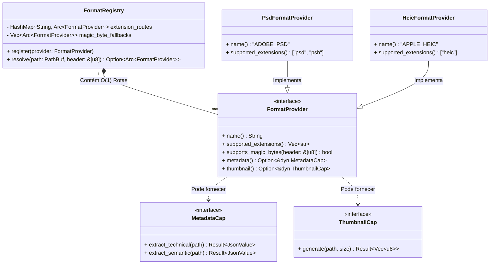

# 03. Format-Kit e Pattern Registry (Extensibilidade Infinita)

## 1. Visão Geral e Objetivo Macro

O **Format-Kit Registry** é a peça fundamental que garante que o mundam seja um DAM verdadeiramente flexível e sem limites de tipo de arquivo. Na arquitetura anterior, a inteligência sobre "como extrair metadados" ou "como gerar thumbnail" ficava espalhada em grandes blocos condicionais (`match ext { "jpg" => ..., "mp4" => ... }`).

Isso tornava adicionar um novo formato de arquivo um pesadelo (era necessário editar múltiplos arquivos do backend).

Com o Format-Kit, transformamos toda essa inteligência em **Plugins Virtuais ("Capabilities").** Um formato é apenas uma estrutura que assina contratos (Traits) específicos. O núcleo do servidor não sabe *o que* é um `PDF` ou um `OBJ`, ele apenas pergunta ao "Registry" central (o Cartório): *"Ei, esse caminho `/teste.pdf` possui suporte a ser Lido?"* e, se sim: *"Esse formato tem a Capability de Thumbnail?"*. 

A extração torna-se descentralizada e cada arquivo implementador só precisa focar no seu próprio escopo. O *Registry* apenas orquestra qual implementação será invocada magicamente.

## 2. Localização Exata
- **Core Abstrato (Contratos/Capabilities):** `src-tauri/src/core/formats/` (Traits genéricas como `FormatProvider`, `MetadataCapability`, `ThumbnailCapability`)
- **Fábrica Concreta de Instâncias:** `src-tauri/src/processing/media/` (O local exato onde ficam o `image_format.rs`, `video_format.rs`, `document_format.rs`)

---

## 3. Responsabilidades

### O que NÓS FAZEMOS:
- **Resolução de Magic Bytes & Extensões:** Dado um caminho no HD (`path`), o Registry varre todos os seus 'Format Providers' registrados até um dar "Aperto de mão" (Handshake) confirmando que o arquivo é dele (ex: um `.psd` com o Magic Byte famoso `8BPS`).
- **Segregação por Interfaces (Capabilities):** Garantir que a falha ao gerar miniatura de um `.MP3` não exista, porque afinal, o MP3 Provider nunca "assinará" a Trait da "ThumbnailCapability", poupando o código de invocações inúteis. O sistema vai extrair metadados ID3v2 de aúdio perfeitamente, e a Thumbnail será processada com Icon genérico.
- **Isolamento de Erros da Biblioteca C/C++ FFI:** O processamento sujo de um extrator (ex: `image-rs`, `ffmpeg-cli` ou bindings brutos) fica oculto atrás de implementações contidas de Rust, mantendo o `Ledger` incólume a panics gráficos e quebras de C-String.

### O que NÓS NÃO FAZEMOS:
- **O Format-Kit NÃO Grava Metadados no SQLite Diretamente:** Os providers devolvem um DTO limpo (JSON Serializável Abstrato `dyn TransformBase`). Outro bloco (`CommandHandler`/`Indexer`) cuida do insert final no BD (através do Event Bus).
- **Ele NÃO Controla Concorrência (Threads/Worker Pools):** Se você precisa gerar 5.000 fotos JPG, o Registry deve ser chamado 5.000 vezes pelo `JobScheduler` dentro de workers variados. O Format-Kit não spawna `tokio::task`, ele apenas é o cérebro que entrega os bytes.

---

## 4. Diagrama de Interações e Interfaces



---

## 5. Estruturas de Dados e Traits (Otimização O(1))

Se o Registrar iterar linearmente sobre `Vec<dyn FormatProvider>` chamando `provider.supports(path)` para 100 formatos em 1.000.000 de arquivos, perderíamos valiosos milissegundos de CPU. O Registry usa um mapa Hash para Roteamento Instantâneo das extensões normatizadas, tal qual o Mundam faz hoje:

```rust
// core/formats/provider.rs
use std::collections::HashMap;
use std::sync::Arc;
use async_trait::async_trait;
use std::path::Path;

/// Uma Capability Pura (Um "Porto" abstrato Hexagonal só com contratos de IO)
#[async_trait]
pub trait MetadataCapability: Send + Sync {
    /// Extrai toda inteligência raiz: width, height, bitrate, focal_lens, exif.
    async fn extract_technical(&self, path: &Path) -> AppResult<serde_json::Value>;
    
    /// Extract NLP text, OCR, Tags embutidas IA... 
    async fn extract_semantic(&self, path: &Path) -> AppResult<serde_json::Value>;
}

/// A Capability de Fotografia Visual do FileSystem
#[async_trait]
pub trait ThumbnailCapability: Send + Sync {
    async fn generate(&self, path: &Path, request: u32 /* ou ThumbnailSize */) -> AppResult<Vec<u8>>;
}

pub trait FormatProvider: Send + Sync {
    fn name(&self) -> &'static str; // ex: "PHOTOSHOP_PROVIDER"
    
    /// DECLARAÇÃO OBRIGATÓRIA: O Registro usará isso para criar o HashMap O(1)
    fn supported_extensions(&self) -> Vec<&'static str>; 
    
    /// Opcional: Se a extensão mentir e não bater, checamos aprofundado a assinatura
    fn supports_magic_bytes(&self, header_bytes: &[u8]) -> bool { false }
    
    // As Capabilities Opcionais Inteligentes
    fn metadata(&self) -> Option<&dyn MetadataCapability> { None }
    fn thumbnail(&self) -> Option<&dyn ThumbnailCapability> { None }
}

// core/formats/registry.rs
pub struct FormatRegistry {
    // Roteamento Instantâneo (O(1)) para 99% dos casos
    by_extension: HashMap<String, Arc<dyn FormatProvider>>,
    // Fallback passivo para formatos binários sem extensão (ex: web streams)
    deep_checkers: Vec<Arc<dyn FormatProvider>>, 
}

impl FormatRegistry {
    pub fn register(&mut self, provider: Arc<dyn FormatProvider>) {
        for ext in provider.supported_extensions() {
            self.by_extension.insert(ext.to_lowercase(), provider.clone());
        }
        self.deep_checkers.push(provider);
    }

    pub fn resolve(&self, path: &Path, header: &[u8]) -> Option<Arc<dyn FormatProvider>> {
        // 1. TENTATIVA SUPER RÁPIDA (O(1)): Cache por Extensão
        if let Some(ext) = path.extension().and_then(|e| e.to_str()) {
            if let Some(provider) = self.by_extension.get(&ext.to_lowercase()) {
                // Checagem Dupla Opcional de segurança, se o provedor exigir
                if provider.supports_magic_bytes(header) || header.is_empty() {
                    return Some(provider.clone());
                }
            }
        }
        
        // 2. FALLBACK LENTO O(N): Magic Bytes infer (Para arquivos sem extensão)
        self.deep_checkers.iter().find(|p| p.supports_magic_bytes(header)).cloned()
    }
}
```

---

## 6. O Padrão de Reatividade com os Trabalhadores Ativos (Dependências)

Quando um Worker pegará um item de sua fila (Job de Thumbnails ou Extract Meta), ele invoca diretamente o `.resolve(path)` de `FormatRegistry`. 

Veja o pipeline do **"Thumbnail Job Worker":**

1. O *ThumbnailScheduler* lê seu *JobQueue* e envia uma thread para pegar `/video/aula01.mp4`.
2. O Worker invoca `registry.resolve("/video/aula01.mp4")`. O motor entrega a instância global de `VideoFormatProvider`.
3. O Worker consulta: `has_capabilities = provider.thumbnail()`. É sim (`Some`).
4. Invoca o `generate()` isolado lá dentro (ele sabe que o `ffmpeg` fará o split da frame num Child Process de sistema escondido via adaptador).
5. Se retornar erro pesado, morre contido; repassa `JobFailed(id)` pro Broadcast. O Bus emite as mensagens e o Ledger processa final. 
6. Se retornar a imagem com sucesso (vetor de bytes), salva na ramificação `.thumbnails/large/XXX.webp` e *Command* para o Ledger atualizá-la usando: `LedgerCommand::CompleteThumbnail(id)`.

---

## 7. Tratamento de Erros Esperados

### **Cenário 1: Formato Desconhecido ou Corrompido (`NoProviderFound`)**
- *Causa:* O usuário adicionou um arquivo quebrado com extensão fake, ou o MUNDAM nunca suportou `.dat`.
- *Comportamento do Registry:* Não encontra quem diga `true` para a assinatura de bytes. Ele não invoca capabilities, gerando Null Safe ou usando um provedor especial de "Fallback genérico". `AppResult::FormatNotSupported`.

### **Cenário 2: Erro de Child Process Subjacente (`CLI_FAILED`)**
- *Causa:* Um formato complexo usou o FFmpeg via Console e ele engasgou na memória e travou em timeout.
- *Comportamento do FormatProvider:* O *Trait Implementation* do `extract_thumbnail` da interface de vídeo mapeará pânicos de Stdout e timeouts do TTY para um simples *Enum*: `AppResult::ExtractionProcessTimeout`. Desta maneira a interface assíncrona falha graciosamente. O banco anota o status da Indexação do Asset com "Error" (impedindo novos scans estéreis infinitos), mas o Mundam não aborta.
