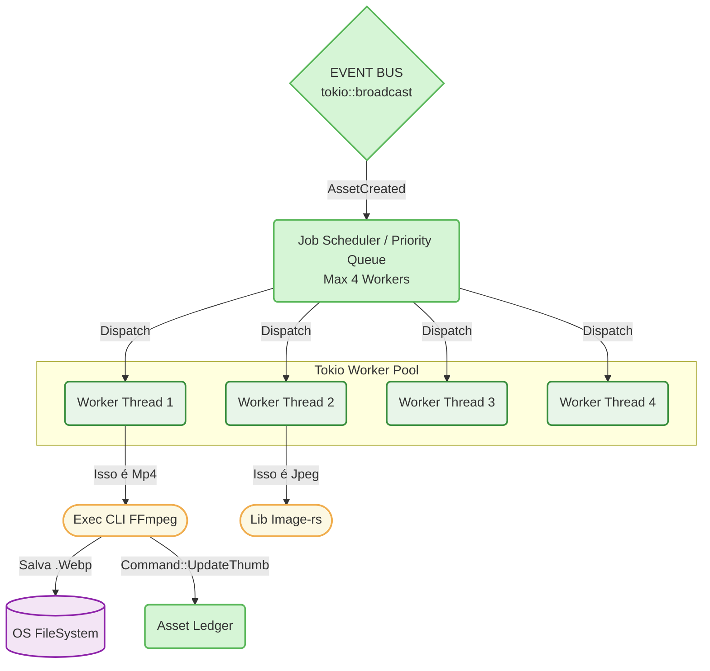

# 05. Job Scheduler e Workers (Processamento Massivo Controlado)

## 1. Visão Geral e Objetivo Macro

O **Job Scheduler e Workers** representam a "força bruta muscular" contida da nossa aplicação. Diferentemente de requisições do frontend, que precisam devolver uma resposta em menos de 100ms, a extração de *frames* de vídeo usando FFmpeg ou a mineração de texto 3D via *Assimp* são tarefas infernais para a CPU. Se soltarmos isso desenfreado (Ex: criando 1 thread para cada um dos 10.000 itens descobertos no disco), o computador "trava" (freeze), o RAM esgota (OOM - Out of Memory) e o banco SQLite é triturado.

A missão desse módulo é enfileirar (Queuing) e limitar o processamento paralelo (Worker Pool Limit) usando assincronismo do "Tokio". Ele capta as intenções pendentes do Event Bus e as resolve gentilmente enfileiradas.

## 2. Localização Exata
`src-tauri/src/processing/workers/`
`src-tauri/src/processing/media/` (Onde executam efetivamente a extração)

---

## 3. Responsabilidades

### O que NÓS FAZEMOS:
- **Priorização Inteligente (Priority Queue):** Se o usuário der scroll na UI pedindo foto X, esse Job "salta" pra frente da fila antes de arquivos de vídeos abandonados no fundo de subpastas do disco, dando extrema "responsividade visual" ao App.
- **Worker Pools Controladas:** Restringe quantas coisas pesadas rodam ao mesmo tempo (ex: `FFMPEG_MAX_THREADS = 4`). O computador nunca deve congelar na mão do usuário de desktop.
- **Circuit Breaking:** Quando um worker de Thumbnail detecta falhas repetidas no gerador de `.ZIP` porque a CLI nativa não existe no SO atual, o Job Scheduler "Desliga o Disjuntor" para o formato Temporariamente, evitando queima de CPU à toa.

### O que NÓS NÃO FAZEMOS:
- **NÓS NÃO tocamos diretamente no SQLite (Mutação):** O Worker processa, pega o binário da imagem, converte para `.webp`, salva fisicamente na pasta `~/.mundam/thumbnails`, e **Emite um Payload para o Asset Ledger** finalizar a alteração no Banco de Dados via Command. A escrita suja no SSD foge ao escopo.

---

## 4. Diagrama de Concorrência e Pipeline



---

## 5. Estruturas de Dados e Traits (O Contrato "Port")

O Coração do módulo é um Agendador que cria `JoinHandles` (Threads Virtuais) do Tokio:

```rust
// processing/workers/scheduler.rs
use std::collections::BinaryHeap;
use tokio::sync::{mpsc, Mutex};
use std::sync::Arc;

/// O 'Trabalho' da Fila. 
/// Os jobs são ordenados pela prioridade (BinaryHeap / Ord implementation)
#[derive(Debug, Clone, Eq, PartialEq)]
pub struct JobTask {
    pub priority: u8,               // 0 (Baixo: Scan de fundo) a 100 (Alto: Demanda imediata UI)
    pub asset_id: String,
    pub path: PathBuf,
    pub job_type: JobType,
}

#[derive(Debug, Clone, Eq, PartialEq)]
pub enum JobType {
    ExtractMetadata,
    GenerateThumbnail,
}

impl Ord for JobTask {
    fn cmp(&self, other: &Self) -> std::cmp::Ordering {
        self.priority.cmp(&other.priority) // Ordem Estrita de Prioridade
    }
}
//... (Implementação de PartialOrd)
```

O Inicializador do Pool no momento em que o Tauri abre:

```rust
// Setup no lib.rs ou main.rs chamando o módulo:

pub async fn start_worker_pool(
    queue_receiver: mpsc::Receiver<JobTask>,
    ledger: Arc<dyn TransactionalAssetLedger>,
    registry: Arc<FormatRegistry>,
    max_workers: usize,
) {
    let safe_receiver = Arc::new(Mutex::new(queue_receiver));

    for worker_id in 0..max_workers {
        let rc_channel = safe_receiver.clone();
        let rc_ledger = ledger.clone();
        let rc_registry = registry.clone();

        tokio::spawn(async move {
            loop {
                // Fica "dormindo" sem custo de CPU até um Job Pisar na fila.
                let job = {
                    let mut lock = rc_channel.lock().await;
                    lock.recv().await
                };

                if let Some(task) = job {
                   // Resolução do Formato pelo Registry
                   if let Some(provider) = rc_registry.resolve(&task.path) {
                       // ... (Extrai -> Devolve Command para Ledger)
                   }
                }
            }
        });
    }
}
```

---

## 6. Dependências e Conexões com o EventBus

O JobScheduler e o Worker Pool se sentam unicamente no lado **"Receptor" do Broadcast**:
Eles invocam o método `bus.subscribe()` no momento da criação para o canal de metadados, e `bus.subscribe()` do canal de Thumbnail. Tudo sem sobrecarregar memória. Ao passo que a CPU do usuário for engolindo e cuspindo o trabalho pesado com o binário C++, o App emite seus *AppCommands* ao Ledger silenciosamente em background.

---

## 7. Controle da Experiência do Usuário (Priorização em Múltiplas Abas)
Se a UI, ao processar imagens num grid (`<VirtualList>`), detectar através de JavaScript Events `VisibilityObserver` que a imagem "UUID XYZ" precisa entrar na tela AGORA e a capa ainda processando, a UI invocará um IPC: `#[tauri::command] prioritize_job(uuid)`.
O Rust pegará essa intenção, e fará um Update dentro da `BinaryHeap` do scheduler elevando o `priority` desse UUID para nível "100". Assim que o *Worker #1* ficar livre nos próximos milissegundos, ele pegará aquela miniatura ignorando 40.000 imagens abandonadas da Fila! Absoluta fluidez perceptual.
