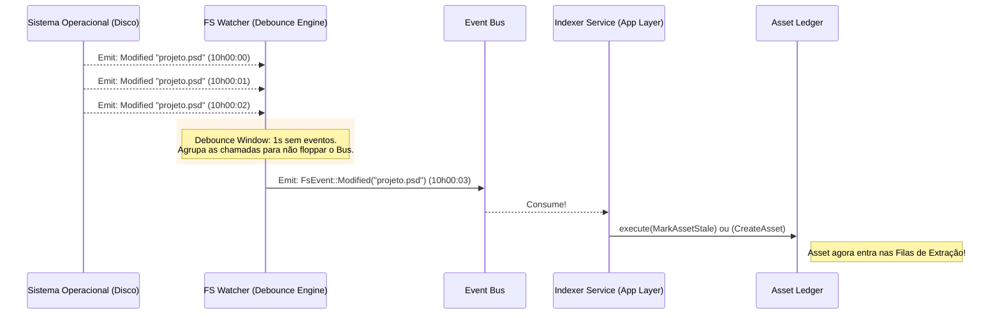

# 06. FS Watcher & Indexer (A Vigília Incessante)

## 1. Visão Geral e Objetivo Macro

O **FileSystem (FS) Watcher e Indexer** formam os "olhos" do Mundam perante as pastas do disco rígido do usuário. Na nossa arquitetura anterior, o Watcher possuía muita responsabilidade: ao mesmo tempo em que recebia um aviso do Mac/Windows de que um arquivo foi colado na pasta, ele mesmo tentava abrir o BD e salvar como novo, disputando Locks com o painel de propriedades do Solid.js aberto, resultando na morte do app.

Nesta Arquitetura Ideal (Hexagonal), o **Watcher é castrado de inteligência transacional**. Ele volta a ser apenas um "Sensor Cego". O *notify* (biblioteca Rust) apenas avisa ao aplicativo que algo aconteceu. O Watcher joga no `EventBus` que a pasta "X" sofreu um `Rename`. A partir daí, é problema do **Indexer** (O Cérebro Rastreável, que atua como *Command Handler*) descobrir de modo idempotente o que mudou de verdade antes de perturbar o `AssetLedger`.

## 2. Localização Exata
`src-tauri/src/processing/watcher/` (Serviço Singleton rodando junto do Tauri App)
`src-tauri/src/feature/library/indexer.rs` (Decisor de I/O)

---

## 3. Responsabilidades

### O que O WATCHER FAZ:
- **Agrupa Eventos Histéricos (Debounce):** Se o Adobe Premiere Exporta um vídeo para dentro da galeria do Mundam, o S.O (Windows/MacOS) dispara uns 1.500 eventos de "modificado" nos primeiros 2 minutos enquanto monta os blocos na pasta. O Watcher no Rust usa um *tokio::time::sleep* com HashMaps para "amassar" (Debounce) esses 1500 gritos em 1 único grito `FileDiscovered` limpo enviado no final do respiro.
- **Mantém Subscrições Abertas:** Vê quais pastas raízes (Library Roots do usuário) devem ser ouvidas, utilizando APIs seguras para não violar permissões da Maçã/Linux (`FSEvents` no macOS etc).

### O que O INDEXER FAZ:
- **Scan Passivo vs Ativo:** Diferencia quando o usuário clicou no Front *"Mandar reindexar tudo C:\Assets"* (Ativo/Batch) versus o Watcher cuspiu um *"Achei a imagem bola.png"* (Passivo).
- **Varredura (WalkDir):** Em varreduras pesadas, desce as sub-pastas sem estourar o limite de descritores de arquivo (File Descriptors limit do SO), catalogando lotes inteiros com segurança.

### O que NÓS NÃO FAZEMOS:
- ** NÃO TOCAMOS NO SQLITE DIRETAMENTE:** Nem Watcher, Nem Indexer têm acesso livre de gravação ao banco de dados ou às tags. O Indexer verifica a Existência (`QueryHandler`) para não indexar lixo 2 vezes, mas a aprovação ("Criar Asset 0089") passa pelo `Ledger::execute(CreateAssetCommand)`.
- **Não Extraímos Capas Aqui:** O *FileDiscovered* jogado no Bus apenas criará no BD pelo Ledger um asset em status transicional. Quem puxará os pixels da capa será o *JobScheduler* de Thumbnails (Módulo 05).

---

## 4. Diagrama de Comunicação do Watcher c/ Debounce



---

## 5. Estruturas de Dados e Traits (O Contrato "Port")

A implementação do *Debouncer* é vital na linguagem para acalmar o Processador. Os eventos puros se parecem com isso:

```rust
// processing/watcher/types.rs
use std::path::PathBuf;
use notify::EventKind;

#[derive(Debug, Clone)]
pub enum FsEventPayload {
    Created(PathBuf),
    Modified(PathBuf),
    Removed(PathBuf),
    Renamed { from: PathBuf, to: PathBuf },
}

// Em `processing/watcher/sensor.rs`
// Um Singleton que vive o tempo todo do APP ligado
pub struct WatcherService {
    // A biblioteca cruzada (notify)
    native_watcher: notify::RecommendedWatcher, 
    // Manda para o Bus internamente após debouncing
    event_bus: Arc<dyn AppEventBus>,          
    
}
```

E o Algoritmo Básico de Indexação Ativa do *Indexer Service*:

```rust
// feature/library/indexer.rs

pub struct LibraryIndexer {
    ledger: Arc<dyn TransactionalAssetLedger>,
}

impl LibraryIndexer {
    /// O Usuário Clilou Reindexar! Varra tudo.
    pub async fn scan_directory_tree(&self, root: &PathBuf) -> AppResult<()> {
        let walker = ignore::WalkBuilder::new(root)
            .hidden(true)
            .git_ignore(false) // MUNDAM indexa tudo
            .build();
            
        for result in walker {
            match result {
                Ok(entry) => {
                    if entry.file_type().unwrap().is_file() {
                         // Cria DTO Limpo pro Ledger
                         let cmd = LedgerCommand::DiscoverAsset { 
                             path: entry.path().to_path_buf() 
                         };
                         // Põe o Ledger pra trabalhar, em vez de esfolar o banco sozinho
                         let _ = self.ledger.execute(cmd).await;
                    }
                }
                Err(err) => tracing::error!("Acesso bloqueado SO: {}", err),
            }
        }
        Ok(())
    }
}
```

---

## 6. Dependências e Conexões com os Outros Módulos

O **FileWatcher** é a "Nave Mãe" da emissão passiva. O Event Bus sem o Watcher é inútil (exceto se você fizesse tudo manualmente pelo Front-End). Ele liga-se umbilicalmente aos eventos do S.O. através da Lib `notify` em Rust e traduz o ruído nativo repassando as notificações aos Command Handlers limpos (Indexer/Feature).

---

## 7. Controle da Experiência do Usuário (Painel Híbrido)

A "Bandeja Lateral do MUNDAM" que exibe em tempo real: "Processando 15 novos arquivos detectados...", baseia-se exatamente nisto. 
O S.O. move a pata (`notify`).
O Watcher emite 15 eventos pacificados após `Debounce`. 
O `Ledger` anexa os 15 registros fantasmas de status transicional e dispara ao Bus a resposta positiva de transação. 
O Event Bus emite `indexer_progress_event`. 
A UI, sentada nas Docas da Janela via `listen()`, acende as bolas verdes dos status e processa a visualização da tela com 60 de FPS em total assincronismo.
