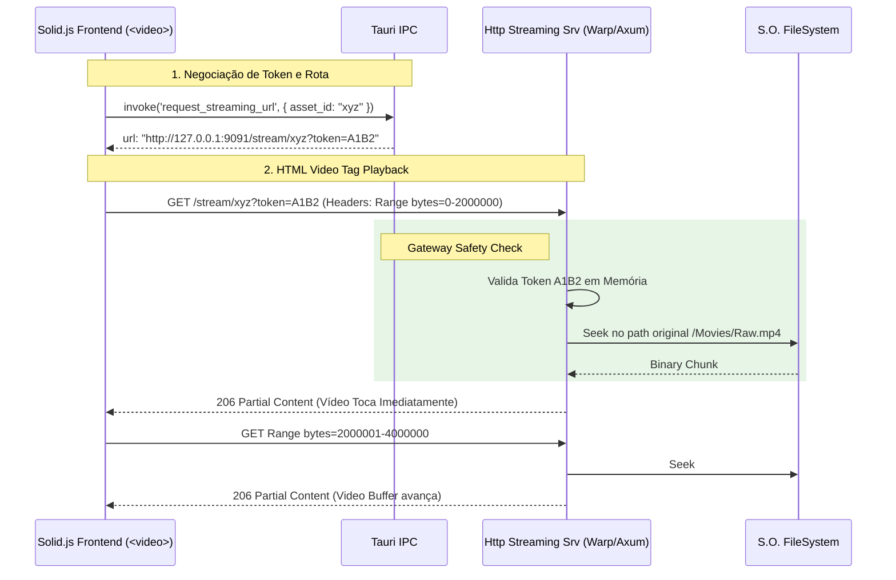

# 07. Streaming & Delivery (A Ponte Multimídia Final)

## 1. Visão Geral e Objetivo Macro

O **Streaming & Delivery Module** resolve um dos maiores gargalos técnicos de aplicativos desktop construídos com tecnologias web (Tauri/Electron): **Exibição de mídia pesada e vídeos longos nativamente no Frontend**.

O protocolo padrão WebView do macOS/Windows (usando URIs locais estáticas como `tauri://localhost` ou `asset://`) é fantástico para carregar imagens JPG ou botões em SVG, mas é **horrível** para lidar com Arquivos de Vídeo de 4 GB (`.mp4`, `.mov`). Ele tenta carregar o arquivo inteiro na memória RAM, não suporta envio fragmentado (Range Requests 206 Partial Content) corretamente e quebra o app se o usuário arrastar a barra progresso do vídeo para frente sem esperar o buffer de download.

Para isso, o Backend ideal embarca um **Mini Servidor HTTP de Alta Performance** (`Axum` ou `Warp` no formato Rust) e protocolos personalizados (`asset://`). Sua única função é servir binários multimídia gigantes fatiados em blocos pequeninos direto do HD para a tag `<video>` do navegador Solid.js, protegido por **Segurança em Token de Autenticação** injetado em tempo real.

## 2. Localização Exata
`src-tauri/src/delivery/streaming/` (O Web Server HTTP local e Rotas)
`src-tauri/src/delivery/protocols/` (As Custom Schemes como `asset://thumbnail/uuid`)

---

## 3. Responsabilidades

### O que NÓS FAZEMOS:
- **Resolução de Range Requests (HTTP 206):** Aceitamos requisições da tag `<video>` do Solid.js dizendo "Me dê apenas os bytes do minuto 4:00 até o 4:03", lemos a parte exata do Offset no Disco Rígido usando I/O Assíncrono (`tokio::fs::File`), e devolvemos. 
- **Verificação de Segurança Restrita:** Bloqueamos que roteadores Wi-Fi ou processos alheios da máquina tentem acessar nosso servidor na porta localhost (Ex: `http://127.0.0.1:4040/stream`). Exigimos validação de *Tokens Dinâmicos* que o Tauri Gateway entregou ao Frontend minutos antes.
- **Custom Protocol para Imagens:** Registramos `asset://` para que componentes como a Grid e Gallery puxem as thumbnails do cache gerado sem trafegar Base64 pelo Tauri, esvaziando drasticamente a carga de CPU ("Zero-Copy" visual).

### O que NÓS NÃO FAZEMOS:
- **NÃO Transcodificamos o Vídeo On-The-Fly (Ainda):** Atualmente nós servimos bytes diretos (Streaming Físico Puro). O `FormatRegistry` ou Atores Extraordinários é que transcodificam Mídias Incompatíveis (como ProRes) em background antes de pedirem a exibição.
- **O Módulo de Streaming NÃO edita banco de dados.** É uma Doca de Saída estéreis, puramente focada no Protocolo da Camada de Rede (Delivery).

---

## 4. Diagrama de Fluxo e "Partial Content Fetch"



---

## 5. Estruturas de Dados e Traits (O Contrato "Port")

A Máquina do Servidor HTTP iniciada assincronamente com o Boot do App e travada em background:

```rust
// delivery/streaming/server.rs
use axum::{routing::get, Router};
use std::net::SocketAddr;
use tokio::net::TcpListener;

// O Ingress State para garantir a ponte com o SQlite
pub struct StreamingState {
    pub ledger: Arc<dyn TransactionalAssetLedger>, // Opcional, ou queries de DB leves se precisar do PATH
    pub auth_tokens: Arc<dashmap::DashMap<String, AuthSession>>, // Cache na Memória Pura do Backend
}

pub struct AuthSession {
    pub asset_id: String,
    pub path: PathBuf,
    pub expires_in: std::time::Instant,
}

/// A Rota Oficial (Extração Binária do Disco -> Rede)
pub async fn serve_media(
    axum::extract::State(state): axum::extract::State<Arc<StreamingState>>,
    axum::extract::Query(params): axum::extract::Query<StreamRequestQuery>,
    headers: axum::http::HeaderMap,
) -> axum::response::Response {
    // 1. Valida o Token
    // 2. Extraí o Range Header ("Range: bytes=X-Y")
    // 3. Lê com `tokio::fs::File` (Zero Blocking)
    // 4. Constrói um Header HTTP "206 Partial Content" e cospe o Stream no Response!
    // ...
}
```

E o Registro do Protocolo Frio (`asset://`) do Tauri, isolando segurança e travando CORS (Cross-Origin Resource Sharing) abusivos na UI:

```rust
// delivery/protocols/asset.rs

pub fn setup_asset_protocol() -> impl Fn(&AppHandle, &tauri::http::Request) -> Result<tauri::http::Response, Box<dyn std::error::Error>> {
    move |app, request| {
        // Exemplo: asset://thumbnail/219fdf213-aa21/small.webp
        
        let uri = request.uri().path();
        // Parsing..
        let physical_path = resolve_internal_cache_path(uri);
        
        // Verifica se a UI tem permissão de escopo (Segurança de Diretório)
        // Cospe o Content-Type: "image/webp" lido brutamente do disco.
        tauri::http::ResponseBuilder::new()
             .header("Content-Type", "image/webp")
             .header("Access-Control-Allow-Origin", "tauri://localhost")
             .body(std::fs::read(physical_path).unwrap()) 
    }
}
```

---

## 6. Conexões e Dependências Arquiteturais

1. O `HTTP Server` é um ser **Agnóstico de Domínio**: Ele não se relaciona emocionalmente com as Regras do `Format Registry`. Ele só quer "bytes do arquivo no disco" para servir via HTTP `Transfer-Encoding: chunked`.
2. A Segurança é administrada pelos Handlers (A camada application/CQRS). Quando o Solid.js quer Assistir um clipe, ele dispara o RPC: `invoke('generate_streaming_token', { id: "123" })`. O Query Handler verifica se o asset existe no SQLite, e embute no `Token In-Memory Cache` uma permissão de acesso expirável em 20 minutos (impedindo roubos ou retenção infinita).
3. Essa ponte HTTP não publica e nem ouve Eventos no `EventBus` diretamente. Ele lida unicamente com I/O de ponta e Despacho ao Browser.

---

## 7. Tratamento de Erros Esperados

### **Cenário 1: "Broken Pipe" ou Conexão Abortada**
- *Causa:* O usuário pausou o vídeo e fechou a Janela Secundária/Overlay visual subitamente enquanto o Backend jorrava 10 MB do Arquivo de Mídia. A Rede Local (TCP Socket) é colapsada no meio da escrita e falha.
- *Comportamento do Streaming Server:* Retorna um log mudo e ignora o erro de *Disconnect*. Erros de Pipe em servidores HTTP rodando local são trivialidades e não podem infectar as Threads de Domínio, gerando pânicos (Panic) ou poluição letal de Logs. Ele apenas enverniza e diz "O cliente largou a ligação", finalizando e fechando o ponteiro de arquivo (`File Descriptor`) silenciosamente para não explodir arquivos pesados bloqueados no Windows C:\.

### **Cenário 2: Token Expirado ou Acesso Hacker Local (`401 Unauthorized`)**
- *Causa:* A interface do Tauri dormiu, o Request expirou (passou de 20 min) e o Token foi evictado do Cache em RAM, ou algum Malware/Outro App no mesmo Desktop tentou bater no `localhost:9091`.
- *Comportamento do Streaming Server:* Bloqueio HTTP total. Um *401 Unauthorized* limpo de Segurança é atirado ao player de vídeo. A tela de UI exibirá "Video Playback Error" na Tag `onError={...}` sem expor diretórios do Windows Explorer/MacOS aos farejadores clandestinos.
