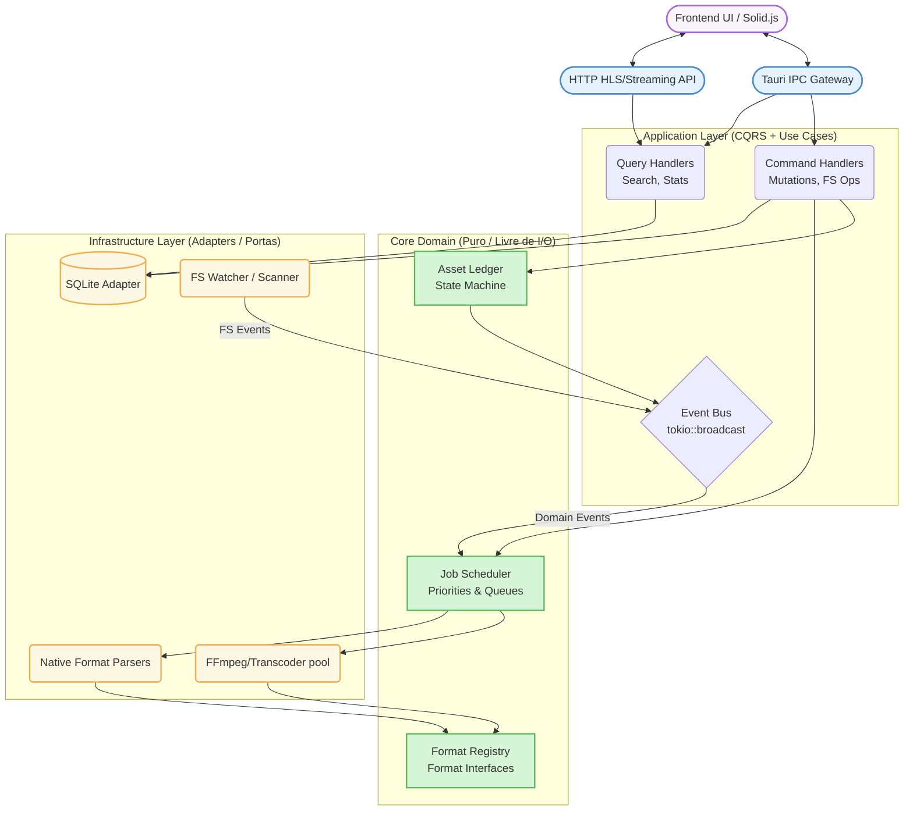

# Visão Macro da Arquitetura do Backend (Overview)

## 1. Visão Macro do Sistema

O backend do Mundam adota uma **Arquitetura Híbrida**, que combina a clareza visual e organizacional da Arquitetura Orientada a Serviços (Vertical Slicing por Escopo) com a consistência, testabilidade e resiliência mecânica da **Arquitetura Hexagonal, Event-Driven Architecture (EDA) e CQRS** no núcleo vital (Core Domain).

Essa estrutura foi escolhida para resolver os desafios brutais de um Digital Asset Manager (DAM) operando de forma pesada e offline em desktop (concorrência agressiva de sistema de arquivos, indexação massiva paralela, travas de banco de dados SQLite e corrupção cruzada de threads e processos), ao mesmo tempo em que mantém uma estrutura física de pastas (Rust) intuitiva para os desenvolvedores.

## 2. Diagrama Arquitetural Principal



## 3. Explicação da Escolha Híbrida

A decisão de adotar este modelo sinérgico unifica duas abordagens historicamente separadas, extraindo o melhor de ambos os cenários de engenharia:

1. **Organização Horizontal Macro (Orientada a Serviços/Delivery):** A árvore de diretórios utiliza grandes domínios de categorização (`core/`, `feature/`, `processing/`, `delivery/`). Isso simplifica a navegação no projeto. Não entulha a raiz com centenas de arquivos.
2. **Hexagonal + EDA + CQRS (Microarquitetura Antifrágil):** Dentro da execução do código Rust propriamente dito, NENHUMA requisição do usuário originada do frontend (mutações) ou leitura automática do Sistema de Arquivos (Watcher) toca o banco de dados diretamente. **Tudo gera Eventos** na camada Application, que são recebidos assincronamente em um **Event Bus**, para então serem digeridos de forma totalmente serializada e idempotente pelo **Asset Ledger**. O Ledger aprova, invalida, ou agenda a mutação do FileSystem/SQLite. 

**O Grande Benefício:** Com isso, o indexador lendo 100.000 imagens e o usuário arrastando tags no App *nunca* irão "dar lock" um no outro do banco de dados ou deixar arquivos fantasmas no HD. Ao separarmos `Commands` (mutações rigorosas com o Ledger acima) e `Queries` (Leituras de alta performance que contornam o Ledger e vão direto do Tauri pro SQLite e UI), adquirimos excelência em performance sem sacrificar a sanidade dos dados em disco.

Além disso, a injeção do padrão **Format Registry** elimina toda a teia de "IF-ELSE" e `matches` para formatos distintos. Módulos de formato agora assinam as Interfaces do Domínio através de "Capabilities". Um vídeo apenas acopla o trait `StreamProvider` que um PDF ignora passivamente.

## 4. Estrutura Física das Pastas (Taxonomia em Rust)

A taxonomia planejada para alinhar a estética do "Modelo Fullstack Ágil" com a severidade do "Modelo Hexagonal" se dará da seguinte forma em `src-tauri/src/`:

```text
src-tauri/src/
├── core/                  # [Domínio Puro] Regras de negócio inabaláveis, Contratos e Traits. Sabe Zero de Tauri ou SQLx.
│   ├── ledger/            # Asset Ledger e máquinas de estado (Único ponto autorizado a mutar o estado)
│   ├── events/            # Definições de Eventos de Domínio e estrutura do Event Bus
│   ├── formats/           # Format Registry, Types e Definições abstratas das Capabilities (ThumbProvider, etc)
│   └── error/             # Erros de domínio centralizados e abstrações de AppResult
├── feature/               # [Lógica de Aplicação / CQRS] Command Handlers e Query Handlers
│   ├── library/           # Regras isoladas de ciclo de vida de Assets (CRUD, Validações)
│   ├── taxonomy/          # Gestão de Tags, Categorias e Cores
│   ├── collections/       # Coleções, Folders Mapeados e Smart Folders
│   └── search/            # Motor de busca (Query Handlers unificados)
├── processing/            # [Domínio Operário] Atores, Schedulers e Processamento Pesado
│   ├── workers/           # Job Scheduler, sistema de Atores e Fila de Prioridades
│   ├── watcher/           # FS Watcher (Monitoramento de arquivos transformado em emissor de Eventos)
│   ├── media/             # Extração bruta: Processadores de Imagem, PDF, Modelos 3D e Áudio
│   ├── transcoding/       # Orquestração de subprocessos com FFmpeg
│   └── thumbnails/        # Fila e gerador exclusivo de Thumbnails
├── delivery/              # [Gateways] Portas de entrada e saída exclusivas de I/O
│   ├── tauri/             # Comandos RPC (macros `#[tauri::command]`)
│   ├── streaming/         # Mini-Servidor warp HTTP HLS + Token Auth
│   └── protocols/         # Registro de Scheme customizados (ex: `asset://`)
├── infra/                 # [Infraestrutura Específica] Adaptadores blindados
│   ├── database/          # Lógica SQLx dura (Connection Pool, Migrations)
│   ├── filesystem/        # Libs de I/O brutas do SO (Deletar pastas reais, mover blocos)
│   └── telemetry/         # Tracing subscriber e logs de diagnóstico estruturado
└── main.rs / lib.rs       # Entrypoint Boot e Tauri App Builder (O Cérebro da Injeção de Dependências)
```

## 5. Glossário de Termos Essenciais da Arquitetura

Para balizar o ciclo de desenvolvimento, adotam-se universalmente neste Backend as seguintes definições conceituais:

- **CQRS (Command e Query Responsibility Segregation):** Divisão arquitetural dos dados. Operações base focadas em leitura (**Queries**) jamais afetam estado e trafegam super rápido para a UI. Operações de modificação de estado (**Commands**, por ex: `MoveFolderCommand`) empacotam DTOs imutáveis de mudança e passam por extrema validação do backend sem bloquear leituras.
- **Port:** Uma *Trait* (Interface) em Rust (ex: `trait ThumbnailCapability { ... }`). É o núcleo que define que *algo abstraido* processa a requisição.
- **Adapter:** A implementação concreta, geralmente "suja", daquele *Port* (ex: o `Mp4FfmpegAdapter` utilizando subprocessos reais ou C++ ffi para respeitar a Trait acima).
- **Event Bus:** O Barramento Central reativo da memória do Rust (Ex: usando `tokio::sync::broadcast`). Extingue instâncias de módulos invocando uma a outra de forma acoplada. "Módulos falam pro vazio, Módulos interessados Escutam do vazio."
- **Asset Ledger:** O Único Ponto de Verdade (Single Source of Truth) para modificações de estado e de disco do projeto Inteiro. O Ledger pega `Commands` vindos do Bus (S.O. ou UI) e os aplica com Idempotência Transacional no Banco e no Disco Rígido. Evita corridas malucas de gravação e mantém versões limpas.
- **Format Registry:** O "Cartório" dos formatos. Toda extensão, mime-type ou "magic byte" de um arquivo é detectada e devolvida a uma estrutura *Capability*, eliminando blocos de códigos com centenas de desvios condicionais na raiz.
