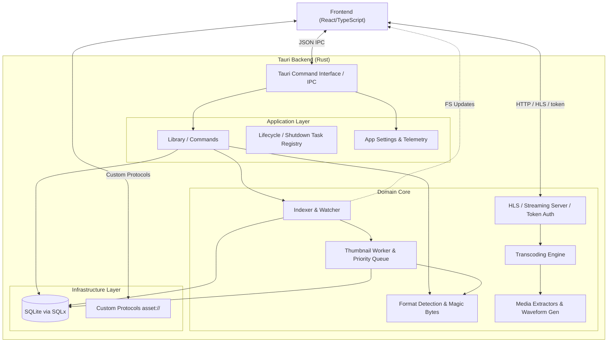
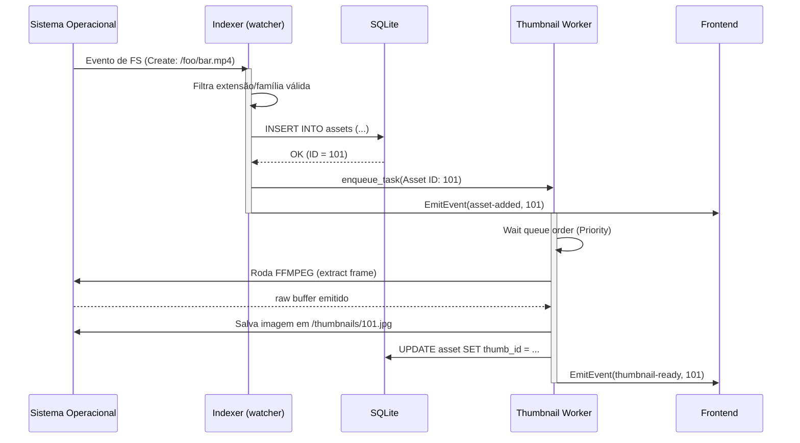
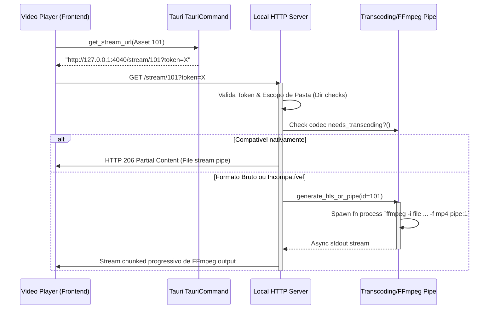

# Documentação da Arquitetura Atual do Backend (Mundam)

Este documento descreve a **arquitetura atual** do backend do Mundam, mapeando como o sistema gerencia banco de dados, indexação de diretórios, geração assíncrona de thumbnails, streaming de mídia (como vídeos não nativos) e a comunicação com a camada frontend via Tauri IPC.

---

## 1. Visão Geral (General Architecture)

O backend do Mundam é escrito em **Rust**, rodando encapsulado pelo **Tauri**. Ele atua como um coordenador local pesado, operando um banco SQLite para metadados, _Watchers_ de File System e um servidor HTTP interno para rotear streams complexos (FFmpeg pipe).

---

## 2. Descrição dos Módulos Principais

### `src/db` (Database Layer)
A camada que encapsula o banco de dados da aplicação.
- **Tecnologia:** `SQLx` e `SQLite`.
- **Estratégia:** Utiliza conexão via _Pool_, modo `Journal=WAL` (Write-Ahead Logging) e transações seguras (`synchronous=Normal`). Reclama espaço e analisa queries via `VACUUM` e `ANALYZE` expostos no `maintenance`.
- **Submódulos:** 
  - `assets`: CRUD (Create, Read, Update, Delete) de arquivos.
  - `folders` e `smart_folders`: Árvore de diretórios e buscas preestabelecidas.
  - `tags` e `colors`: Taxonomia da biblioteca e cache nativo das paletas indexadas.
  - `search`: Motor de filtros flexíveis pelo banco.
  - `settings`: Configurações do usuário e persistência de dados.

### `src/indexer` (Scanner & Watcher)
Responsável por vasculhar os diretórios configurados pelo usuário, adicionar arquivos no DB e mantê-los sincronizados.
- **Componentes (`scan.rs`, `watcher.rs`):**
  - O **Scanner** realiza uma varredura inicial pesada usando `walkdir`, calculando Hash dos arquivos para verificação de unicidade.
  - O **Watcher** utiliza a _crate_ `notify` (via Crossbeam channels e Tokio) para escutar as alterações do Sistema Operacional (`Create`, `Modify`, `Remove`, `Rename`).
- **Integração:** Toda vez que o Indexer cadastra uma nova imagem ou vídeo no SQLite vazio, ele também "enfileira" o arquivo (Asset) no `Thumbnail Priority Queue`.

### `src/thumbnails` (Worker Assíncrono e Prioridade)
Gerador de "previews" visuais em background sem atrasar a thread de interface.
- **Componente Principal (`worker.rs`):** Um Job Queue rodando de forma assíncrona isolada via Tokio spawn.
- **Estratégia de Prioridade (`priority.rs`):** Se o usuário navega na galeria (_ListView_), o frontend informa o backend sobre os IDs visíveis ao viewport, mudando-os para "Alta Prioridade" na fila de processamento.
- **Estrutura de Extração (`extractors/`):** 
  - **Standard Extractors:** Utiliza bibliotecas nativas de imagem (como `image` crate) para redimensionamento eficiente de JPEGs/PNGs e `ffmpeg` para captura de frames em arquivos de vídeo comuns.
  - **Specialized Extractors:** Motores dedicados para formatos não-convencionais, incluindo renderização de miniaturas para modelos 3D, extração de metadados visuais de arquivos de design (como arquivos de projeto específicos) e geração de representações visuais para documentos PDF ou vetoriais.
- **Processamento e Cache:** Responsável por executar recortes `ffmpeg` (vídeos) ou processar as imagens localmente via bibliotecas Rust, guardando os arquivos binários no cache local e atualizando o status de disponibilidade no SQLite para que o frontend carregue via protocolo `asset://`.
- 
### `src/streaming` & `src/transcoding`
Habilita suporte real-time para formatos não suportados nativamente pelo Chromium/WebKit (ex: H.265, ProRes, MKV).
- **Embedded Server (`server.rs`):** Inicia um mini-servidor HTTP local (via `warp`) rodando sob um IP dinâmico dentro do Runtime Tauri. Exige um token gerado via Boot (`StreamingSessionToken`) em toda Query (`?token=x`) para garantir que apenas a instância local do frontend acesse os recursos, prevenindo acessos externos na rede local.
- **Transcoding Engine (`ffmpeg_pipe.rs`):** Orquestra processos `ffmpeg` em tempo real. Se o formato exigir transcodificação "on-the-fly", o backend monta uma pipe de subprocesso que redireciona o `stdout` do FFmpeg diretamente para o stream de resposta HTTP (`hyper::Body`), permitindo reprodução imediata sem necessidade de arquivos temporários.
- **HLS & Seeking (`hls.rs`):** Provê segmentação dinâmica para suporte a *HTTP Live Streaming*. Isso permite que o player realize buscas (seeking) em arquivos pesados de forma eficiente, gerando manifestos `.m3u8` e fragmentos `.ts` sob demanda.
- **Quality & Hardware Acceleration (`quality.rs`):** Gerencia perfis de codificação e tenta utilizar aceleração de hardware (como NVENC, VAAPI ou VideoToolbox) para reduzir a carga de CPU durante a transcodificação, ajustando bitrate e resolução conforme a capacidade do sistema.
- **Media Probing (`probe.rs`):** Utiliza `ffprobe` para analisar o container do arquivo, identificando codecs, múltiplas faixas de áudio, legendas embutidas e metadados de HDR/Color Space antes de iniciar o streaming, permitindo que o frontend ofereça seletores de trilhas.

### `src/formats` (Identificação de Assets)
A engine que tenta entender a natureza do arquivo além de sua simples extensão de nome.
- **Detecção:** Pode analisar "Magic Bytes" de um buffer (usando as crates de introspecção) para determinar `AssetFamily` categórica (ex: `Audio`, `Video`, `Image`, `Document`, `3DModel`, `Project`).

### `src/lifecycle` (Registry and Graceful Shutdown)
Registra todas as "tarefas em backgorund gulosas" (Thumbnail Worker, Watcher, Streaming Server). 
- Toda _Goroutine/TokioTask_ é registrada aqui usando *Cancellation Tokens*.
- Quando o usuário decide apertar em "Sair" do App, o Tauri alerta esse módulo para invocar o sinal de cancelamento nas threads filhas, aguardando que gravem status e encerrem limpos sem rasgar dados do banco.

### `src/library`, `src/settings` e `src/media`
- **Library (`commands/*`)**: Cobre as rotinas de roteamento expostas pelo Tauri (Macro `#[tauri::command]`).
- **Settings**: Variáveis globais carregadas no SQLite e Mutex para Settings de usuário (Cache usage, etc).
- **Media**: Extrações pontuais, muito utilizado para desenhar Audio Waveforms brutas.

---

## 3. Diagramas de Sequência e Fluxos

### 3.1 Fluxo do Indexador e Fila de Thumbnail

O indexador funciona como um espião. Quando algo muda no File System host, os eventos de domínio refletem para o banco e despacham intenções silenciosas de geração de cache.

### 3.2 Fluxo de Streaming com Conversão na Mosca

A engenhosidade principal na exibição de vídeos brutos pesados passa pelo `Streaming Server` blindado e pelo `ffmpeg_pipe`.

---

## 4. Análise de Fraquezas Atuais (Por que a "Modularização" é necessária?)

Apesar de funcionar em multi-thread muito bem de fato, a estrutura apresenta acoplamentos técnicos que dificultarão adições orgânicas:

1. **Dependência Circular ou Transversal:** A lógica específica de **como extrair um dado** de uma Família X muitas vezes se vaza entre `thumbnails/strategies` e scripts perdidos em `media/`.
2. **Watchers fracos em Comandos Explicitos:** Operações feitas explícitamente na Interface (ex: "Excluir", "Mover de pasta") dependem primariamente do FS repassar a mensagem ao Watcher, podendo gerar _race conditions_ de "Arquivo Deletado vs Watcher Indexando de Novo".
3. **Falta de Interface Pura de Formato (Asset Protocol):** Tentar adicionar o formato ".PSD" no backend atual implicaria em escrever em 4 a 5 trechos distintos do backend (`formats::detect`, adicionar o FFI nos thumbnails, criar parser no indexer).

Os novos projetos, como a biblioteca `format_kit` proposta nos planos de ação de migração (Arquitetura por Biblioteca de Formatos), propiciam a reversão destas lacunas.
