Vou analisar o repositório para entender os recursos implementados e criar uma arquitetura robusta e escalável.Agora vou explorar a estrutura do projeto em detalhes para entender todos os recursos implementados:Now let me get the content of key files to understand the architecture better:Agora tenho uma visão clara do projeto. Deixa eu elaborar um relatório completo com a arquitetura ideal para o Mundam.

---

# 📊 RELATÓRIO ARQUITETURAL - MUNDAM
## Gerenciador Profissional de Referências para Artistas

**Data:** 05 de Março de 2026  
**Projeto:** marcusagm/Mundam  
**Versão:** 0.1.0  
**Escopo:** Análise e Proposta de Arquitetura Escalável

---

## 1. VISÃO GERAL DO PROJETO

### Propósito
**Mundam** é um gerenciador profissional de referências de imagens destinado a artistas, oferecendo:
- Indexação de bibliotecas de imagens
- Visualização de 3D, PDF e vídeo
- Processamento e streaming de mídia
- Gestão de tags e coleções
- Sistema de notificações
- Streaming HLS integrado

### Stack Atual
- **Frontend:** Solid.js + TypeScript (Vite)
- **Backend:** Rust (Tauri v2)
- **Desktop:** Tauri (multiplataforma)
- **Banco de Dados:** SQLite com SQLx
- **Processamento:** FFmpeg, ImageMagick, Assimp, PDFium

---

## 2. ANÁLISE DA ESTRUTURA ATUAL

```
Mundam/
├── src/                          # Frontend (Solid.js)
│   ├── components/               # Componentes UI/Apresentação
│   ├── core/                     # Hooks, Store, Services
│   ├── layouts/                  # Estrutura de páginas
│   ├── lib/                      # Utilitários
│   ├── types/                    # Tipos TypeScript
│   ├── utils/                    # Funções auxiliares
│   ├── App.tsx                   # Raiz da aplicação
│   └── index.tsx                 # Entry point
│
├── src-tauri/                    # Backend (Rust)
│   ├── src/
│   │   ├── db/                   # Camada de dados
│   │   ├── library/              # Lógica de biblioteca
│   │   ├── indexer/              # Indexação de assets
│   │   ├── media/                # Processamento de mídia
│   │   ├── thumbnails/           # Sistema de thumbnails
│   │   ├── streaming/            # Servidor HLS
│   │   ├── transcoding/          # Conversão de formatos
│   │   ├── formats/              # Suporte de formatos
│   │   ├── settings/             # Configurações
│   │   ├── protocols/            # Protocolos Tauri
│   │   ├── lifecycle/            # Gestão de ciclo de vida
│   │   ├── error.rs              # Tratamento de erros
│   │   ├── lib.rs                # Raiz da biblioteca
│   │   └── main.rs               # Entry point
│   │
│   ├── migrations/               # Migrações de BD
│   ├── capabilities/             # Permissões Tauri
│   ├── binaries/                 # Executáveis externos
│   ├── assimp/                   # Biblioteca 3D
│   ├── ffmpeg/                   # Executável FFmpeg
│   ├── Cargo.toml                # Dependências Rust
│   └── tauri.conf.json           # Config Tauri
│
└── package.json                  # Dependências Node.js
```

---

## 3. ARQUITETURA IDEAL PROPOSTA

### 3.1 Princípios de Design

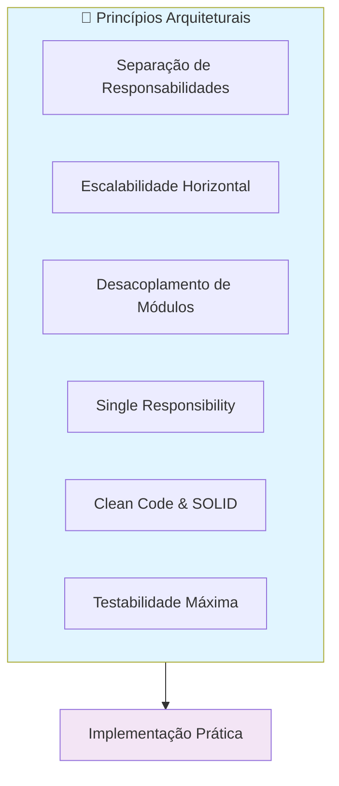

### 3.2 Arquitetura em Camadas

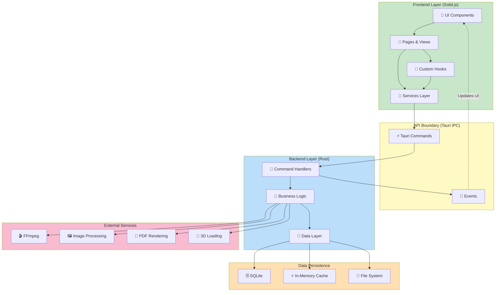

### 3.3 Estrutura Modular Proposta

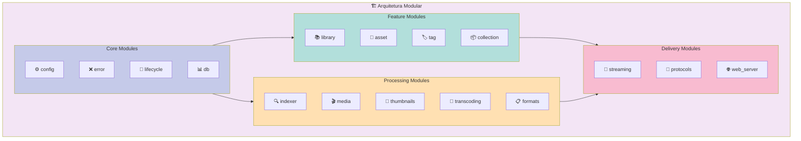

---

## 4. DESIGN DETALHADO POR CAMADA

### 4.1 Frontend Layer

```
src/
├── types/                          # Tipos globais
│   ├── api.ts                      # Tipos de respostas da API
│   ├── domain.ts                   # Tipos de domínio
│   ├── ui.ts                       # Tipos de UI
│   └── events.ts                   # Tipos de eventos
│
├── core/                           # Lógica compartilhada
│   ├── hooks/                      # Custom hooks Solid
│   │   ├── useLibrary.ts           # Estado da biblioteca
│   │   ├── useSelection.ts         # Gestão de seleção
│   │   ├── useSystem.ts            # Sistema global
│   │   ├── useNotification.ts      # Notificações
│   │   ├── useMetadata.ts          # Dados de assets
│   │   └── useAppearance.ts        # Tema e aparência
│   │
│   ├── store/                      # Gerenciadores de estado
│   │   ├── libraryStore.ts
│   │   ├── settingsStore.ts
│   │   ├── appearanceStore.ts
│   │   └── formatStore.ts
│   │
│   ├── services/                   # Serviços de aplicação
│   │   ├── api/                    # Comunicação com backend
│   │   │   ├── commandService.ts   # Tauri commands
│   │   │   └── eventListener.ts    # Event listeners
│   │   ├── search/                 # Busca
│   │   │   └── searchService.ts
│   │   ├── drag-drop/              # Drag & drop
│   │   │   └── dndService.ts
│   │   └── file/                   # Operações de arquivo
│   │       └── fileService.ts
│   │
│   ├── input/                      # Sistema de input
│   │   ├── inputProvider.ts        # Provedor
│   │   ├── shortcuts.ts            # Atalhos de teclado
│   │   └── types.ts                # Tipos de input
│   │
│   └── dnd/                        # Drag & drop nativo
│       ├── registry.ts             # Registro de estratégias
│       ├── strategies.ts           # Estratégias de drop
│       └── state.ts                # Estado do drag
│
├── components/                     # Componentes React/Solid
│   ├── ui/                         # Design system
│   │   ├── Button.tsx
│   │   ├── Modal.tsx
│   │   ├── Input.tsx
│   │   ├── Loader.tsx
│   │   ├── Sonner.tsx              # Toast notifications
│   │   └── index.ts                # Barrel export
│   │
│   ├── layout/                     # Componentes de layout
│   │   ├── LibrarySidebar.tsx
│   │   ├── FileInspector.tsx
│   │   ├── GlobalStatusbar.tsx
│   │   ├── Viewport.tsx
│   │   └── AppShell.tsx
│   │
│   ├── features/                   # Componentes de features
│   │   ├── settings/               # Modal de configurações
│   │   ├── preview/                # Previsualizações
│   │   │   ├── ImagePreview.tsx
│   │   │   ├── VideoPreview.tsx
│   │   │   ├── PDFPreview.tsx
│   │   │   └── ModelViewer.tsx
│   │   ├── library/                # Gestão de biblioteca
│   │   │   ├── LibraryList.tsx
│   │   │   └── FolderBrowser.tsx
│   │   └── tagging/                # Sistema de tags
│   │       ├── TagManager.tsx
│   │       └── TagInput.tsx
│   │
│   └── common/                     # Componentes reutilizáveis
│       ├── Loader.tsx
│       ├── ErrorBoundary.tsx
│       └── ContextMenu.tsx
│
├── layouts/
│   ├── AppShell.tsx                # Shell principal
│   └── MainLayout.tsx              # Layout padrão
│
├── pages/                          # Página principal (SPA)
│   └── Dashboard.tsx
│
├── lib/                            # Utilitários
│   ├── fuzzy-search.ts             # Busca fuzzy (fuse.js)
│   └── dom-utils.ts                # Utilitários DOM
│
├── styles/                         # Estilos globais
│   ├── global.css
│   ├── variables.css
│   └── animations.css
│
├── App.tsx                         # Componente raiz
├── index.tsx                       # Entry point
└── vite-env.d.ts                   # Type defs Vite
```

**Padrões Implementados:**
- **Container/Presentational:** Hooks como containers, componentes como presentacionais
- **Custom Hooks:** Encapsulam lógica reutilizável
- **Global Store:** Solid.js stores para estado compartilhado
- **Service Layer:** Abstração de API

---

### 4.2 Backend Layer (Rust/Tauri)

```
src-tauri/src/
│
├── [CORE MODULES]
│   ├── error.rs                    # Error handling centralizado
│   │   ├── AppError enum
│   │   ├── AppResult<T> type
│   │   └── Context trait
│   │
│   ├── lifecycle.rs                # Gestão de ciclo de vida
│   │   ├── LifecycleRegistry
│   │   └── CancellationToken hierarchy
│   │
│   ├── db/
│   │   ├── mod.rs                  # Pub interface
│   │   ├── connection.rs           # Pool gerenciado
│   │   ├── migrations.rs           # Schema setup
│   │   ├── transaction.rs          # Transações
│   │   └── queries/                # Queries organizadas
│   │       ├── asset_queries.rs
│   │       ├── tag_queries.rs
│   │       ├── collection_queries.rs
│   │       └── metadata_queries.rs
│   │
│   └── config.rs                   # Configurações globais
│       └── ConfigState
│
├── [FEATURE MODULES]
│   ├── library/                    # Core de negócio
│   │   ├── mod.rs
│   │   ├── asset.rs                # Asset model & logic
│   │   ├── tag.rs                  # Tag management
│   │   ├── collection.rs           # Collection management
│   │   └── queries.rs              # Queries específicas
│   │
│   ├── asset/                      # Asset utilities
│   │   ├── mod.rs
│   │   ├── models.rs
│   │   ├── validators.rs           # Validações
│   │   └── operations.rs           # Operações
│   │
│   └── [Other features...]
│
├── [PROCESSING MODULES]
│   ├── indexer/                    # File indexing & watching
│   │   ├── mod.rs
│   │   ├── watcher.rs              # File system watcher
│   │   ├── crawler.rs              # Directory crawler
│   │   ├── worker.rs               # Worker pool
│   │   └── metadata/               # Metadata extraction
│   │       ├── exif.rs
│   │       ├── dimensions.rs
│   │       └── file_info.rs
│   │
│   ├── media/                      # Media processing
│   │   ├── mod.rs
│   │   ├── image/
│   │   │   ├── processor.rs
│   │   │   └── codecs.rs
│   │   ├── video/
│   │   │   ├── processor.rs
│   │   │   └── ffmpeg.rs
│   │   ├── document/               # PDF, PSD, etc.
│   │   │   └── processor.rs
│   │   └── model/                  # 3D models
│   │       ├── processor.rs
│   │       └── loaders.rs
│   │
│   ├── thumbnails/
│   │   ├── mod.rs
│   │   ├── generator.rs            # Gerador de thumbnails
│   │   ├── cache.rs                # Cache sistema
│   │   ├── priority.rs             # Fila de prioridade
│   │   └── worker.rs               # Background worker
│   │
│   ├── transcoding/
│   │   ├── mod.rs
│   │   ├── converter.rs            # Conversor central
│   │   ├── queue.rs                # Fila de transcodificação
│   │   └── codecs/                 # Suporte de codecs
│   │       └── mod.rs
│   │
│   └── formats/
│       ├── mod.rs
│       ├── image.rs
│       ├── video.rs
│       ├── document.rs
│       ├── model.rs
│       └── registry.rs             # Format registry
│
├── [DELIVERY MODULES]
│   ├── streaming/
│   │   ├── mod.rs
│   │   ├── hls/                    # HLS streaming
│   │   │   ├── server.rs
│   │   │   ├── segment.rs
│   │   │   ├── playlist.rs
│   │   │   └── chunk_generator.rs
│   │   ├── auth.rs                 # Token-based auth
│   │   └── routes.rs
│   │
│   ├── protocols/
│   │   ├── mod.rs
│   │   ├── register.rs             # Registro de protocolos
│   │   ├── commands/               # Tauri commands
│   │   │   ├── library.rs
│   │   │   ├── asset.rs
│   │   │   ├── search.rs
│   │   │   ├── streaming.rs
│   │   │   └── settings.rs
│   │   └── handlers/               # Handlers de eventos
│   │
│   └── web_server/
│       ├── mod.rs
│       ├── router.rs               # Axum router
│       └��─ middleware.rs           # CORS, auth, etc.
│
├── lib.rs                          # Public API da biblioteca
└── main.rs                         # Entry point Tauri
```

**Padrões Implementados:**
- **Modular Design:** Cada módulo é independente
- **Error Handling:** Centralized `AppError` e `AppResult`
- **Lifecycle Management:** `LifecycleRegistry` para tasks
- **Database Layer:** Abstração com SQLx
- **Service Layer:** Lógica de negócio isolada

---

### 4.3 Data Layer

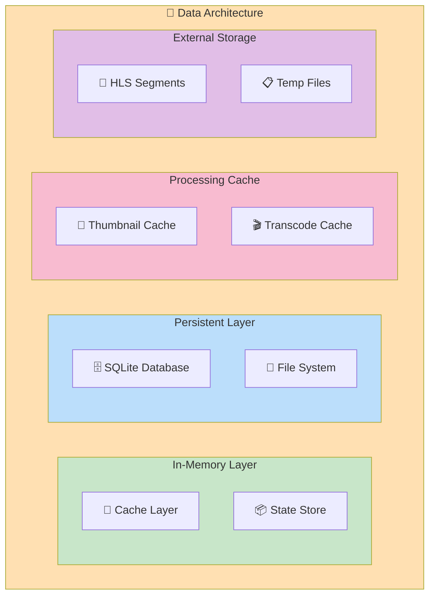

**Database Schema (SQLite):**

```sql
-- Core Tables
CREATE TABLE assets (
    id TEXT PRIMARY KEY,
    name TEXT NOT NULL,
    path TEXT UNIQUE NOT NULL,
    format TEXT NOT NULL,
    file_size INTEGER,
    created_at TIMESTAMP,
    updated_at TIMESTAMP,
    indexed_at TIMESTAMP
);

CREATE TABLE asset_metadata (
    id TEXT PRIMARY KEY,
    asset_id TEXT UNIQUE NOT NULL,
    width INTEGER,
    height INTEGER,
    duration REAL,
    fps REAL,
    color_histogram BLOB,
    dominant_colors JSON,
    exif_data JSON,
    FOREIGN KEY (asset_id) REFERENCES assets(id)
);

CREATE TABLE tags (
    id TEXT PRIMARY KEY,
    name TEXT UNIQUE NOT NULL,
    color TEXT,
    category TEXT,
    created_at TIMESTAMP
);

CREATE TABLE asset_tags (
    asset_id TEXT,
    tag_id TEXT,
    PRIMARY KEY (asset_id, tag_id),
    FOREIGN KEY (asset_id) REFERENCES assets(id),
    FOREIGN KEY (tag_id) REFERENCES tags(id)
);

CREATE TABLE collections (
    id TEXT PRIMARY KEY,
    name TEXT NOT NULL,
    description TEXT,
    created_at TIMESTAMP
);

CREATE TABLE collection_items (
    collection_id TEXT,
    asset_id TEXT,
    position INTEGER,
    PRIMARY KEY (collection_id, asset_id),
    FOREIGN KEY (collection_id) REFERENCES collections(id),
    FOREIGN KEY (asset_id) REFERENCES assets(id)
);

-- Thumbnail records
CREATE TABLE thumbnails (
    id TEXT PRIMARY KEY,
    asset_id TEXT UNIQUE NOT NULL,
    size_small TEXT,
    size_medium TEXT,
    size_large TEXT,
    generated_at TIMESTAMP,
    FOREIGN KEY (asset_id) REFERENCES assets(id)
);

-- Config
CREATE TABLE config (
    key TEXT PRIMARY KEY,
    value TEXT NOT NULL
);
```

---

## 5. FLUXO DE DADOS

### 5.1 Fluxo de Indexação

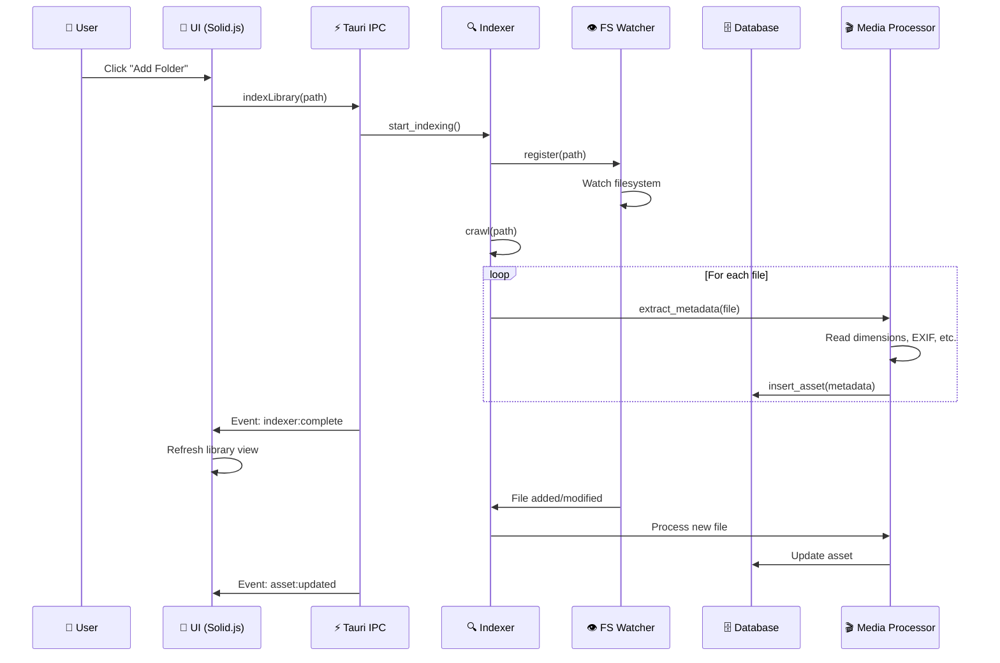

### 5.2 Fluxo de Streaming

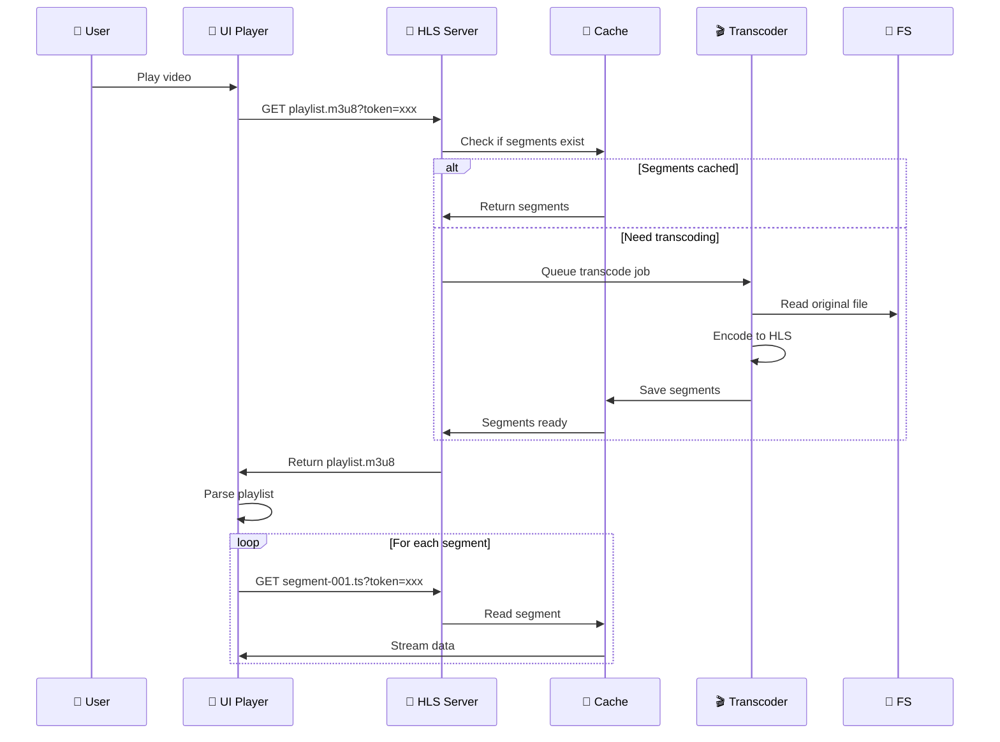

### 5.3 Fluxo de Busca

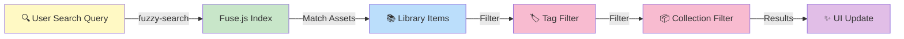

---

## 6. PADRÕES DE COMUNICAÇÃO

### 6.1 Tauri IPC Protocol

```typescript
// Frontend Command Call
type LibraryCommand = 
  | { type: 'indexLibrary'; path: string }
  | { type: 'searchAssets'; query: string; filters: TagFilter[] }
  | { type: 'getStreamingToken' }
  | { type: 'updateAssetTags'; assetId: string; tags: string[] }
  | { type: 'deleteAsset'; assetId: string }

// Backend Response
type CommandResponse<T> = 
  | { success: true; data: T }
  | { success: false; error: string }

// Events (Backend -> Frontend)
type AppEvent = 
  | { type: 'indexer:complete'; totalIndexed: number }
  | { type: 'asset:added'; asset: Asset }
  | { type: 'asset:updated'; assetId: string }
  | { type: 'asset:deleted'; assetId: string }
  | { type: 'thumbnailGenerated'; assetId: string; url: string }
  | { type: 'streamingReady'; assetId: string; playlistUrl: string }
```

### 6.2 Error Handling

```rust
// Backend Error Response
#[derive(Serialize)]
struct ErrorResponse {
    code: String,      // "DB_ERROR", "NOT_FOUND", etc
    message: String,
    details: Option<String>,
}

// Frontend Error Handler
interface ApiError {
    code: ErrorCode;
    message: string;
    retry?: boolean;
}

type ErrorCode = 
  | 'DB_ERROR'
  | 'NOT_FOUND'
  | 'VALIDATION_ERROR'
  | 'INTERNAL_ERROR'
  | 'IO_ERROR'
```

---

## 7. COMPONENTES PRINCIPAIS

### 7.1 Asset Management Module

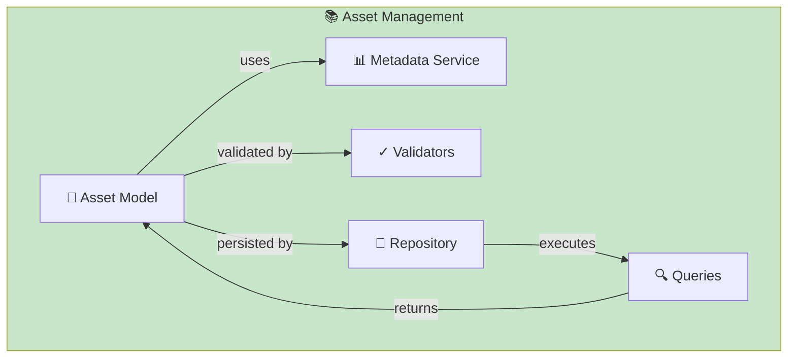

**Asset Model:**
```typescript
interface Asset {
  id: string;                    // UUID
  name: string;
  path: string;                  // Sistema de arquivos
  format: SupportedFormat;
  fileSize: number;
  createdAt: Date;
  updatedAt: Date;
  indexedAt: Date;
  
  metadata?: AssetMetadata;      // Lazy-loaded
  tags?: Tag[];                   // Lazy-loaded
  thumbnail?: ThumbnailData;      // Lazy-loaded
}

interface AssetMetadata {
  dimensions?: { width: number; height: number };
  duration?: number;              // Para vídeos
  fps?: number;                   // Para vídeos
  colorHistogram?: ColorData;
  dominantColors?: string[];
  exifData?: Record<string, any>;
}
```

### 7.2 Thumbnail System

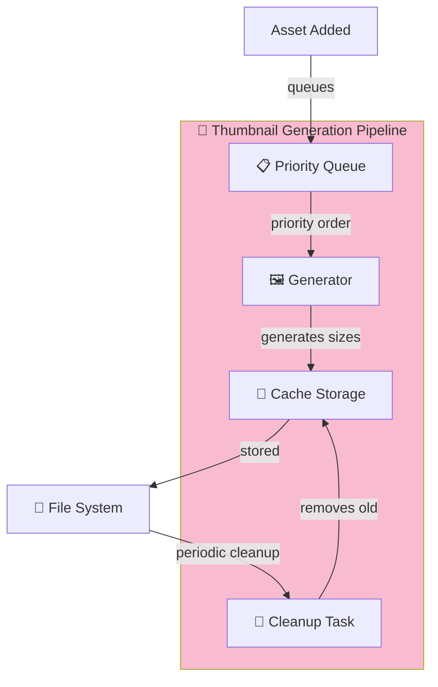

**Sizes:**
- Small: 120x120 (UI list view)
- Medium: 320x320 (Inspector panel)
- Large: 1280x1280 (Full preview)

### 7.3 Indexer & Watcher

```rust
pub struct Indexer {
    db: Arc<Db>,
    processor: Arc<MediaProcessor>,
    watcher_registry: Arc<Mutex<WatcherRegistry>>,
}

impl Indexer {
    /// Scan directory and index all files
    pub async fn crawl(&self, path: PathBuf) -> AppResult<usize> { }
    
    /// Watch directory for changes
    pub async fn watch(&self, path: PathBuf) -> AppResult<()> { }
    
    /// Process single file
    async fn process_file(&self, path: PathBuf) -> AppResult<Asset> { }
}

pub struct WatcherRegistry {
    // Maps path -> (CancellationToken, JoinHandle)
    watchers: HashMap<String, (CancellationToken, JoinHandle<()>)>,
}
```

---

## 8. ESCALABILIDADE & PERFORMANCE

### 8.1 Estratégias de Cache

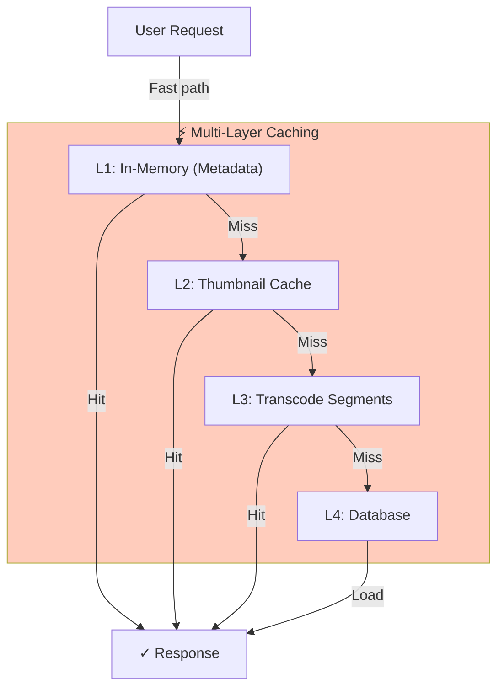

### 8.2 Worker Pools

```rust
pub struct ThumbnailWorker {
    priority_queue: Arc<PriorityQueue<ThumbnailJob>>,
    worker_count: usize,
    cancellation_token: CancellationToken,
}

impl ThumbnailWorker {
    pub async fn start(&self) {
        for _ in 0..self.worker_count {
            let queue = self.priority_queue.clone();
            let token = self.cancellation_token.clone();
            
            tokio::spawn(async move {
                loop {
                    select! {
                        job = queue.pop() => {
                            // Process job
                        }
                        _ = token.cancelled() => break,
                    }
                }
            });
        }
    }
}
```

### 8.3 Database Optimization

```typescript
// Indexed queries
CREATE INDEX idx_asset_format ON assets(format);
CREATE INDEX idx_asset_created ON assets(created_at);
CREATE INDEX idx_tag_name ON tags(name);
CREATE INDEX idx_asset_tags ON asset_tags(asset_id, tag_id);

// Lazy loading
interface AssetWithMetadata {
  asset: Asset;
  metadata?: () => Promise<AssetMetadata>;
}
```

---

## 9. CONFIGURAÇÃO & EXTENSIBILIDADE

### 9.1 Format Registry Pattern

```rust
pub struct FormatRegistry {
    formats: HashMap<String, Box<dyn FormatHandler>>,
}

pub trait FormatHandler: Send + Sync {
    fn supports(&self, mime_type: &str) -> bool;
    fn process(&self, path: &Path) -> AppResult<Asset>;
    fn generate_thumbnail(&self, path: &Path) -> AppResult<Vec<u8>>;
}

// Implementations
impl FormatHandler for ImageFormatHandler { }
impl FormatHandler for VideoFormatHandler { }
impl FormatHandler for DocumentFormatHandler { }
impl FormatHandler for ModelFormatHandler { }
```

### 9.2 Settings & Configuration

```rust
#[derive(Serialize, Deserialize, Clone)]
pub struct AppConfig {
    pub library_paths: Vec<PathBuf>,
    pub thumbnail_quality: u8,
    pub auto_index: bool,
    pub streaming_quality: StreamingQuality,
    pub appearance: AppearanceSettings,
}

impl AppConfig {
    pub async fn load(db: &Db) -> AppResult<Self> { }
    pub async fn save(&self, db: &Db) -> AppResult<()> { }
}
```

---

## 10. TESTING STRATEGY

### 10.1 Frontend Tests (Vitest + Testing Library)

```typescript
describe('AssetLibrary', () => {
  test('should display assets in grid view', () => {
    const { getByTestId } = render(() => <AssetLibrary />);
    expect(getByTestId('asset-grid')).toBeInTheDocument();
  });
  
  test('should filter assets by tag', async () => {
    // Setup
    // Action
    // Assert
  });
});
```

### 10.2 Backend Tests (Cargo test)

```rust
#[cfg(test)]
mod tests {
    use super::*;
    
    #[tokio::test]
    async fn test_asset_indexing() {
        let db = test_db().await;
        let indexer = Indexer::new(db);
        
        let result = indexer.crawl(test_path()).await;
        
        assert!(result.is_ok());
        assert_eq!(result.unwrap(), 5);
    }
}
```

### 10.3 Integration Tests

```bash
# E2E testing com Tauri
npm run test:e2e
```

---

## 11. DEPLOYMENT & CI/CD

### 11.1 Build Pipeline

```mermaid
graph LR
    A["🔄 Push to main"] -->|Trigger| B["🔨 Build"]
    B -->|Type Check| C["✓ TypeScript"]
    C -->|Lint| D["🎯 ESLint"]
    D -->|Test| E["🧪 Unit Tests"]
    E -->|Package| F["📦 Tauri Build"]
    F -->|Artifacts| G["💾 Release Assets"]
    
    style A fill:#fff9c4
    style B fill:#c8e6c9
    style C fill:#bbdefb
    style D fill:#f8bbd0
    style E fill:#ffccbc
    style F fill:#e1bee7
    style G fill:#b2dfdb
```

### 11.2 GitHub Actions Workflow

```yaml
name: Build & Test
on: [push, pull_request]

jobs:
  build:
    runs-on: ubuntu-latest
    steps:
      - uses: actions/checkout@v3
      
      - name: Setup Node
        uses: actions/setup-node@v3
        with:
          node-version: '18'
      
      - name: Setup Rust
        uses: actions-rs/toolchain@v1
        with:
          toolchain: stable
      
      - name: Install dependencies
        run: npm install && cargo build -p mundam_lib
      
      - name: Type check
        run: npm run typecheck
      
      - name: Lint
        run: npm run lint
      
      - name: Test
        run: npm run test && cargo test
      
      - name: Build Tauri
        run: npm run build
```

---

## 12. MONITORAMENTO & LOGGING

### 12.1 Structured Logging

```rust
use tracing::{info, warn, error, debug};
use tracing_subscriber::fmt;

// In lib.rs setup
tracing_subscriber::fmt()
    .with_env_filter(EnvFilter::from_default_env())
    .with_target(true)
    .with_level(true)
    .init();

// Usage
info!(asset_id = %id, format = %fmt, "Asset indexed");
warn!(missing_metadata = true, "EXIF extraction failed");
error!(error = %e, "Database transaction failed");
```

### 12.2 Performance Metrics

```rust
pub struct PerformanceMetrics {
    pub indexing_time_ms: u64,
    pub thumbnail_generation_time_ms: u64,
    pub query_time_ms: u64,
    pub memory_usage_mb: u64,
}
```

---

## 13. SEGURANÇA

### 13.1 Tauri Permissions

```json
{
  "permissions": {
    "fs": {
      "allowlist": ["read", "write"],
      "deny": ["rmDir"]
    },
    "dialog": {
      "allowlist": ["open", "save"]
    },
    "http": {
      "allowlist": ["localhost"]
    }
  }
}
```

### 13.2 Input Validation

```rust
pub fn validate_asset_name(name: &str) -> AppResult<()> {
    if name.is_empty() || name.len() > 255 {
        return Err(AppError::Generic("Invalid asset name".into()));
    }
    if name.contains('\0') {
        return Err(AppError::Generic("Invalid characters".into()));
    }
    Ok(())
}
```

### 13.3 Token-Based Streaming Auth

```rust
pub struct StreamingAuth {
    session_token: String,
    created_at: Instant,
    expiry: Duration,
}

impl StreamingAuth {
    pub fn validate(&self, token: &str) -> bool {
        token == self.session_token && self.created_at.elapsed() < self.expiry
    }
}
```

---

## 14. MIGRATION PATH

### Fase 1: Refactoring (2-4 semanas)
- ✅ Organizando módulos Rust
- ✅ Padronizando error handling
- ✅ Criando service layer
- ✅ Documentação de módulos

### Fase 2: Frontend Restructuring (2-3 semanas)
- ✅ Organizando componentes
- ✅ Implementando service layer
- ✅ Custom hooks padronizados
- ✅ Type safety melhorada

### Fase 3: Testing & QA (2-3 semanas)
- ✅ Unit tests
- ✅ Integration tests
- ✅ E2E tests
- ✅ Performance testing

### Fase 4: Optimization (1-2 semanas)
- ✅ Caching strategies
- ✅ Query optimization
- ✅ Bundle size reduction
- ✅ Performance tuning

---

## 15. BENEFÍCIOS DA ARQUITETURA PROPOSTA

| Aspecto | Benefício |
|---------|-----------|
| **Escalabilidade** | Módulos independentes permitem expansão | 
| **Manutenção** | Separação clara de responsabilidades |
| **Testabilidade** | Cada módulo testável isoladamente |
| **Performance** | Multi-layer caching, worker pools |
| **Extensibilidade** | Format registry pattern |
| **Tipo de Dados** | Type-safe com TypeScript + Rust |
| **Reusabilidade** | Service layer compartilhado |
| **DevOps** | CI/CD pronto, logging estruturado |

---

## 16. CONCLUSÃO

A arquitetura proposta para o **Mundam** segue princípios consolidados de **clean architecture**, oferecendo:

🎯 **Escalabilidade Horizontal:** Novos formatos, processadores e módulos de negócio podem ser adicionados sem refatoração

🔒 **Tipo de Dados Robusto:** TypeScript + Rust + SQLx proporcionam garantias de tipo em todas as camadas

⚡ **Performance Otimizada:** Multi-layer caching, worker pools assíncronos e lazy loading

🧪 **Testabilidade Máxima:** Cada módulo pode ser testado isoladamente com mocks

📚 **Manutenção Facilitada:** Código bem organizado, documentado e seguindo padrões SOLID

---

**Versão do Relatório:** 1.0  
**Data de Geração:** 05/03/2026  
**Autor:** GitHub Copilot (@copilot)  
**Status:** ✅ Pronto para Implementação
