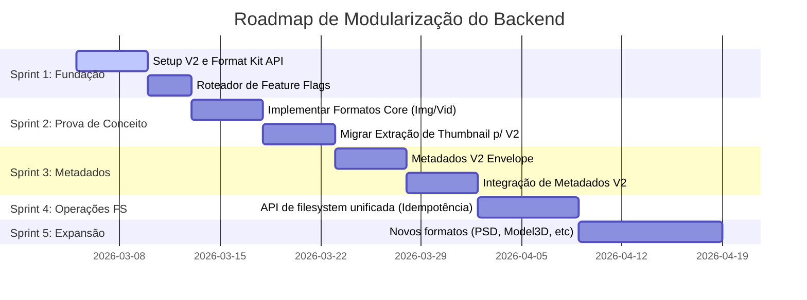

# Relatório Técnico — Modularização do Backend (Parte 3: Plano de Execução)

## 1. Visão Geral da Migração

A estratégia de "Strangler Fig" (Backend Paralelo) será empregada para garantir que o Mundam continue funcionando, enquanto as novas APIs de domínio (`backend_v2`) e abstrações de formato (`format_kit`) são desenvolvidas e integradas de forma isolada.



## 2. Sprint 1: Fundação e Contratos (Format Kit)

**Objetivo:** Estabelecer as bases (APIs passivas) para o `format_kit` e a infraestrutura mínima do `backend_v2` sem tocar no funcionamento do sistema atual.

### Arquivos e Estruturas a Criar:

**`src-tauri/src/format_kit/api/mod.rs`**
Criação dos Traits (Contratos):
- `FormatModule` (Retorna ID, Família e Capacidades).
- `MetadataCapability` (Extração padronizada de metadados).
- `ThumbnailCapability` (Geração unificada de thumbnail).
- `PreviewCapability` (Geração de preview otimizado - ex: h264/mp4 para vídeos brutos).

**`src-tauri/src/format_kit/registry/mod.rs`**
- Criar o `FormatRegistry` (Singleton gerido pelo Tauri State) que registra as implementações usando Builder pattern. Ele detecta arquivos baseados nos magic bytes (Probe) e MIME types, retornando uma lista ordenada por `DetectConfidence`.

**`src-tauri/src/backend_v2/router.rs`**
- Criação do "Feature Flag Router". Uma struct global que lê de variáveis de ambiente do app (ou do banco local de preferências) se deve despachar tarefas para V1 ou V2 (Ex.: `Config::v2_thumbnails_enabled()`).

## 3. Sprint 2: Prova de Conceito (Thumbnails em V2)

**Objetivo:** Fazer o novo sistema assumir 1 responsabilidade de fluxo real (Thumbnails) para 2 ou 3 formatos piloto (Ex: JPEG, PNG, MP4).

### Trabalhos:

**`src-tauri/src/format_kit/formats/image/jpeg.rs`**
- Implementar `FormatModule` e `ThumbnailCapability`. A implementação chamará a lib de processamento de imagens moderna adotada, encapsulando os erros num `ExtractError` único do `format_kit`.

**`src-tauri/src/format_kit/formats/video/mp4.rs`**
- Implementar `ThumbnailCapability` e `PreviewCapability` chamando e orquestrando o FFMPEG. Toda a complexidade do subprocesso deve estar retida dentro da capability.

**`src-tauri/src/backend_v2/application/thumbnail_service.rs`**
- Orquestrar a geração: recebe o request, usa o `FormatRegistry` para achar o melhor `FormatModule`, invoca a `ThumbnailCapability` passando o arquivo e salva no sistema de cache.

**Refatoração no Ponto de Entrada / Tauri Command:**
- Modificar o command Tauri inicial (ex: `generate_thumbnail`) para checar o Router:
  - Se flag=true: `backend_v2::thumbnail_service::process()`
  - Se flag=false (V1 atual): `thumbnails::generates::process()`

## 4. Sprint 3: O Novo Motor de Metadados e Buscas (Metadados em V2)

**Objetivo:** Abstrair o caótico sistema atual de extração de metadados em "Envelopes" limpos, onde a tabela do SQlite armazenará os dados indexáveis (CoreMetadata) e JSONs para queries flexíveis.

### Trabalhos:

**`src-tauri/src/format_kit/api/types.rs`**
- Definir o `AssetMetadataEnvelope`:
```rust
pub struct AssetMetadataEnvelope {
    pub parent_family: AssetFamily,  // ex: Video
    pub format_id: String,           // ex: core.mp4
    pub width: Option<u32>,
    pub height: Option<u32>,
    pub technical_json: serde_json::Value, // FFMPEG probe details, EXIF data grossa
    pub semantic_json: serde_json::Value,  // Faces detectadas, Tags de IA, OCR
}
```

**Migração das Extrações (Exif, Mpeg, XML):**
- Criar módulos em `format_kit/formats/` que assinem a interface `MetadataCapability` e gerem Envelopes padronizados.

**`src-tauri/src/backend_v2/application/metadata_service.rs`**
- Ler e validar as capacidades, salvar no SQlite e disparar eventos de atualização visual para o Frontend.

## 5. Sprint 4: Padronização das Operações de Filesystem (Idempotência)

**Objetivo:** Centralizar `Renomear`, `Mover`, `Deletar` e `Ignorar` num serviço único de transação do Backend V2, onde o Frontend *pede a intenção* e o Backend consolida no Banco e no FS lado a lado ("Transaction-like").

### Trabalhos:

**`src-tauri/src/backend_v2/application/fs_operations.rs`** (O "ChangeApplier")
- Implementar um modelo que garanta completude. Se renomear falhar no meio, um Log Reverso de Auditoria faz rollout no banco (Evitando Ghosts: Arquivo no banco, mas não no HD).
- Operações de `move_asset`, `delete_asset_with_meta`, `rename_folder` seriam expostas via Tauri Commands exclusivos no Backend V2.
- Isso diminui o número brutal de bugs que ocorrem quando usuários realizam operações no Frontend e o Watcher (simultâneo) acaba bagunçando os status da indexação.

## 6. Sprint 5: Expansão de Formatos e Remoção de V1 (Sunset)

**Objetivo:** Usar a solidez dos contratos do V2 para rapidamente suportar dezenas de formatos complexos de mídia. E uma vez concluído, jogar fora as pastas legadas.

### Trabalhos:

- Incluir formatos complexos como `.psd`, `.ai`, Modelos 3D (`glb`), fontes (`ttf/otf`).
- O código do Frontend ficará muito mais limpo, pois só pedirá metadados e thumbs via API Universal e receberá o Payload Uniforme do V2.
- Acompanhar logs de falha via Sentry/Telemetry.
- Após semanas operando sem issues pesados vindos da "V2", remover fisicamente as ramificações de V1, convertendo `backend_v2` em `backend` e `format_kit` em padrão-ouro de projeto.

---

## 7. Próximos Passos (Ação Recomendada)

Recomendação para pormos a "mão na massa":

Se os passos e a arquitetura delineada na Parte 1, Parte 2 e este Plano de Execução (Parte 3) estiverem alinhados com sua visão, o próximo passo para quebrar a inércia é:

1. Eu criar os **diretórios e definições iniciais dos Traits** do `format_kit` (Sprint 1), apenas "esqueletos" TypeScript e Rust para avaliação e validação de compilação.
2. Com isso, faremos um review conjunto da API antes de efetuar qualquer lógica nela.

Diga-me se posso iniciar a criação física dos diretórios do `format_kit/api` e os primeiros Traits Rust para você analisar!
