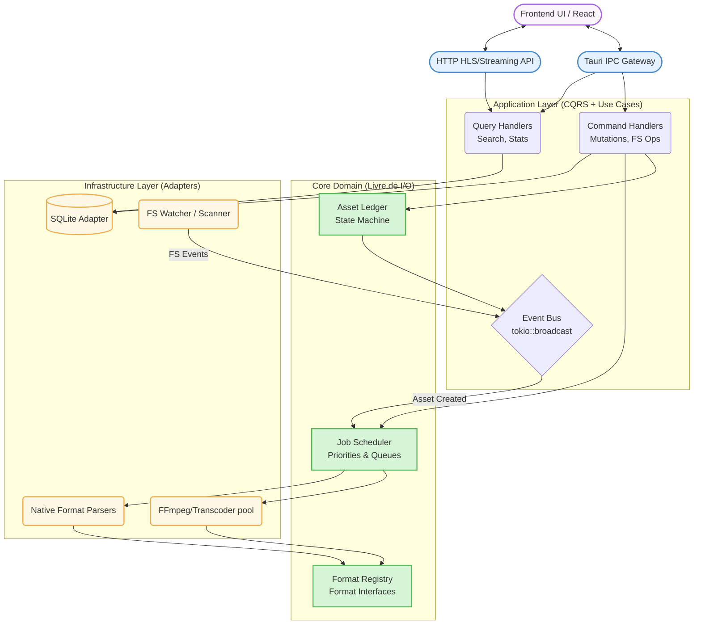
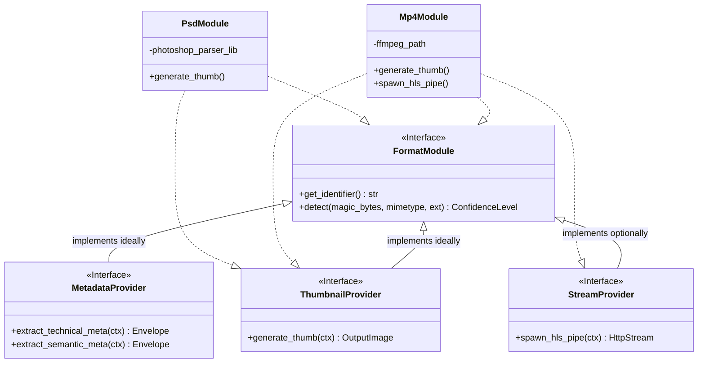
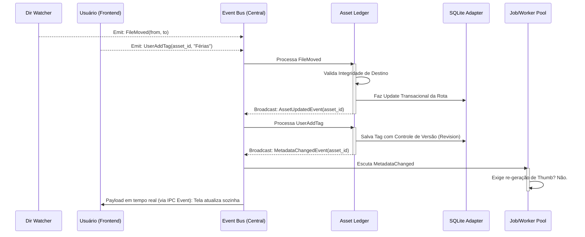

# Arquitetura Ideal do Backend: Escalabilidade, Manutenção e Excelência

Este documento descreve a **arquitetura de backend ideal** para o Mundam. Ela foi projetada do zero (abstraindo implementações legadas) para comportar todos os recursos atuais de forma magistral e preparar o terreno para escalabilidade máxima, facilidade de manutenção extrema e suporte simplificado a novos recursos (como plugins externos e milhares de formatos).

A arquitetura baseia-se em três pilares fundamentais:
1. **Hexagonal Architecture (Ports and Adapters):** O núcleo da regra de negócio (Core Domain) não conhece o banco de dados, não conhece o Tauri e não conhece o SO diretamente. Tudo se comunica por interfaces.
2. **Event-Driven Architecture (EDA):** Todos os módulos se comunicam via um barramento de eventos interno. O sistema reage assincronamente a mudanças sem acoplamento direto.
3. **Format Engine Orientada a Interfaces (Plugin-like):** A extinção de blocos condicionais massivos (`if/match`). Todo novo tipo de arquivo é um "plugin" que obedece a contratos estritos.

---

## 1. Visão Macro da Arquitetura Ideal

Abaixo está a representação dos anéis e do fluxo de comunicação da Arquitetura Ideal.

---

## 2. Padrão CQRS (Command Query Responsibility Segregation)

Separar operações de leitura (Queries) de operações de escrita (Commands) permite otimização independente. Buscas e filtros no banco de dados não devem bloquear o pipeline de indexação.

- **Queries (Leituras):** Rotas diretas e otimizadas do Tauri IPC para o Banco de Dados. Operações totalmente passivas (ex: paginar galeria, ler tags).
- **Commands (Escritas):** Operações que alteram dados (ex: renomear arquivo, deletar biblioteca, atualizar metadados). Elas não alteram o banco sozinhas; elas invocam o `AssetLedger`, que valida a regra de negócio e então persiste.

---

## 3. O Motor de Formatos (The Format Engine)

O problema crônico em DAMs (Digital Asset Managers) é o suporte a arquivos. A arquitetura ideal resolve isso definindo a regra: **O sistema não sabe abrir um MP4. O sistema pergunta ao `FormatRegistry` quem sabe abrir.**

Toda extensão/assinatura digital obrigatoriamente satisfaz traits (interfaces) específicas.

### Benefícios:
- **Open-Closed Principle (OCP):** Você pode adicionar suporte nativo a PDF, DWG, e EPUB simplesmente criando o arquivo `formats/pdf.rs`, implementando o Trait `FormatModule` e inserindo no `Registry`. O índice e a Galeria não precisam sofrer 1 linha de alteração.
- **Isolamento de Erros (Sandboxing):** Se a extração de um PSD corrompido der *Panic*, ele é contido na thread abstrata que instanciou aquela *Capability*, não derrubando o Indexador ou o Streaming.

---

## 4. O Sistema Reativo: Ledger e Event Bus

Em gerenciadores de arquivo, o Sistema Operacional e Usuários brigam constantemente (O usuário edita as tags do arquivo no mesmo milissegundo em que o FS Watcher notifica que o arquivo mudou no Windows Explorer). Isso gera condições de corrida severas.

A solução arquitetônica ideal é o **Asset Ledger (Livro-Razão) via Event Bus**.

### Mecânica de Defesa:
- **The Source of Truth:** O `AssetLedger` garante idempotência. Eventos repetidos pelo S.O. (ex: macOS lançando 3 eventos de `Modify` em menos de 10ms) sofrem *debounce* e verificação de *hash state* antes de tocar no Banco.
- **CQRS Escrita Direcionada:** O Frontend não manda um "Dê update no Asset 101". O Frontend manda o comando: `AddTagCommand(101, "Férias")`. A semântica importa e enriquece a auditoria.

---

## 5. Job Scheduler e Workers Desacoplados

Trabalhos pesados (gerar thumbnails e realizar conversões com `ffmpeg`) nunca podem gargalar indexação de texto, e menos ainda a UI.

1. **Prioritization Layer:** Assim como o backend atual desenha de forma rudimentar, o modelo ideal possui filas Múltiplas: `UI_INTENT_QUEUE` (Highest - Usuário está olhando pra foto), `CRITICAL_QUEUE` (High), `BACKGROUND_QUEUE` (Low).
2. **Actor Model (Tokio Actors):** Cada Worker (ex: `FFmpegTranscoderWorker`, `ExifMetadataWorker`) atua de forma autônoma recebendo mensagens.
3. **Resiliência:** Se um worker travou codificando um vídeo em 8K, o Supervisor da Actor Tree finaliza o worker por timeout e avisa o Ledger do `ExtractionFailedEvent`.

---

## 6. Sumário dos Componentes Principais

| Componente | Função Ideal na Arquitetura | Localização (Pasta/Módulo Recomendada) |
|------------|-----------------------------|----------------------------------------|
| **Tauri IPC** | Roteador mudo. Recebe JSON serializado e empurra para o Command/Query correspondente. | `api/commands` |
| **HTTP Server** | Gateway isolado e focado apenas na transmissão (chunks) e validação de tokens temporários. | `api/server` |
| **Asset Ledger** | O grande cérebro de estado. Aprova Mutações, aplica Idempotência e gerencia ciclo de vida dos Assets. | `core/ledger` |
| **Event Bus** | O coração da concorrência segura. Trafega objetos de Evento que disparam workflows pela aplicação toda sem acoplamento. | `core/events` |
| **Format Registry** | Fábrica Mágica. Identifica bytes e despacha Interfaces padrão para quem perguntar. Acabou a espaguetização. | `core/formats` (format_kit) |
| **Data Adapters** | Implementa chamadas reais SQLx. O Core apenas diz `save(asset)`, o Adapter lida com sintaxe de SQL e Migrations. | `infra/database` |
| **Scheduler** | Escuta eventos, bota na fila de prioridade e divide CPUs paras as tarefas extração. | `infra/workers` |

---

## 7. Porque essa é a "Excelência em Código"?

- **Testabilidade Absoluta:** Como o Banco de dados (`Database Adapter`) e as Ferramentas Nativas estão por trás de injeções de Traits, é possível testar individualmente **todo o motor lógico** do aplicativo realizando *Mocks* das interfaces.
- **Desenvolvimento em Paralelo:** Um desenvolvedor pode criar perfeitamente um suporte fenomenal para `.blend` (Blender 3D) lidando unicamente com o pacote `format/blender.rs`, sem se importar em como o Ledger persiste as coisas ou como o Tauri manda pra a tela.
- **Sem Perda de Dados:** Mutações geram Log através de Comandos. Operações de Sistema de Arquivos (Mover Pasta) operam garantindo que o HD e o SQLite andem passo a passo ou façam `rollback` sistêmico de estado. O usuário nunca vai experimentar arquivos fantasmas, corrupção cega ou "Arquivos não encontrados" persistentes.

---

## 8. Análise de Adequação e Migração (Modelo Atual ➔ Modelo Ideal)

Migrar da arquitetura fortemente acoplada atual (baseada no Indexador/Watcher centralizado) para a arquitetura Hexagonal e Orientada a Eventos exige cautela. Tentativas de "reescrever tudo de uma vez" (Big Bang Rewrite) para ferramentas desktop com banco local SQLite tendem a quebrar a confiança do usuário e corromper bibliotecas em produção. A abordagem ideal é uma **Migração Fatiada por Domínio**.

### 8.1. Estratégia Recomendada: Strangler Fig Pattern Adaptado
A ideia é construir as "Portas" e "Adaptadores" novos lado a lado com os antigos no mesmo projeto.

1. **Camada de Isolamento:** Os comandos do Tauri receberão um _Feature Toggle_. O novo código e o antigo habitarão o mesmo binário, instanciados simultaneamente na inicialização do Tauri.
2. **Intersecção Segura:** O banco SQLite será o _Single Point of Truth_ (Ponto Único de Verdade) partilhado pelas duas arquiteturas durante a fase híbrida.

### 8.2. Roteiro Passo a Passo de Implementação

#### Fase 1: Fundação do Core Domain (O "Berço")
* **O que fazer:** Criar as subpastas em Rust (`core/ledger`, `core/events`, `core/formats`). Escrever as **interfaces** (`traits`) do domínio totalmente puras, isoladas de dependências SQL ou ferramentas pesadas externas.
* **Impacto no legado:** Zero. O código novo não é chamado por ninguém operacionalmente (dark code).
* **Adição Crucial:** Estabelecer o `EventBus` (usando canais assíncronos como `tokio::sync::broadcast`) e o modelo conceitual do `AssetLedger`.

#### Fase 2: O Novo Motor de Formatos (Decapitação dos `Match` legados)
* **O que fazer:** Extrair progressivamente os detectores espalhados em `src/formats/*` e extratores de metadados em `src/media/*`, reescrevendo-os formalmente como implementações isoladas do `FormatModule`.
* **Substituição Cirúrgica:** No `ThumbnailWorker` antigo em `src/thumbnails/`, no momento de avaliar qual extrator de mídia utilizar para a foto/vídeo, delega-se a tarefa chamando o *novo* `FormatRegistry`.
* **Resultado:** O pipeline se torna absurdamente mais fácil de expandir logo nesta etapa, ainda que mantenha os trâmites da fila antiga.

#### Fase 3: Estrangulamento das Filas e Workers
* **O que fazer:** Vincular o `EventBus` reativo ao invés de canais acoplados unicamente do Indexador/Watcher. Em seguida, acionar o novo `JobScheduler` de Atores/Fatores para escutar estes eventos.
* **Substituição:** Eventos de 'Arquivo Registrado', despachados tanto no novo domínio, quanto herdados dos scripts do S.O., rotearão tarefas de FFmpeg, ou Parseamento e Thumbnailing dentro deste pipeline reativo mais eficiente.
* **Resultado:** Derruba-se e exclui-se a _goroutine_ monolítica `thumbnail_worker` base em prol do *Escalonador orientado a Eventos*, mais elástico e distribuído.

#### Fase 4: Substituição do Cérebro FS (The Asset Ledger & Watchers)
* **O que fazer:** Refatorar criticamente todo o pipeline de monitoramento (`src/indexer/watcher.rs`). Ao invés deste módulo ter o poder de modificar o Banco Diretamente via blocos bloqueantes (Locks) SQL, o Watcher legará o processo, transformando-se num "emissor burro" disparando *intentions* de mutação para o `EventBus`.
* **Adequação Global:** O `AssetLedger` se torna a **Única Entidade Autorizada** a realizar comandos `UPDATE/INSERT/DELETE assets`. Frontends e Watchers se comunicam através de Eventos Validados e Submetidos a ele.
* **Resultado:** Fim definitivo à corrupção cruzada, encerramento de travas no banco em varreduras densas, e sanidade operacional.

#### Fase 5: Limpeza Arquitetural (Sunset Phase)
* **O que fazer:** Remoção segura das velhas classes legadas nas raízes `src/`. Todo o Tauri (`tauri::command`) deve estar apenas invocando `CommandHandlers` e devolvendo as abstrações Hexagonais finalizadas. A base velha se esmaece completamente do codebase.

---

## 9. Análise Profunda de Riscos e Planos de Mitigação (Contramedidas)

A migração traz ameaças inerentes de inconsistência transacional, especialmente porque o banco de dados funcionará sob um contexto dinâmico intersecionado. 

| Risco e Ameaça Arquitetural | Severidade | Descrição e Impacto | Estratégia de Mitigação Defensiva |
|-----------------------------|------------|---------------------|-----------------------------------|
| **Database Deadlocks Híbridos** | **Crítica** | A base atual insere arquivos direto via Indexer, e a nova escreveria simultaneamente via Ledger (Event Bus). O SQLite tranca em lock severo com `database is locked`. | **Restrição em 'Escritor Único' / Mutex Central:** Mesmo em fase de transição (híbrido), criar um Proxy de Escrita ou canal centralizado antes do *SQLite*. O uso nativo e exclusivo via `WAL mode` suaviza a situação, mas na convivência das duas arquiteturas, operações devem respeitar um Lock em transações sensíveis de Escrita Global e Rollback. |
| **Corrupção em Thumbnails e Cache** | **Alta** | A Engine ideal converte formatos levemente diferente (rotas novas do ffmpeg), bagunçando tamanhos antigos ou gravando caminhos defeituosos. IDs não batem no frontend. | **Double-Run (Shadow Execution):** Durante os períodos de Testes Intermediários, a engine nova converte o recurso e salva na diretório Temporário, e só analisa assertivamente se sua operação equivaleu com o resultado da engine antiga (telemetria silenciosa / "log de auditoria visual"). Só depois validada, aciona as chaves do *Feature Flag* visual. |
| **Gargalo Massivo no Barramento (EventBus/tokio)** | **Média** | O Watcher no Windows despacha 20.000 eventos de "Modificação" num delete de pasta e pendura o barramento central entupindo Ram ou atrasando Front. | **Operações em Backpressure:** Aplicar na raiz do adaptador do Watcher de O.S rotinas massivas de Agrupamento ('Throttle/Debounce'). Unir centenas de sinais próximos na mesma janela de *ms* enviando um evento como `BulkFolderUpdateEvent` para diluir carga da thread assíncrona. |
| **Divergência Técnica (Over-engineering x Features)** | **Alta** | Durante a escalada arquitetural ao modelo excelente (Hexagonal rigoroso), features ágeis como as `Transcodificações` de "conversões mágicas do V1" se percam na burocracia ou pararem de funcionar pela rigidez dos novos Traits. | **Testes de Contrato (Contract Tests Base line):** Antes de desmanchar e recriar o módulo `src/transcoding/*`, deve-se criar uma suíte unitária cravando com exatidão o input/output da *stream* (Teste do "Tubo em Pé"). Se as saídas não correm exatamente como antes, a peça Hex nova fica em Stand-By até equivalência plena. |
| **Perca Adicional Sensorial em Latência Local** | **Baixa** | Adicionar um "Scheduler de Trefas", "Event Bus" e "Atores Reativos", poderia acrescentar overhead em ms na transação dos arquivos locais, frente à scriptada monolítica anterior. | Compreende o _Trade-Off_. Rust minimiza e pulveriza impactos da máquina virtual através dacompilação implacável LLVM. Ganhar robustez no Asset Manager, não perder arquivos (Corrupções silenciosas zeradas) vale o microssegundo. Reflexões sobre o tempo-resposta serão constantemente refinadas pela Telemetria (Observability). |

### 9.1. O Princípio de Ouro (A Lei de Implementação)
A fundação de toda e qualquer adequação aqui documentada rema sob uma só diretriz suprema no ciclo de refatoração: **Delineação da Responsabilidade Híbrida**. Nunca submeta um mesmo evento do usuário a execução por duas lógicas sistêmicas diferentes correndo soltas. Isolar via "Toggles Limítrofes". Uma responsabilidade transferida ao Backend V2 **nunca** retorna ou retroage ao modelo legado após sua fase experimental superada com sucesso.
