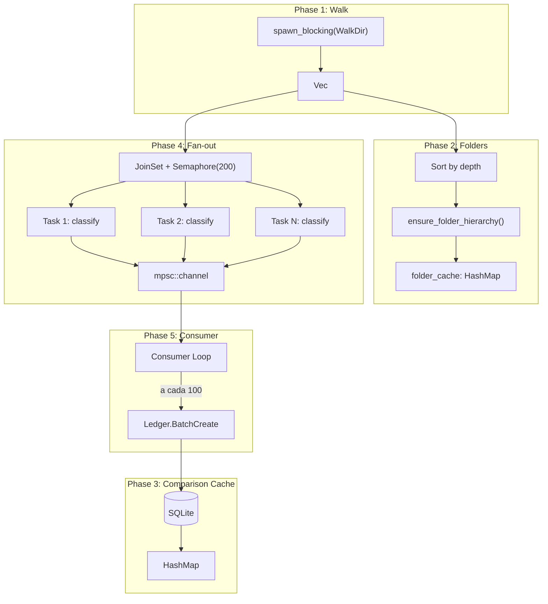

# Sprint 10.2 — Walkthrough: Indexador Paralelo + Rename Heuristics

## Resumo

Refatoração completa do `LibraryIndexer` V2 para pipeline paralelo fan-out producer-consumer, e port dos 4 heurísticos de rename da V1 para o `EventDebouncer`.

---

## Arquitetura do Novo Indexer



## Mudanças por Arquivo

### Backend (Rust)

---

#### [indexer.rs](file:///Users/marcusmaia/Documents/Desenvolvimento/Mundam/src-tauri/src/feature/library/indexer.rs) — Reescrita completa

| Antes | Depois |
|-------|--------|
| 2 WalkDir passes (contagem + processo) | 1 `spawn_blocking` WalkDir |
| Serial `for entry in WalkDir` | Fan-out `JoinSet` + `Semaphore(200)` |
| `find_folder_by_path()` por pasta | `HashMap<PathBuf, String>` pre-loaded |
| Sem timing logs | `info!("▶ Scan STARTED...")` / `info!("■ Scan COMPLETED... Duration: {:.2}s")` |
| Sem auto-scan boot | Auto-scan diferencial no boot |

**Novo método:** `with_concurrency_limit(limit)` — builder pattern para configurar o limite.

---

#### [debouncer.rs](file:///Users/marcusmaia/Documents/Desenvolvimento/Mundam/src-tauri/src/processing/watcher/debouncer.rs) — Reescrita completa

4 heurísticos portados da V1:

| Gap | V1 Referência | Implementação V2 |
|-----|---------------|-------------------|
| `RenameMode::Both` | watcher.rs L144-160 | `EventKind::Modify(Name(Both))` → emissão direta |
| Metadata fallback | watcher.rs L256-271 | `apply_rename_heuristics()` — size+created_at pairing |
| Delayed deletion | watcher.rs L368-399 | `pending_untracked_removes` com 2s guard |
| Dir vs File | watcher.rs L174-200 | `FsDirectoryDiscovered` / `FsDirectoryDeleted` |

---

#### [payloads.rs](file:///Users/marcusmaia/Documents/Desenvolvimento/Mundam/src-tauri/src/core/events/payloads.rs)

```diff
+    FsDirectoryDiscovered { path: String },
+    FsDirectoryDeleted { path: String },
```

---

#### [model.rs](file:///Users/marcusmaia/Documents/Desenvolvimento/Mundam/src-tauri/src/core/settings/model.rs)

```diff
+    pub indexer_concurrency_limit: usize, // default: 200
```

---

#### [lib.rs](file:///Users/marcusmaia/Documents/Desenvolvimento/Mundam/src-tauri/src/lib.rs)

- Lê `indexer_concurrency_limit` dos Settings
- Instancia `LibraryIndexer::new(...).with_concurrency_limit(limit)`
- Adiciona auto-scan diferencial no boot via `tokio::spawn`

---

### Frontend (TypeScript)

---

#### [schemas.ts](file:///Users/marcusmaia/Documents/Desenvolvimento/Mundam/src/core/store/settings/schemas.ts)
```diff
+    indexerConcurrencyLimit: z.number().min(10).max(500).optional()
```

#### [settingsStore.ts](file:///Users/marcusmaia/Documents/Desenvolvimento/Mundam/src/core/store/settingsStore.ts)
- Novo signal `indexerConcurrencyLimit` (default: 200)
- Persist via `tauriService.setSetting('indexer_concurrency_limit', ...)`

#### [useSettings.ts](file:///Users/marcusmaia/Documents/Desenvolvimento/Mundam/src/core/hooks/useSettings.ts)
- Expõe `indexerConcurrencyLimit` no hook

#### [GeneralPanel.tsx](file:///Users/marcusmaia/Documents/Desenvolvimento/Mundam/src/components/features/settings/GeneralPanel.tsx)
- Novo selector "Indexer Concurrency" com opções: 50/100/200/300/400

---

## Verificação

### Build
```
cargo check → ✅ 0 errors, 3 pre-existing warnings
```

### Testes
```
cargo test → ✅ 29 passed, 0 failed

Novos testes adicionados:
  - test_event_aggregation ✅
  - test_rename_mode_both ✅
  - test_delayed_deletion_guard ✅
```

### Resumabilidade

O mecanismo de retomada após interrupção funciona via **scan diferencial**:
1. No boot, `auto-scan` executa `scan_directory()` para cada root
2. `get_all_files_comparison_data()` carrega a cache do banco
3. Cada arquivo é comparado: se `size` e `modified_at` batem → `ExistingAsset` (skip)
4. Apenas arquivos novos ou modificados são processados via `NewAsset`

Portanto, se a indexação for interrompida no meio, ao reabrir, a próxima `scan_directory()` pula os que já foram indexados.
