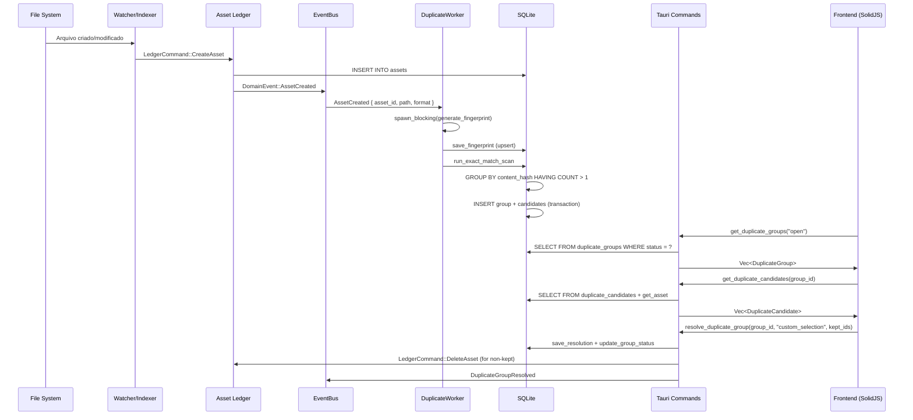

# Relatório Completo — Módulo de Detecção de Arquivos Duplicados

**Projeto:** Mundam — Digital Asset Manager  
**Data:** 2026-08-31  
**Autor:** Gerado automaticamente a partir da análise de código  
**Referências:** `gpt-overview.md`, `gpt-proprosal.md`, `implementation-plan.md`

---

## 1. Visão Geral

O módulo de detecção de duplicados foi implementado como um subsistema completo do Mundam, seguindo a filosofia de **processamento incremental em background** integrado ao pipeline de indexação existente. A arquitetura segue o padrão Hexagonal (Ports & Adapters) já utilizado no restante do projeto, com separação clara entre domínio (`core/`), orquestração (`feature/`), infraestrutura (`infra/`) e entrega (`delivery/`).

### 1.1 Status Atual

| Componente                     | Status     | Observações                                        |
| ------------------------------ | ---------- | -------------------------------------------------- |
| Modelo de Domínio (Rust)       | ✅ Completo | 6 entidades, 3 enums                               |
| Tabelas SQLite                 | ✅ Completo | 5 tabelas + 4 índices                              |
| Repositório (Porta)            | ✅ Completo | Trait com 8 operações                              |
| Repositório (SQLite)           | ✅ Completo | Implementação com upserts                          |
| DuplicateWorker (Eventos)      | ✅ Parcial  | Escuta `AssetCreated`, fingerprint por `file_size` |
| DuplicateCommandService        | ✅ Completo | Resolve, ignora, deleta via Ledger                 |
| DuplicateQueryService          | ✅ Completo | Consulta por status e candidatos                   |
| Tauri Commands                 | ✅ Completo | 4 comandos expostos                                |
| Domain Events                  | ✅ Completo | 5 variantes de evento                              |
| Frontend — View                | ✅ Completo | `DuplicateFinderView` com ResizablePanel           |
| Frontend — Group List          | ✅ Completo | Componente extraído com deck preview               |
| Frontend — Group Item          | ✅ Completo | Deck visual + ignored styling                      |
| Frontend — Comparison Panel    | ✅ Completo | Cards lado a lado com rolagem                      |
| Frontend — Hook                | ✅ Completo | `useDuplicateGroups` com fetch + mutate            |
| Frontend — Types/API           | ✅ Completo | `duplicates.ts` com mapeamento completo            |
| Hashing Real (Blake3/pHash)    | ❌ Pendente | Usa `file_size` como placeholder                   |
| Perceptual Hash                | ❌ Pendente | Campo preparado, não implementado                  |
| UI de Regras Configuráveis     | ❌ Pendente | Modelo pronto, UI não criada                       |
| Comparação Visual (Split View) | ❌ Pendente | Planejado na proposta                              |

---

## 2. Arquitetura Backend (Rust)

### 2.1 Modelo de Domínio — `core/models/duplicates.rs`

O módulo define 6 structs e 3 enums que representam completamente o domínio de duplicados:

```
DuplicateFingerprint     → Impressão digital de um asset (hashes, dimensões, mime)
DuplicateGroup           → Agrupamento de candidatos similares
DuplicateCandidate       → Um asset membro de um grupo
DuplicateResolution      → Registro da decisão do usuário
DuplicateRuleSet         → Perfil de regras de detecção configurável
DuplicateGroupType       → enum: Exact | Near | Derived
DuplicateGroupStatus     → enum: Open | Reviewed | Ignored | Resolved
DuplicateResolutionAction→ enum: KeepOne | DeleteSelected | MergeMetadata | IgnoreGroup | CustomSelection
```

Todos os enums usam `strum::Display` e `strum::EnumString` para serialização segura de/para strings no SQLite, eliminando conversões manuais propensas a erro.

### 2.2 Porta do Repositório — `core/repository/duplicates.rs`

Define o trait `DuplicatesRepository` com 8 operações assíncronas:

| Método                 | Tipo  | Descrição                                          |
| ---------------------- | ----- | -------------------------------------------------- |
| `save_fingerprint`     | Write | Upsert de fingerprint (ON CONFLICT UPDATE)         |
| `get_fingerprint`      | Read  | Busca por `asset_id`                               |
| `get_rule_sets`        | Read  | Lista todas as regras configuradas                 |
| `save_group`           | Write | Cria ou atualiza grupo (upsert)                    |
| `save_candidate`       | Write | Adiciona candidato ao grupo (upsert)               |
| `get_groups_by_status` | Read  | Filtra grupos por status (`open`, `ignored`, etc.) |
| `get_group_candidates` | Read  | Lista candidatos de um grupo                       |
| `save_resolution`      | Write | Registra decisão do usuário                        |
| `update_group_status`  | Write | Altera status do grupo                             |
| `run_exact_match_scan` | Write | Varredura completa por hash exato                  |

### 2.3 Implementação SQLite — `infra/sqlite/duplicates_repository.rs`

A implementação concreta usa `sqlx::Pool<Sqlite>` e segue padrões consistentes:

- **Upserts** via `INSERT ... ON CONFLICT DO UPDATE` para fingerprints, grupos e candidatos.
- **Transações** (`pool.begin()` + `tx.commit()`) no `run_exact_match_scan` para garantir atomicidade ao criar grupo + candidatos.
- **Backfill automático**: Ao rodar o scan, gera fingerprints para assets que existiam antes do módulo ser implementado:

```sql
INSERT OR IGNORE INTO duplicate_fingerprints (asset_id, content_hash, file_size, ...)
SELECT a.id, 'hash_' || CAST(a.file_size as TEXT), a.file_size, ...
FROM assets a
WHERE NOT EXISTS (SELECT 1 FROM duplicate_fingerprints df WHERE df.asset_id = a.id)
```

- **Seed automático** do rule set `exact-match` via `INSERT OR IGNORE` para evitar FK constraint errors.

### 2.4 Camada Feature — `feature/duplicates/`

#### `commands.rs` — DuplicateCommandService

Orquestra a resolução de grupos com integração ao **Asset Ledger**:

1. Recebe a ação do usuário (`IgnoreGroup`, `CustomSelection`, etc.)
2. Persiste a `DuplicateResolution` com audit trail completo (who, when, payload)
3. Atualiza o status do grupo (`ignored` ou `resolved`)
4. Para `CustomSelection`: itera candidatos e envia `LedgerCommand::DeleteAsset` para cada asset não-selecionado
5. Publica `DomainEvent::DuplicateGroupResolved`

#### `queries.rs` — DuplicateQueryService

Camada fina que delega ao repositório para consultas de leitura.

#### `events.rs` — DuplicateWorker

Worker em background que escuta o `AppEventBus`:

1. Recebe `DomainEvent::AssetCreated`
2. Executa `generate_fingerprint` via `tokio::task::spawn_blocking` (não bloqueia o executor async)
3. Salva o fingerprint no repositório
4. Roda `run_exact_match_scan` automaticamente após cada novo fingerprint

**Estado atual do hashing**: O `generate_fingerprint` lê o `file_size` via `std::fs::metadata` e gera um hash placeholder `hash_{file_size}`. Os campos `perceptual_hash`, `block_hash` e `thumb_hash` ficam como `None`.

### 2.5 Delivery Tauri — `delivery/tauri/commands/duplicates.rs`

4 comandos registrados no `invoke_handler`:

| Comando                    | Parâmetros                          | Retorno                   |
| -------------------------- | ----------------------------------- | ------------------------- |
| `get_duplicate_groups`     | `status: String`                    | `Vec<DuplicateGroup>`     |
| `get_duplicate_candidates` | `group_id: String`                  | `Vec<DuplicateCandidate>` |
| `resolve_duplicate_group`  | `group_id, action, kept_asset_ids?` | `()`                      |
| `start_duplicate_scan`     | —                                   | `()`                      |

### 2.6 Domain Events — `core/events/payloads.rs`

5 variantes de evento para duplicados:

```rust
DuplicateGroupCreated   { group_id, group_type, confidence, canonical_asset_id, candidate_count, rule_set_id }
DuplicateGroupUpdated   { group_id, status, candidate_count }
DuplicateGroupResolved  { group_id, action }
DuplicateScanProgressed { processed, matched, groups_created }
DuplicateScanFinished   { groups_created }
```

### 2.7 Banco de Dados — Schema

5 tabelas criadas em `bootstrap/database.rs`:

```sql
duplicate_fingerprints  — PK: asset_id, FK → assets(id) ON DELETE CASCADE
duplicate_rule_sets     — PK: id
duplicate_groups        — PK: id, FK → duplicate_rule_sets(id)
duplicate_candidates    — PK: (group_id, asset_id), FKs → groups, assets
duplicate_resolutions   — PK: id, FK → duplicate_groups(id) ON DELETE CASCADE
```

4 índices para performance:
```sql
idx_duplicate_fingerprints_content_hash
idx_duplicate_fingerprints_phash
idx_duplicate_groups_status
idx_duplicate_candidates_asset_id
```

---

## 3. Arquitetura Frontend (SolidJS)

### 3.1 Estrutura de Arquivos

```
src/components/features/duplicates/
├── index.ts                        # Barrel exports
├── types.ts                        # DuplicateCandidate, DuplicateGroup
├── mockData.ts                     # Dados mock para desenvolvimento
├── DuplicateGroupList.tsx          # Lista de grupos (sidebar)
├── DuplicateGroupItem.tsx          # Item individual com deck preview
├── DuplicateComparisonPanel.tsx    # Painel de comparação detalhada
├── duplicate-group-list.css
├── duplicate-group-item.css
├── duplicate-comparison-panel.css
└── hooks/
    └── useDuplicateGroups.ts       # Hook principal de estado

src/views/
├── DuplicateFinderView.tsx         # View principal
└── duplicate-finder-view.css

src/lib/
└── duplicates.ts                   # API layer (Tauri invoke wrappers)
```

### 3.2 Hook Principal — `useDuplicateGroups`

O hook gerencia todo o estado reativo:

- **`groups`**: `createResource` que busca tanto grupos `open` quanto `ignored`.
- **`visibleGroups`**: `createMemo` derivado que filtra conforme `showIgnored`.
- **`selectGroup`**: Seleciona um grupo e carrega os candidatos sob demanda (lazy loading).
- **`resolveGroup`**: Chama a API e atualiza o estado local (move para `ignored` ou remove).
- **`startScan`**: Dispara varredura e refaz o fetch.
- **`candidatesLoaded`**: Flag booleana para distinguir "ainda não carregou" de "carregou e está vazio".

### 3.3 API Layer — `duplicates.ts`

Camada de mapeamento entre o backend Rust e os tipos do frontend:

- `BackendDuplicateGroup` → `DuplicateGroup` (converte `group_type` → `type`, `candidate_count` → `candidateCount`, `status`)
- `BackendDuplicateCandidate` + `BackendAsset` → `DuplicateCandidate` (resolve asset via `get_asset`, extrai nome do path, formata tamanho em MB, mapeia `thumbnail_path`, `state`)

### 3.4 Componentes Visuais

#### `DuplicateFinderView`
Layout principal com `ResizablePanelGroup` horizontal:
- **Painel esquerdo (30%)**: Toolbar com "Scan Now" + lista de grupos
- **Painel direito (70%)**: Painel de comparação ou mensagem contextual

#### `DuplicateGroupList`
Header com título + filtro dropdown ("Show ignored groups"). Delega renderização de cada item para `DuplicateGroupItem`.

#### `DuplicateGroupItem`
- **Deck preview**: Até 3 thumbnails empilhadas com rotação (inspirado no `MultiInspector`)
- **Badge de contagem**: Número de candidatos sobreposto no deck
- **Estado ignored**: Opacidade reduzida + grayscale + badge "Ignored"
- **Badges**: Tipo do grupo (`exact`, `visual`, `derived`) + contagem de arquivos

#### `DuplicateComparisonPanel`
- **Header**: Título, badge de tipo, confiança, botões "Ignore Group" e "Keep Selected"
- **Grid horizontal**: Cards de candidatos lado a lado com `flex-wrap: nowrap` e `overflow-x: auto`
- **Cada card**: Nome, thumbnail (com `state` para fallback correto), detalhes (path, format, size, dimensions, datas, tags, notes), botão "Keep Only This"
- **Seleção**: Clique no card para selecionar/deselecionar, ícone check visual

---

## 4. Fluxo de Dados Completo



---

## 5. Bugs Resolvidos Durante a Implementação

| #   | Bug                                          | Causa Raiz                                   | Correção                                            |
| --- | -------------------------------------------- | -------------------------------------------- | --------------------------------------------------- |
| 1   | `start_duplicate_scan not allowed`           | Comandos não registrados no `invoke_handler` | Adicionados ao bootstrap                            |
| 2   | `get_asset missing required key id`          | Frontend passava `assetId` em vez de `id`    | Corrigido mapeamento em `duplicates.ts`             |
| 3   | FK constraint error 787 ao criar grupo       | `rule_set_id` referenciava tabela vazia      | Auto-seed do rule set `exact-match`                 |
| 4   | Assets existentes não apareciam no scan      | Só assets novos geravam fingerprints         | Backfill query no `run_exact_match_scan`            |
| 5   | Badge "0 files" em todos os grupos           | `candidateCount` não mapeado                 | Mapeado `candidate_count` → `candidateCount`        |
| 6   | "No candidates loaded" permanente            | Verificava `candidates.length === 0`         | Adicionado flag `candidatesLoaded`                  |
| 7   | Tamanho sempre "Unknown"                     | Frontend lia `file_size` (Rust usa `size`)   | Corrigido para ler `size` (via `#[serde(rename)]`)  |
| 8   | Thumbnails de vídeo/áudio com spinner eterno | Faltava `state` no componente Thumbnail      | Passado `state` do asset para o fallback `FileIcon` |
| 9   | Cards sobrepostos com 3+ candidatos          | CSS grid com `auto-fit` quebrando layout     | Mudado para flexbox horizontal                      |
| 10  | Conteúdo cortado verticalmente               | `align-items: stretch` no flex container     | Mudado para `align-items: start`                    |
| 11  | Filtro "Show ignored" não funcionava         | Hook só buscava grupos `open`                | Hook busca `open` + `ignored`, filtra localmente    |
| 12  | `thumbnailUrl` apontava para `id`            | Mapeamento incorreto                         | Corrigido para usar `thumbnail_path`                |

---

## 6. Análise de Gaps — O Que Falta para o Estado da Arte

### 6.1 Hashing e Fingerprinting (Crítico)

**Estado atual**: O `content_hash` é apenas `hash_{file_size}`, o que agrupa erroneamente arquivos de tamanhos iguais mas conteúdos diferentes.

**Necessário para estado da arte**:

| Prioridade | Item                           | Impacto                                    | Complexidade |
| ---------- | ------------------------------ | ------------------------------------------ | ------------ |
| **P0**     | Hash real com Blake3 ou xxHash | Elimina falsos positivos                   | Baixa        |
| **P1**     | Perceptual Hash (pHash/dHash)  | Detecta reexportações/recompressões        | Média        |
| **P2**     | Block Hash multi-escala        | Detecta crops e edições parciais           | Alta         |
| **P3**     | Thumbnail Hash                 | Checagem rápida baseada em thumb existente | Baixa        |

**Recomendação técnica**: Usar a crate `blake3` para hash de conteúdo (streaming, sem carregar arquivo inteiro na memória) e `image` + implementação manual de dHash 8x8 para perceptual hash. Para block hash, avaliar `img_hash` crate.

### 6.2 Performance e Escalabilidade

| Item                        | Estado Atual                                | Ideal                                     |
| --------------------------- | ------------------------------------------- | ----------------------------------------- |
| Scan incremental            | ❌ `run_exact_match_scan` refaz tudo         | Scan apenas de novos fingerprints         |
| Batch loading de candidatos | ❌ N+1 queries (1 `get_asset` por candidato) | `SELECT ... WHERE id IN (...)` batch      |
| Cancelamento de scan        | ❌ Não cancelável                            | `CancellationToken` para abort            |
| Progresso de scan           | ❌ Progresso fixo em 0/0/0                   | Emissão real de `DuplicateScanProgressed` |
| Indexação paralela          | ❌ Sequencial (1 fingerprint por vez)        | Work-stealing pool com `rayon`            |
| Paginação de grupos         | ❌ Carrega todos de uma vez                  | `LIMIT/OFFSET` ou cursor-based            |
| Cache de thumbnails no deck | ❌ Cada deck item faz request                | Pré-carregar thumbnails com o grupo       |

### 6.3 Interface de Usuário

| Item                            | Estado Atual              | Ideal (Estado da Arte)                       |
| ------------------------------- | ------------------------- | -------------------------------------------- |
| Split View sincronizado         | ❌ Não implementado        | Zoom/Pan travado entre 2 imagens             |
| Overlay de diferenças           | ❌ Não implementado        | Toggle de transparência entre versões        |
| Ações em lote (bulk)            | ❌ Um grupo por vez        | Selecionar múltiplos grupos e resolver       |
| "Manter o maior/mais antigo"    | ❌ Apenas "Keep Only This" | Botões contextuais inteligentes              |
| Merge de metadados/tags         | ❌ Não implementado        | Transferir tags ao manter um asset           |
| Resumo/Dashboard                | ❌ Não há                  | Contadores, gráficos de economia             |
| Atalhos de teclado              | ❌ Não há                  | ← → para navegar, K para keep, D para delete |
| Filtros avançados               | ❌ Apenas por status       | Por tipo, confidence, pasta, formato         |
| Notificação de novos duplicados | ❌ Não há                  | Toast/badge quando worker encontra grupo     |

### 6.4 Regras Configuráveis

| Item                           | Estado Atual               | Ideal                                    |
| ------------------------------ | -------------------------- | ---------------------------------------- |
| Modelo `DuplicateRuleSet`      | ✅ Pronto no banco          | —                                        |
| UI de criação/edição de regras | ❌ Não implementado         | `DuplicateRulesDialog` com toggles       |
| Aplicação de regra no scan     | ❌ Sempre usa `exact-match` | Seletor de perfil antes do scan          |
| Perfis pré-definidos           | ❌ Apenas `exact-match`     | "Somente exatos", "Visuais", "Agressivo" |

### 6.5 Qualidade de Código e Arquitetura

| Item                             | Status                      | Ação Necessária                                          |
| -------------------------------- | --------------------------- | -------------------------------------------------------- |
| Rustdoc em todos os arquivos     | ✅ Bom                       | Adicionar `# Errors` onde falta                          |
| TSDoc no frontend                | ⚠️ Parcial                   | Adicionar `@example` nos hooks                           |
| Testes unitários (Rust)          | ❌ Nenhum                    | Testar repositório, matcher, scanner                     |
| Testes de integração             | ❌ Nenhum                    | Testar fluxo completo com DB in-memory                   |
| Testes de componente (Solid)     | ❌ Nenhum                    | Testar hook e componentes com `@solidjs/testing-library` |
| FK `ON DELETE CASCADE` enforcado | ❌ `PRAGMA foreign_keys` = 0 | Ativar na conexão SQLite                                 |
| Cleanup de grupos órfãos         | ❌ Não implementado          | Trigger ou job periódico                                 |
| Reação a `AssetDeleted`          | ❌ Worker ignora             | Limpar fingerprints + recalcular grupos                  |

---

## 7. Roadmap de Próximos Passos

### Fase 1 — Correções Críticas (1-2 dias)
1. **Implementar hash real com Blake3** em `generate_fingerprint`
2. **Ativar `PRAGMA foreign_keys = ON`** na conexão SQLite
3. **Corrigir N+1 queries**: Buscar todos os assets do grupo em uma única query batch
4. **Reagir a `AssetDeleted`**: Limpar fingerprint e remover de grupos

### Fase 2 — Perceptual Hash e Scan Incremental (3-5 dias)
1. **Implementar dHash/pHash** para similaridade visual
2. **Tornar scan incremental**: Apenas processar fingerprints novos desde o último scan
3. **Emitir progresso real** do scan via `DuplicateScanProgressed`
4. **Adicionar cancelamento** de scan via `CancellationToken`

### Fase 3 — UX Premium (5-7 dias)
1. **Split View sincronizado** para comparação visual de 2 assets
2. **Ações inteligentes**: "Manter o maior", "Manter o mais antigo", "Manter favorito"
3. **Merge de metadados**: Transferir tags/notas do asset deletado para o mantido
4. **Atalhos de teclado** para triagem rápida
5. **Dashboard** com contadores e economia de espaço estimada
6. **Toast notifications** quando novos duplicados são encontrados

### Fase 4 — Regras e Configuração (3-5 dias)
1. **UI de regras** (`DuplicateRulesDialog`)
2. **Perfis pré-definidos** e seletor de perfil
3. **Filtros avançados** na lista de grupos

### Fase 5 — Detecção Avançada (5-10 dias)
1. **Block hash** para detecção de crops
2. **Comparação multi-escala** para derivados
3. **Score explicável** ("agrupado por: mesmo hash, mesma resolução")
4. **Overlay visual** de diferenças

---

## 8. Conclusão

O módulo de duplicados do Mundam possui uma base arquitetural sólida e completa: o modelo de domínio cobre todos os conceitos necessários, a persistência em SQLite é robusta com upserts e transações, a integração com o Asset Ledger garante atomicidade e auditoria, e o frontend já oferece uma experiência funcional de revisão e resolução.

O principal gap é o **hashing real** — sem ele, o sistema gera falsos positivos (arquivos de mesmo tamanho agrupados indevidamente). Essa é a prioridade máxima. Em seguida, a **performance** (N+1 queries, scan incremental) e a **UX de comparação visual** são os caminhos para transformar o módulo em uma ferramenta de produtividade séria para artistas e gestores de acervo.

A estrutura modular permite que cada fase seja implementada de forma independente, sem quebrar o que já funciona.
